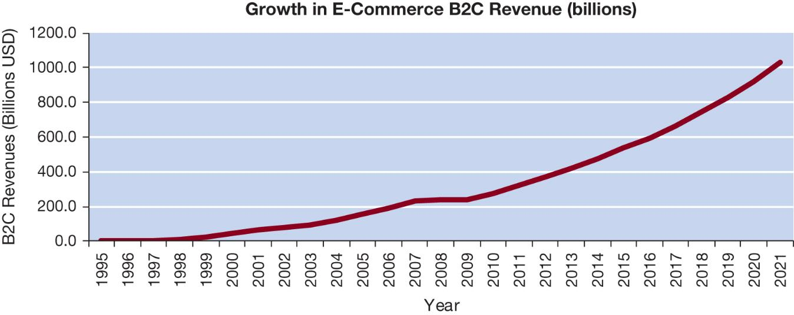
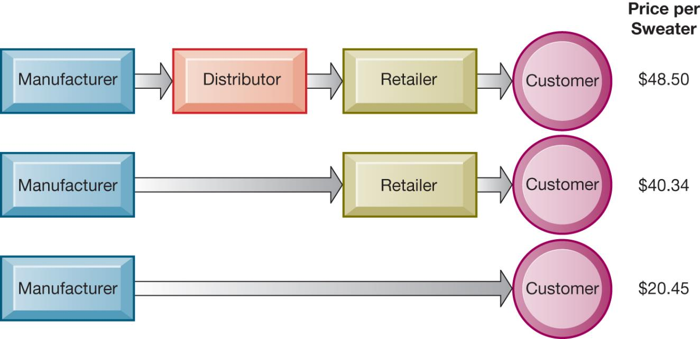
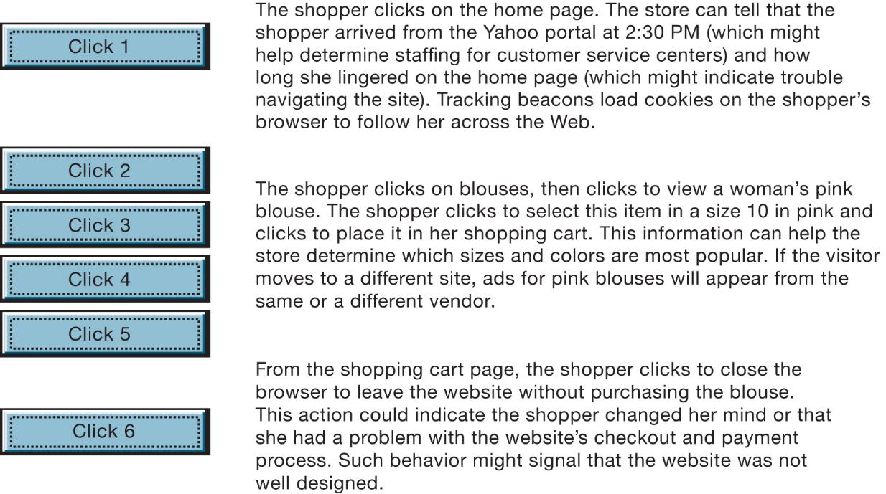
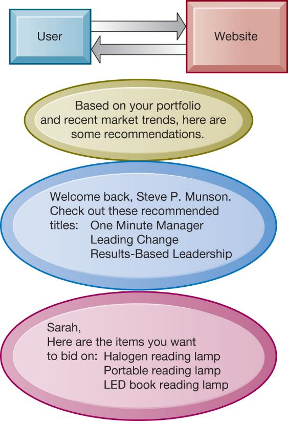
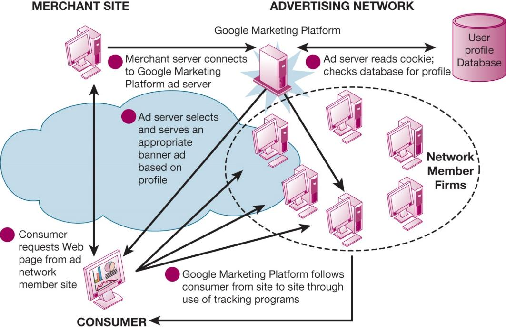
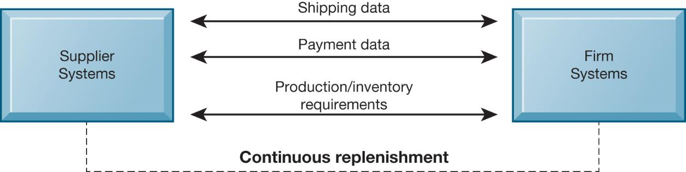
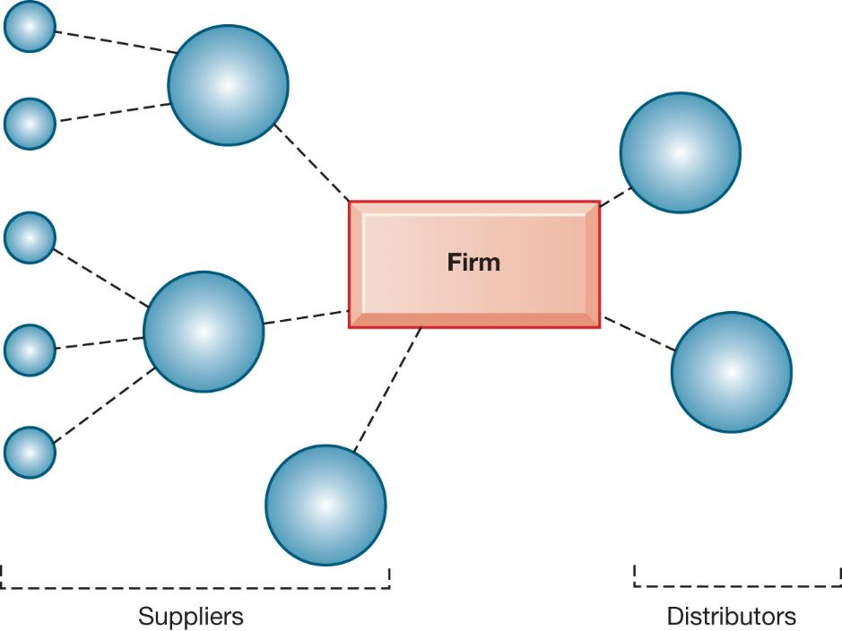
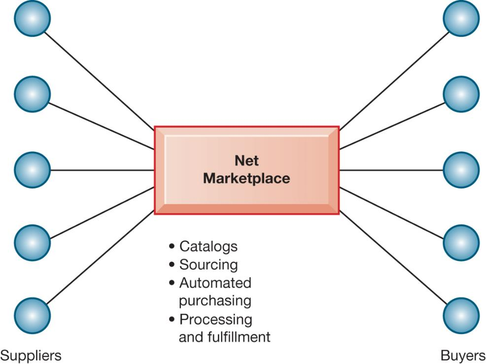
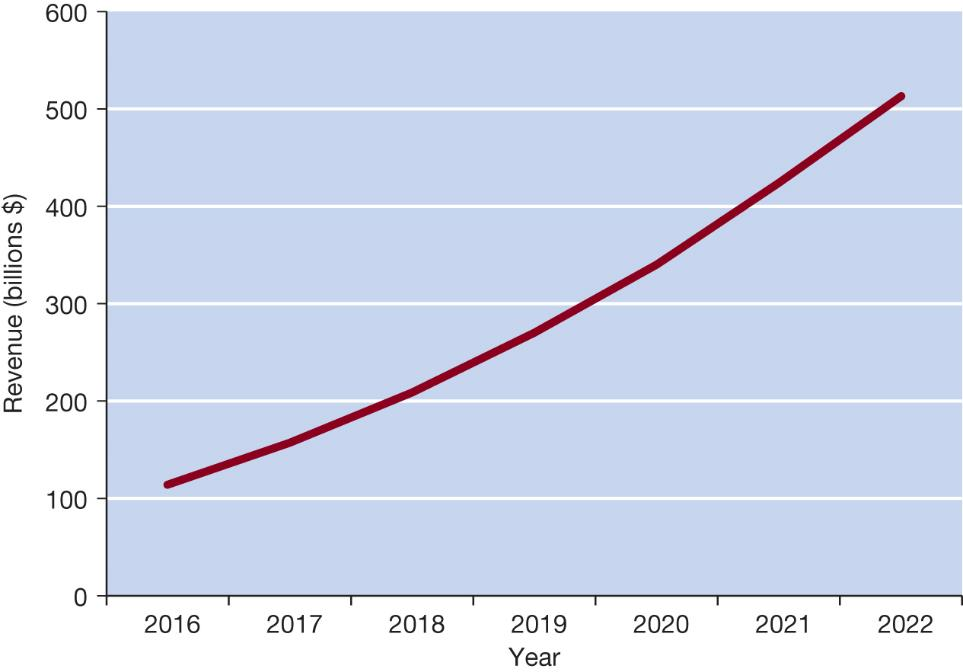
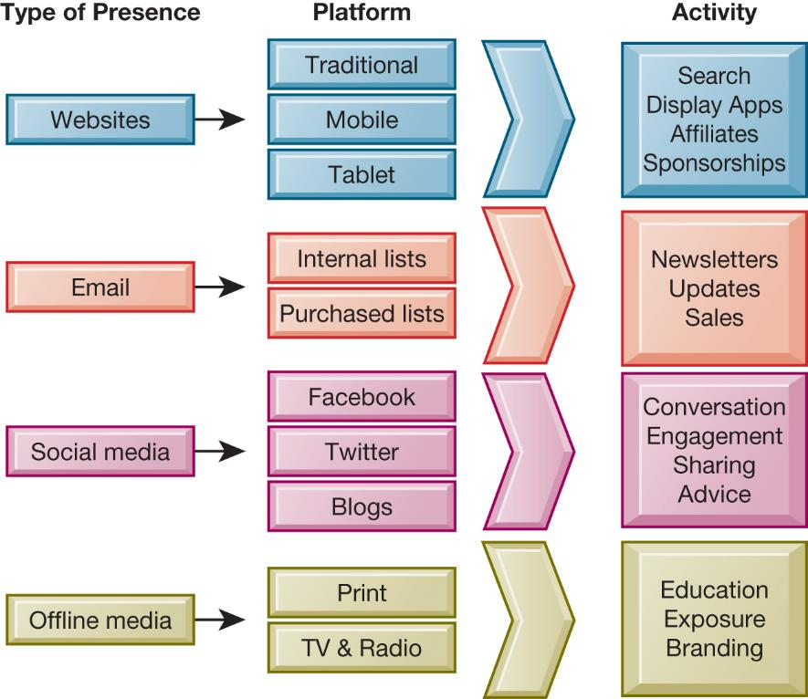

```{r, echo=FALSE, message=FALSE}
library(rstudioapi)
library(stringr)
library(tools)

this_file <- knitr::current_input()
this_file_split <- str_split(file_path_sans_ext(knitr::current_input()),"_")
this_title <- this_file_split[[1]][2]
this_session_no <- as.numeric(this_file_split[[1]][1])

source("../../Templates/render_toc.R")

```


---
class: segue, left, bottom

```{r message=FALSE, echo=FALSE, results='asis'}
pandoc.header(this_title, 1)
```
### ERP Systems

#### Dominik Böhler, Deggendorf Institute of Technology


---
class: agenda

Agenda
------

```{r, echo=FALSE, message=FALSE}
render_toc(this_file, toc_depth = 1)
```


---

Learning Components
-------------------

#### ERP Systems, Summer 2021


.pull-left[

### `r icon::fontawesome("book-open")` PREPARATION

Skim-read, get the essentials, prepare discussion. 


Laudon & Laudon (2020), ** Essentials of Management Information Systems**

Fourteenth Edition,
Global Edition.

.content-box-gray[
```{r, echo=FALSE, message=FALSE, results='asis'}
  
put_reading(this_session_no)

```
  ]
]

.pull-right[

### `r icon::fontawesome("chalkboard-teacher")` LECTURE

- Get perspectives and understanding
- Discuss with peers
- (maybe) Entertainment

### `r icon::fontawesome("rocket")` EXCERCISE

- Apply knowledge in practical excercises
- Build your digital skillset in a project
- Prepare directly for the exam
  
]

---

## Learning Objectives

__10\.1__ What are the unique features of e\-commerce\, digital markets\, and digital goods?

__10\.2__ What are the principal e\-commerce business and revenue models?

__10\.3__ How has e\-commerce transformed marketing?

__10\.4__ How has e\-commerce affected business\-to\-business transactions?

__10\.5__ What is the role of m\-commerce in business\, and what are the most important m\-commerce applications?

__10\.6__ What issues must be addressed when building an                e\-commerce presence?

__10\.7__ How willM IS help my career?

---

## Video Cases

Case 1: Walmart Takes on Amazon: A Battle ofIT and Management Systems

Case 2: Groupon: Deals Galore

Case 3: Etsy: A Marketplace and Community

Instructional Video 1: Walmart’s E\-commerce Fulfillment Center Network

Instructional Video 2: Behind the Scenes of an Amazon Warehouse

---

## E-commerce Comes to the Dashboard: The Battle for the "Fourth Screen"

* Problem
  * Opportunities presented by new technology
* Solutions
  * Dashboard display screens
  * Android Auto and Apple CarPlay
  * Android Automotive
  * Customer and auto databases
* Illustrates some major trends in e\-commerce
  * E\-commerce moves to the auto mobile platform
  * Sales of services
  * Advanced data mining and search technology

---

## E-Commerce Today

E\-commerce: Use of the Internet and web to transact business

Began in 1995 and grew exponentially; still stable even in a recession

Companies that survived the dot\-com bubble now thrive

The new e\-commerce: social\, mobile\, local

Move from desktop to smartphone

---

## Figure 10.1 The Growth of E-Commerce



---

## Why E-commerce Is Different (1 of 2)

* Ubiquity
  * Marketspace is virtual
  * Transaction costs reduced
* Global reach
  * Transactions cross cultural and national boundaries
* Universal standards
  * One set of technology standards: Internet standards
* Richness
  * Supports video\, audio\, and text messages

* Interactivity
* Information density
  * Greater price and cost transparency
  * Enables price discrimination
* Personalization/customization
  * Technology permits modification of messages\, goods
* Social technology
  * Promotes user content generation and social networking

---

## Key Concepts in E-commerce – Digital Markets and Digital Goods in a Global Marketplace

Internet and digital markets have changed the way companies conduct business

Information asymmetry reduced

Menu costs\, search and transaction costs reduced

Dynamic pricing enabled

Switching costs

Delayed gratification

Disintermediation

---

## Figure 10.2 The Benefits of Disintermediation to the Consumer



---

## Digital Goods

Goods that can be delivered over a digital network

Cost of producing first unit is almost entire cost of product

Costs of delivery over the Internet very low

Marketing costs remain the same; pricing highly variable

Industries with digital goods are undergoing revolutionary changes \(publishers\, record labels\, etc\.\)

---

## Types of E-commerce

* Three major types
  * Business\-to\-consumer \(B2C\)

    * Example: Barnes and Noble\.com

  * Business\-to\-business \(B2B\)
    * Example: ChemConnect
  * Consumer\-to\-consumer \(C2C\)
    * Example: eBay
* E\-commerce can also be categorized by platform
  * Mobile commerce \(m\-commerce\)

---

## E-commerce Business Models

Portal

E\-tailer

Content provider

Transaction broker

Market creator

Service provider

Community provider

---

## Interactive Session – Technology: Small Business Loans From a FinTech App

* Class discussion
  * What distinguishes the FinTech services described in this case from traditional banks? Explain your answer\.
  * How do the financial services described here use information technology to innovate?
  * What are the advantages and disadvantages of small businesses obtaining loans from FinTech services?
  * If you were a small business\, what factors would you consider in deciding whether to use a FinTech service?

---

## E-commerce Revenue Models

Advertising

Sales

Subscription

Free/Freemium

Transaction fee

Affiliate

---

## How Has E-commerce Transformed Marketing?

* Internet provides new ways to identify and communicate with customers
* Long tail marketing
* Internet advertising formats
* Behavioral targeting
  * Tracking online behavior of individuals
* Programmatic ad buying
* Native advertising

---

## Figure 10.3 Website Visitor Tracking



---

## Figure 10.4 Website Personalization



---

## Figure 10.5 How an Advertising Network Works



---

## Social E-commerce and Social Network Marketing (1 of 2)

* Social e\-commerce based on digital social graph
* Features of social e\-commerce driving its growth
  * Newsfeed
  * Timelines
  * Social sign\-on
  * Collaborative shopping
  * Network notification
  * Social search \(recommendations\)
* Social media
  * Fastest growing media for branding and marketing

* Social network marketing
  * Seeks to leverage individuals’ influence over others
  * Targeting a social network of people sharing interests and advice
  * Facebook’s “Like” button
  * Social networks have huge audiences
* Social shopping sites
* Wisdom of crowds
* Crowdsourcing

---

## Interactive Session – People: Engaging "Socially" with Customers

* Class discussion
  * Assess the people\, organization\, and technology issues for using social media technology to engage with customers\.
  * What are the advantages and disadvantages of using social media for advertising\, brand building\, market research\, and customer service?
  * Give an example of a business decision in this case study that was facilitated by using social media to interact with customers\.
  * Should all companies use social media technology for customer service and marketing? Why or why not? What kinds of companies are best suited to use these platforms?

---

## How Has E-commerce Affected Business-To Business Transactions?

* U\.S\. B2B trade in 2019 is $13\.5 trillion
  * U\.S\. B2B e\-commerce in 2018 is $6\.3 trillion
* Internet and networking helps automate procurement
* Variety of Internet\-enabled technologies used in B2B
  * Electronic data interchange \(E DI\)
  * Private industrial networks \(private exchanges\)
  * Net marketplaces
  * Exchanges

---

## Electronic Data Interchange (E D I)

* Computer\-to\-computer exchange of standard transactions such as invoices\, purchase orders
* Major industries haveE D Istandards
  * Define structure and information fields of electronic documents
* More companies are moving toward web\-enabled private networks
  * Allow them to link to a wider variety of firms thanE D Iallows
  * Enable sharing a wider range of information

---

## Figure 10.6: Electronic Data Interchange (E D I)



---

## New Ways of B2B Buying and Selling

* Private industrial networks
  * Private exchanges
  * Large firm using a secure website to link to suppliers and partners
* Net marketplaces \(e\-hubs\)
  * Single digital marketplace for many buyers and sellers
  * May focus on direct or indirect goods
  * May be vertical or horizontal marketplaces
* Exchanges
  * Independently owned third\-party Net marketplaces for spot purchasing

---

## Figure 10.7 A Private Industrial Network



---

## Figure 10.8 A Net Marketplace



---

## What Is the Role of M-commerce in Business, and What Are the Most Important M-commerce Applications?

* M\-commerce in 2019 is 45 percent of all e\-commerce
* Fastest growing form of e\-commerce
  * Growing at 30 percent or more per year
* Main areas of growth
  * Mass market retailing \(Amazon\, eBay\, etc\.\)
  * Sales of digital content \(music\, T V\, etc\.\)
  * In\-app sales to mobile devices

---

## Figure 10.9 Mobile Retail Commerce Revenues



---

## Location-Based Services and Applications

* Used by 74 percent of smartphone owners
* Based onG P Smap services
* Geosocial services
  * Where friends are
* Geo advertising
  * What shops are nearby
* Geo information services
  * Price of house you are passing

---

## Other Mobile Commerce Services

* Financial account management apps
  * Banks\, credit card companies
* Mobile advertising market
  * Google and Facebook are largest markets
  * Ads embedded in games\, videos\, and mobile apps
* 65 percent of online retailers have m\-commerce websites

---

## What Issues Must Be Addressed When Building an E-commerce Presence?

* Most important management challenges
  * Developing clear understanding of business objectives
  * Knowing how to choose the right technology to achieve those objectives
* Develop an e\-commerce presence map
  * Four areas: websites\, email\, social media\, offline media
* Develop a timeline: milestones
  * Breaking a project into discrete phases

---

## Figure 10.10 E-commerce Presence Map



---

## How Will M I S Help My Career?

The Company:SportsFantasyEmpire

Position Description: Junior e\-commerce data analyst

Job Requirements

Interview Questions

Author Tips

