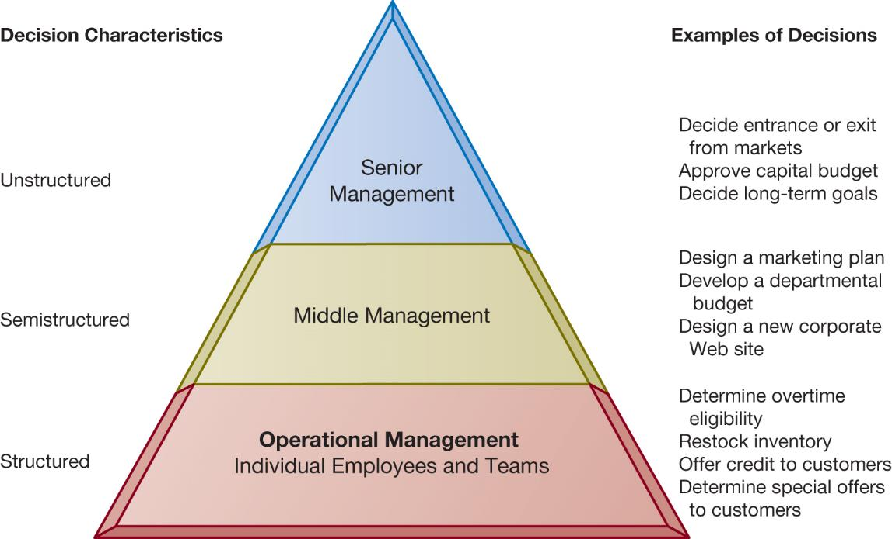
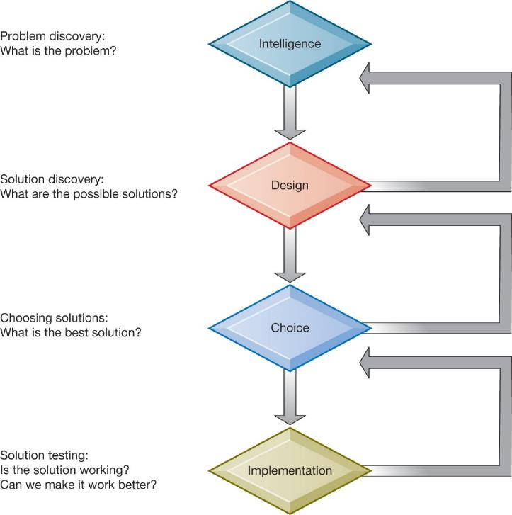
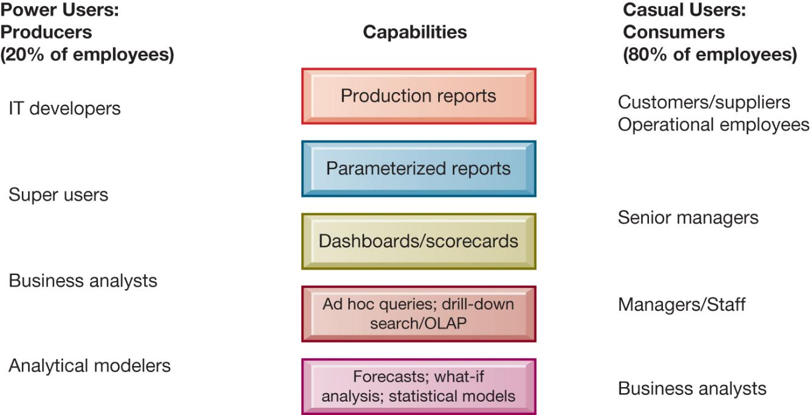
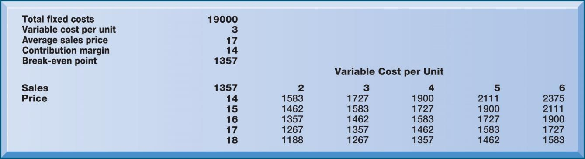
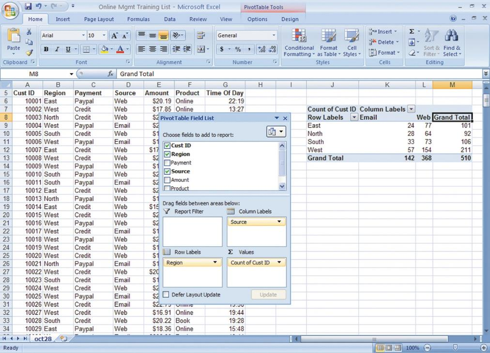
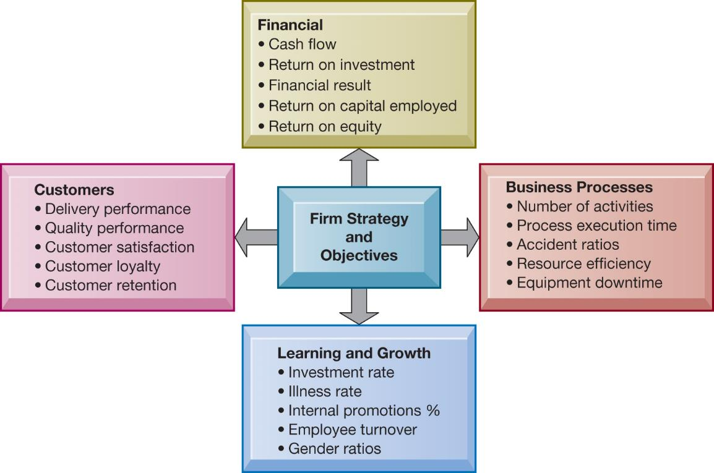
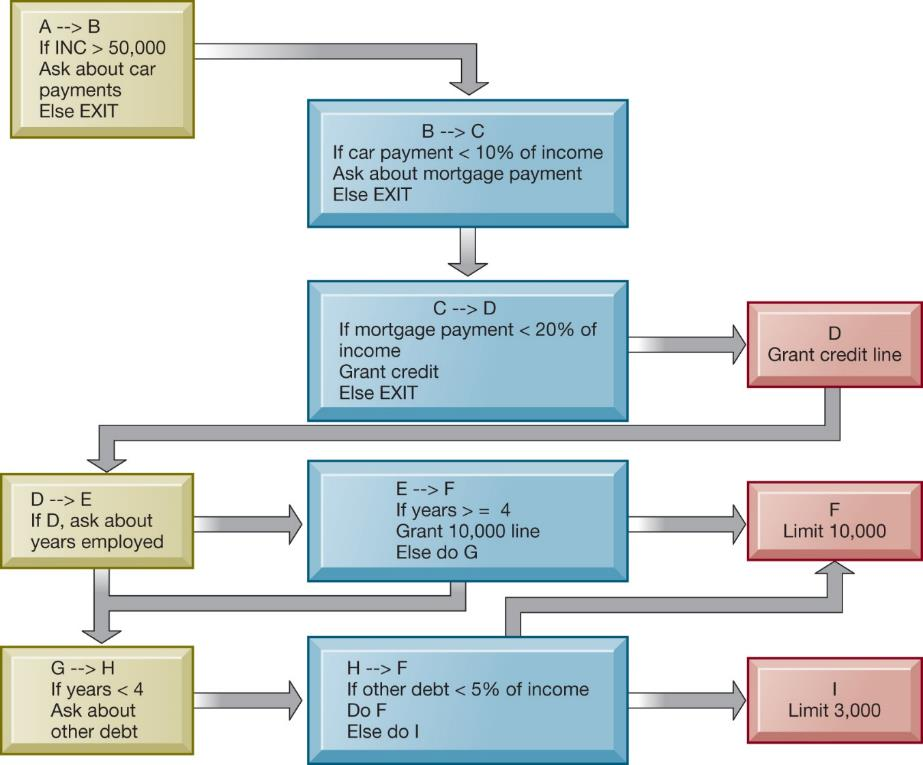
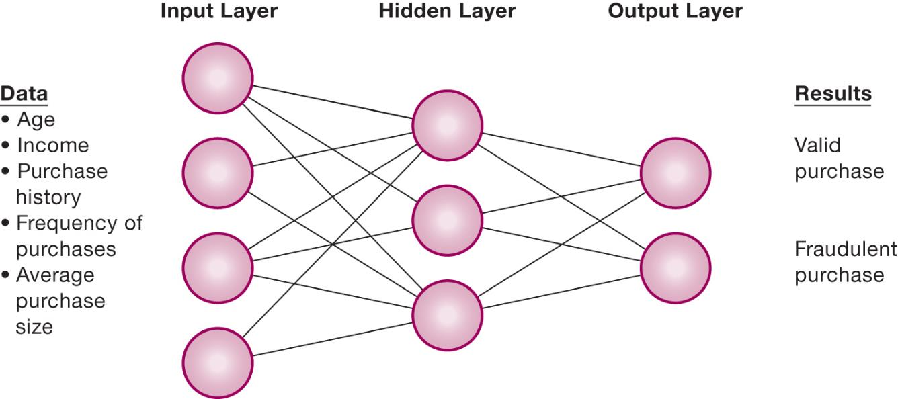
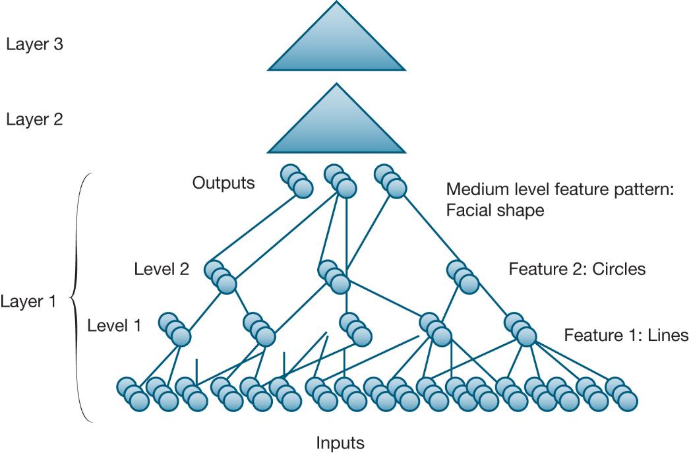
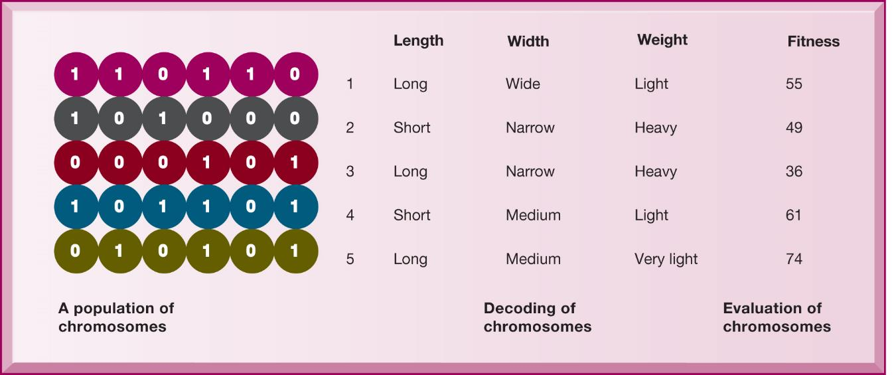

```{r, echo=FALSE, message=FALSE}
library(rstudioapi)
library(stringr)
library(tools)

this_file <- knitr::current_input()
this_file_split <- str_split(file_path_sans_ext(knitr::current_input()),"_")
this_title <- this_file_split[[1]][2]
this_session_no <- as.numeric(this_file_split[[1]][1])

source("../../Templates/render_toc.R")

```


---
class: segue, left, bottom

```{r message=FALSE, echo=FALSE, results='asis'}
pandoc.header(this_title, 1)
```
### ERP Systems

#### Dominik Böhler, Deggendorf Institute of Technology


---
class: agenda

Agenda
------

```{r, echo=FALSE, message=FALSE}
render_toc(this_file, toc_depth = 1)
```


---

Learning Components
-------------------

#### ERP Systems, Summer 2021


.pull-left[

### `r icon::fontawesome("book-open")` PREPARATION

Skim-read, get the essentials, prepare discussion. 


Laudon & Laudon (2020), ** Essentials of Management Information Systems**

Fourteenth Edition,
Global Edition.

.content-box-gray[
```{r, echo=FALSE, message=FALSE, results='asis'}
  
put_reading(this_session_no)

```
  ]
]

.pull-right[

### `r icon::fontawesome("chalkboard-teacher")` LECTURE

- Get perspectives and understanding
- Discuss with peers
- (maybe) Entertainment

### `r icon::fontawesome("rocket")` EXCERCISE

- Apply knowledge in practical excercises
- Build your digital skillset in a project
- Prepare directly for the exam
  
]


---

## Learning Objectives

__11.1__ What are the different types of decisions, and how does the decision-making process work?
__11.2__ How do business intelligence and business analytics support decision-making?
__11.3__ What is artificial intelligence (AI)? How does it differ from human intelligence?
__11.4__ What are the major types of AI techniques and how do they benefit organizations?


---

## Machine Learning Helps Akershus University Hospital Make Better Treatment Decisions

* Problem
  * Unstructured data
  * Very large volume of data
  * Opportunities from new technology
  
* Solutions
  * IBM Watson Explorer
  * Machine learning
  * Natural language processing
* Illustrates how information systems improve decision-making

---

## Business Value of Improved Decision Making

* Possible to measure value of improved decision making
* Decisions made at all levels of the firm
  * Some are common, routine, and numerous
  * Although value of improving any single decision may be small, improving hundreds of thousands of “small” decisions adds up to large annual value for the business

---

## Table 11.1 Business Value of Enhanced Decision Making

---

## Types of Decisions

* Unstructured
  * Decision maker must provide judgment to solve problem
  * Novel, important, nonroutine
  * No well-understood or agreed-upon procedure for making them
* Structured
  * Repetitive and routine
  * Involve definite procedure for handling them so do not have to be treated as new
* Semi-structured
  * Only part of problem has clear-cut answer provided by accepted procedure

---

## Figure 11.1 Information Requirements of Key Decision-Making Groups in a Firm



---

## The Decision-Making Process

 1. Intelligence
 Discovering, identifying, and understanding the problems occurring in the organization
 
 2. Design
 Identifying and exploring various solutions
 
 3. Choice
 Choosing among solution alternatives
 
 4. Implementation
 Making chosen alternative work and monitoring how well solution is working

---

## Figure 11.2 Stages in Decision Making



---

## High-Velocity Automated Decision Making

+ Humans eliminated
+ Decision-making process captured by computer algorithms
+ Predefined range of acceptable solutions
+ Decisions made faster than managers can monitor and control
+ E.g., Trading programs at electronic stock exchanges

---

## Quality of Decisions and Decision Making

+ Accuracy
+ Comprehensiveness
+ Fairness
+ Speed (efficiency)
+ Coherence
+ Due process

---

## What Is Business Intelligence?

* Infrastructure for managing data from business environment
  * Warehousing
  * Integrating
  * Reporting
  * Analyzing
* Hadoop, OLAP, Analytics
* Products defined by technology vendors and consulting firms

---

## The Business Intelligence Environment

Six elements in the BI environment:
1. Data from business environment
2. Business intelligence infrastructure
3. Business analytics toolset
4. Managerial users and methods
5. Delivery platform (MSS, DSS, ESS)
6. User interface

---

## Figure 11.3 Business Intelligence and Analytics for Decision Support


---

## Business Intelligence and Analytics Capabilities

* Production reports
* Parameterized reports
* Dashboards/scorecards
* Ad-hoc query/search/report creation
* Drill-down
* Forecasts, scenarios, models
  * Linear forecasting, what-if scenario analysis, data analysis

---

## Table 11.3 Examples of Predefined Business Intelligence Production Reports

---

## Interactive Session – Technology: Siemens Makes Business Processes More Visible

* Class discussion
  * Identify the problem in this case study. What people, organization, and technology factors contributed to the problem?
  * Describe the capabilities of process mining software. Was this an effective solution? Explain your answer.
  * How did process mining change decision making at Siemens?
  * What people, organization, and technology issues need to be addressed when implementing process mining systems?

---

## Predictive Analytics

* Uses statistical analytics, data mining, historical data; assumptions of future conditions
* Extracts information from data to predict future trends and behavior patterns
  * Responses to direct marketing campaigns
  * Best potential customers for credit cards
  * At-risk customers
  * Customer response to price changes and new services
* Accuracies range from 65 to 90 percent

---

## Big Data Analytics

* Predictive analytics can use the big data generated from social media, consumer transactions, sensor and machine output, etc.
* Combining with customer data
* Big data analytics driving move toward “smart cities”
  * Utility management
  * Transportation operation
  * Healthcare delivery
  * Public safety

---

## Operational Intelligence and Analytics

* Operational intelligence
  * Day-to-day monitoring of business decisions and activity
* Real-time monitoring
* Schneider National truckload logistics services provider
  * Data developed from sensors in trucks, trains, industrial systems
* The Internet of Things (IoT) providing huge streams of data from connected sensors and devices

---

## Location Analytics and GIS

* Location analytics
  * Big data analytics that uses location data from mobile phones, sensors, and maps
  * E.g. Helping a utility company view customer costs as related to location
* GIS– Geographic information systems
  * Help decision makers visualize problems with mapping
  * Tie location data about resources to map

---

## Figure 11.4 Business Intelligence Users



---

## Support for Semi-Structured Decisions

* Decision-support systems (D S S)
  * B Idelivery platform for “super-users” who want to create own reports, use more sophisticated analytics and models
  * What-if analysis
  * Sensitivity analysis
  * Backward sensitivity analysis
  * Pivot tables: Spreadsheet function for multidimensional analysis
  * Intensive modeling techniques

---

## Figure 11.5 Sensitivity Analysis



---

## Figure 11.6 A Pivot Table That Examines Customer Regional Distribution and Advertising Source



---

## Decision Support for Senior Management (1 of 2)

* Executive support systems
* Balanced scorecard method
  * Measures four dimensions of firm performance
    * Financial
    * Business process
    * Customer
    * Learning and growth
  * Key performance indicators (K P I) used to measure each dimension

---

## Figure 11.7 The Balanced Scorecard Framework



---

## Decision Support for Senior Management (2 of 2)

* Business performance management (BPM)
  * Management methodology based on firm’s strategies
  * Translates strategies into operational targets
  * Uses set of KPIs to measure progress toward targets
* ESS combine internal data with external
  * Financial data, news, etc.
* Drill-down capabilities

---

## Artificial Intelligence Techniques

* Artificial intelligence:Grand vision vs. narrow definition
* Evolution of AI
  * Big data databases
  * Reduction in the price of processors
  * Expansion in capacity of processors
  * Refinement and explosion of algorithms
  * Large investments in IT and AI
* Progress in image recognition and natural language
  * E.g.: Siri, Alexa, facial recognition

---

## What Are the Major Types of AI Techniques and How Do They Benefit Organizations? (1 of 5)

* Expert systems
  * Capture human expertise in a limited domain of knowledge
  * Express expertise as a set of rules in a software system
  * Knowledge base
  * Inference engine

---

## Figure 11.8 Rules in an Expert System



---

## What Are the Major Types of AI Techniques and How Do They Benefit Organizations?(2 of 5)

* Machine learning
  * Computers improving performance by using algorithms to learn patterns from data and examples
* Neural networks
  * Find patterns and relationships in very large amounts of data
  * Sensoring and processing nodes
  * “Deep Learning” neural networks

---

## Figure 11.9 How a Neural Network Works



---

## Figure 11.10 A Deep Learning Network



---

## What Are the Major Types of AI Techniques and How Do They Benefit Organizations?(3 of 5)

* Genetic algorithms
  * Examine large number of solutions for a problem
  * Based on machine learning techniques inspired by evolutionary biology

---

## Figure 11.11 The Components of a Genetic Algorithm



---

## What Are the Major Types of AI Techniques and How Do They Benefit Organizations?(4 of 5)

* Natural language processing
  * Software that can process voice or text commands using natural human language
* Computer vision systems
  * Emulate human visual system to view and extract information from real-world images
* Robotics
  * Design and use of movable machines that can substitute for humans

* Intelligent Agents
  * Software programs that imitate humans and perform tasks on command
  * The agent uses a limited built-in or learned knowledge base
  * Accomplish tasks or make decisions on the user’s behalf, e.g. chatbots finding cheap fares, routing calls in a call center

--- 
## Bibliography

Marr, Bernard. Artificial Intelligence in Practice : How 50 Successful Companies Used AI and Machine Learning to Solve Problems, John Wiley & Sons, Incorporated, 2019. ProQuest Ebook Central, https://ebookcentral.proquest.com/lib/th-deggendorf/detail.action?docID=5751846.

