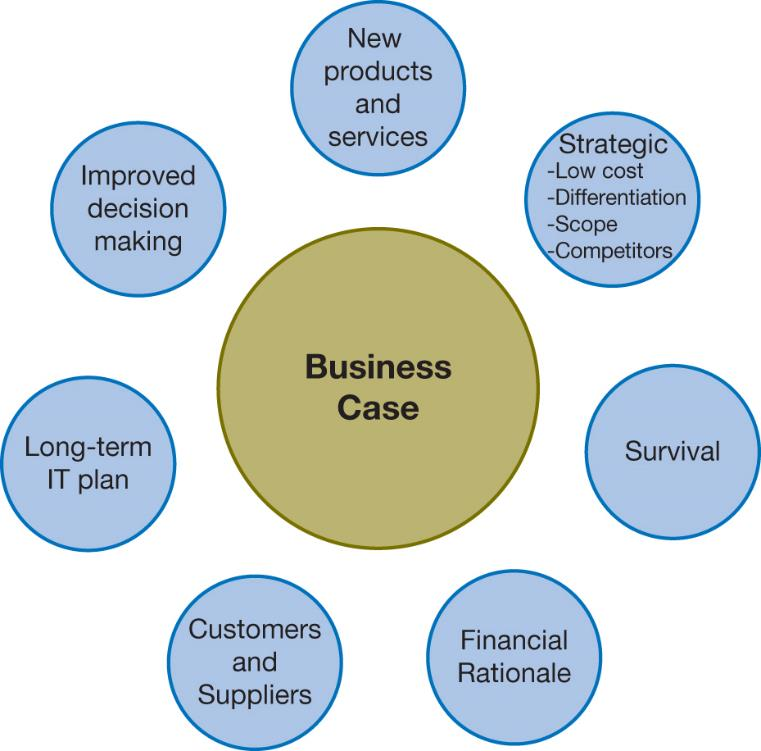
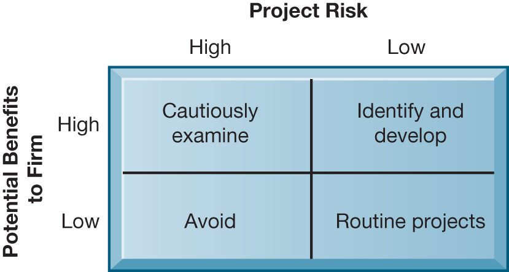
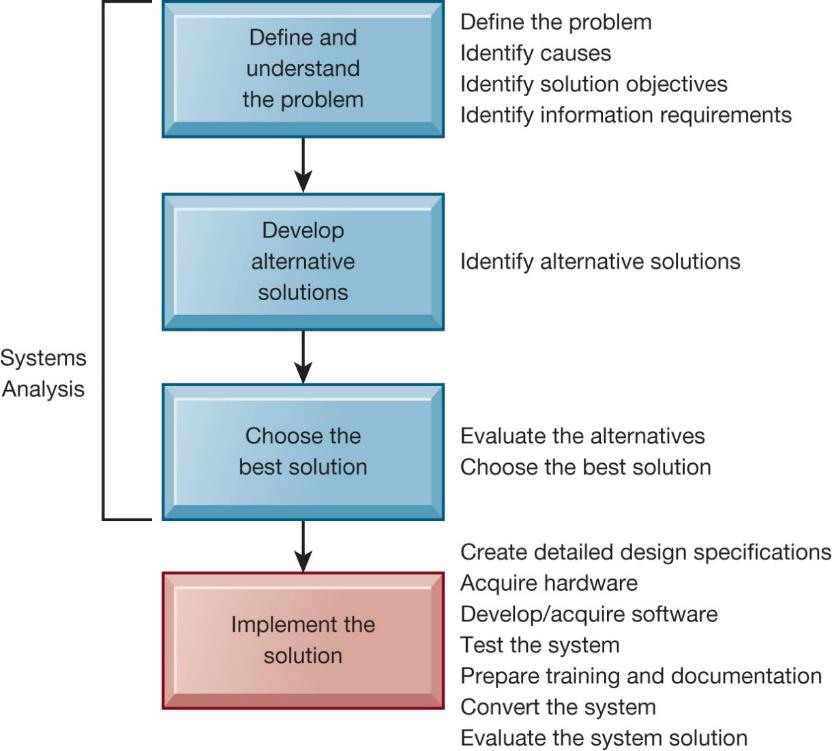
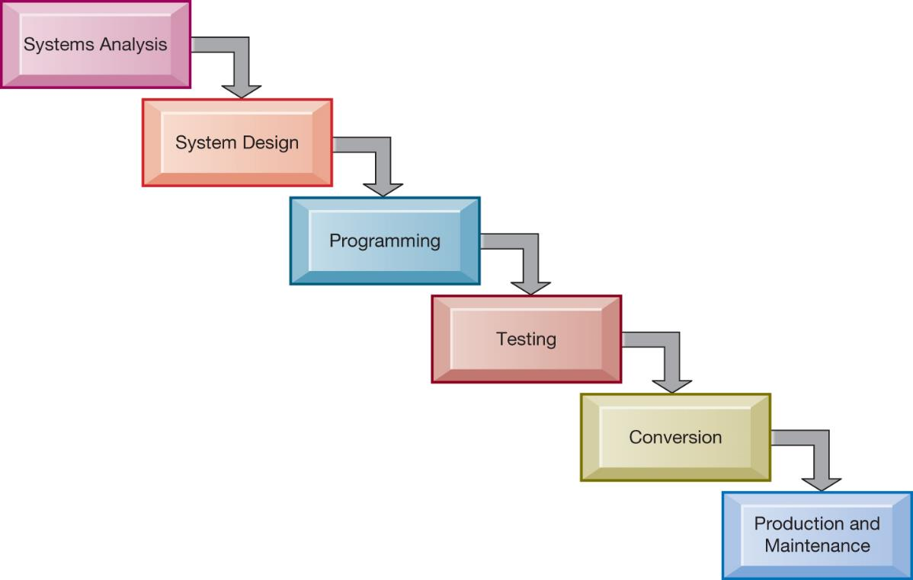
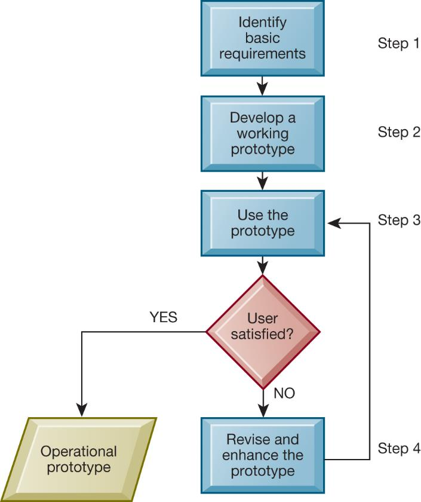
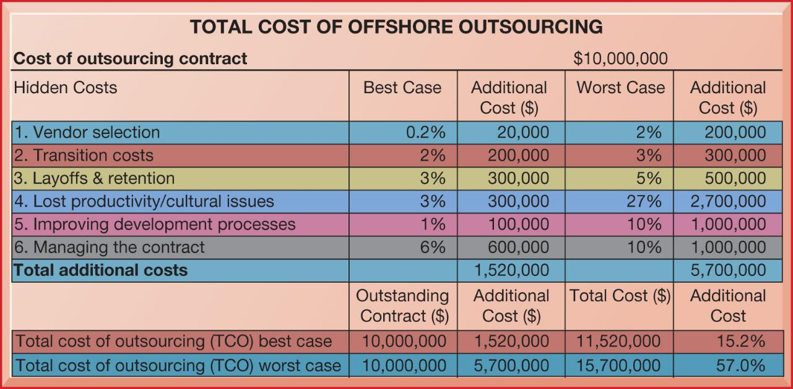

```{r, echo=FALSE, message=FALSE}
library(rstudioapi)
library(stringr)
library(tools)

this_file <- knitr::current_input()
this_file_split <- str_split(file_path_sans_ext(knitr::current_input()),"_")
this_title <- this_file_split[[1]][2]
this_session_no <- as.numeric(this_file_split[[1]][1])

source("../../Templates/render_toc.R")

```


---
class: segue, left, bottom

```{r message=FALSE, echo=FALSE, results='asis'}
pandoc.header(this_title, 1)
```
### ERP Systems

#### Dominik Böhler, Deggendorf Institute of Technology


---
class: agenda

Agenda
------

```{r, echo=FALSE, message=FALSE}
render_toc(this_file, toc_depth = 1)
```


---

Learning Components
-------------------

#### ERP Systems, Summer 2021


.pull-left[

### `r icon::fontawesome("book-open")` PREPARATION

Skim-read, get the essentials, prepare discussion. 


Laudon & Laudon (2020), ** Essentials of Management Information Systems**

Fourteenth Edition,
Global Edition.

.content-box-gray[
```{r, echo=FALSE, message=FALSE, results='asis'}
  
put_reading(this_session_no)

```
  ]
]

.pull-right[

### `r icon::fontawesome("chalkboard-teacher")` LECTURE

- Get perspectives and understanding
- Discuss with peers
- (maybe) Entertainment

### `r icon::fontawesome("rocket")` EXCERCISE

- Apply knowledge in practical excercises
- Build your digital skillset in a project
- Prepare directly for the exam
  
]


---

## Learning Objectives

__12.1__ How should managers build a business case for the acquisition and development of a new information system?

__12.2__ What are the core problem-solving steps for developing a new information system?

__12.3__ What are the alternative methods for building information systems?

__12.4__ How should information systems projects be managed?

__12.5__ How will MIS help my career?


---

# Key Business Case Considerations

+ IT is an investment of corporate funds. Is it worth it?
+ What is the rationale for investment?
+ How will the system fit with firm’s strategic goals?
+ How does the system provide value?
+ What are the risks? Alternative solutions?
+ How will the firm’s culture, processes, and systems need to change?

---

## Figure 12.1 Factors to Consider in Making the Business Case



---

## The Information Systems Plan

+ Overview of plan contents
+ Strategic business plan rational
+ Current systems
+ New developments
+ Management strategy
+ Implementation of the plan
+ Budget

---

## Selecting Projects

* Determining project costs and benefits
  * Tangible benefits
  * Intangible benefits
  * Capital budgeting methods
* Information systems plan
* Portfolio analysis
* Scoring model

---

## Figure 12.2 A System Portfolio Analysis



---

## Scoring Model for Selecting Alternatives

Used to evaluate alternative system projects, especially when many criteria exist

Assigns weights to various features of system and calculates weighted totals

Many qualitative judgments involved

Requires experts who understand the issues and the technology

See Table 12.2 Example Scoring Model in text

---

# Building a Business Case

* New information systems are built as solutions to problems
* Four steps to building an information system
  * Define and understand the problem
  * Develop alternative solutions
  * Choose a solution
  * Implement the solution
* The first three steps are called systems analysis

---

## Determining Solution Costs and Benefits

* Tangible benefits
  * Measurable monetary value
  * E.g. lower costs, higher sales
* Intangible benefits
  * Better customer service
  * Enhanced or faster decision making
* See Table 12.3 in text Costs and Benefits of Information Systems

---

## Capital Budgeting for Information Systems

* Capital budgeting models
  * Measure value of long-term capital investment projects
  * Rely on measures of the firm’s cash outflows and inflows
* Principal capital budgeting models evaluate IT projects
  * Payback method
  * Accounting rate of return on investment (ROI)
  * Net present value
  * Internal rate of return (IRR)
* Limitations of financial models
* See Figure 12.3 in text

---

## Figure 12.4 Developing an Information System Solution



---

## Evaluating and Choosing Solutions

* Feasibility study:
  * Is solution feasible from financial, technical, and organizational standpoint?
* Systems proposal report
  * Describes, for each alternative solution
    * Costs and benefits
    * Advantages and disadvantages

---

# Implementing the Solution

* Systems design
* Completing implementation
  * Hardware selection and acquisition
  * Software development and programming
  * Testing
  * Training and documentation
  * Conversion
  * Production and maintenance
* Managing the change

---

## Traditional Systems Development Lifecycle

+ SLDC: Oldest method for building information systems
+ Phased approach with formal stages
+ Waterfall approach
+ Formal division of labor
+ Used for building large, complex systems
+ Time consuming and expensive to use

---

## Figure 12.6 The Traditional Systems Development Life Cycle



---

## Prototyping

* Preliminary model built rapidly and inexpensively
* Four-step process
  * Identify the user’s basic requirements
  * Develop an initial prototype
  * Use the prototype
  * Revise and enhance the prototype
* Especially useful in designing a user interface

---

## Figure 12.7 The Prototyping Process



---

## End-User Development

+ End users create simple information systems with little or no assistance from specialists
+ Completed more rapidly than systems developed with conventional tools
+ Often leads to higher level of user involvement and satisfaction with systems
+ Cannot handle large numbers of transactions
+ Organizational risks

---

## Application Software Packages, Software Services, and Outsourcing

* Request for Proposal (RFP)
* Application software packages and cloud software packages
  * Generalized systems for universal functions with standard processes
  * Customization features
* Outsourcing
  * Domestic outsourcing
  * Offshore outsourcing

---

## Figure 12.8 Total Cost of Offshore Outsourcing



---

## Mobile Application Development

* Mobile websites, web apps
* Native apps
* Different requirements for mobile devices than for PCs
  * Reduced size of screens
  * Touch screens
  * Saving resources: bandwidth, memory, processing, data entry
* Responsive web design

---

## Interactive Session – Technology: Systems Development is Different for Mobile Applications

* Class discussion
  * What people, organization, and technology issues need to be addressed when building mobile applications?
  * How does user requirement definition for mobile applications differ from that in traditional systems analysis?

---

## Rapid Application Development

* Need for agility, scalability, and fast-cycle techniques
* Rapid application development (RAD)
  * Creating workable systems in a very short period of time
* Joint application design (JAD)
  * End users and information systems specialists working together on design
* Agile development
* DevOps

---

## Component-Based Development and Web Services

* Component-based development
  * Groups of objects that provide software for common functions (e.g., online ordering) and can be combined to create large-scale business applications
* Web services
  * Reusable software components that use XML and open Internet standards (platform independent)
  * Enable applications to communicate with no custom programming required to share data and services
* Cloud-based solutions: online development

---

# Project Management Objectives

* Project management
  * Application of knowledge, skills, tools, and techniques to achieve targets within specified budget and time constraints
* Five major variables:
  * Scope
  * Time
  * Cost
  * Quality
  * Risk

---

## Managing Project Risk and System-Related Change

* Implementation and change management
  * Implementation
  * User-designer communications gap
* Controlling risk factors
  * Formal planning and tools
  * Gantt chart, PERT chart
  * Project management software
* Overcoming user resistance
  * Ergonomics
  * Organizational impact analysis

