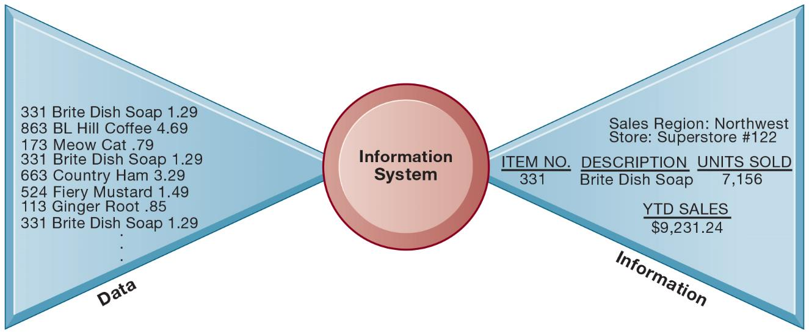
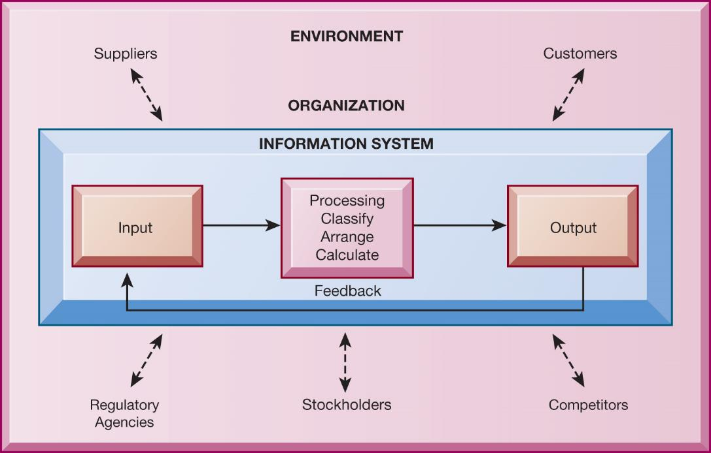
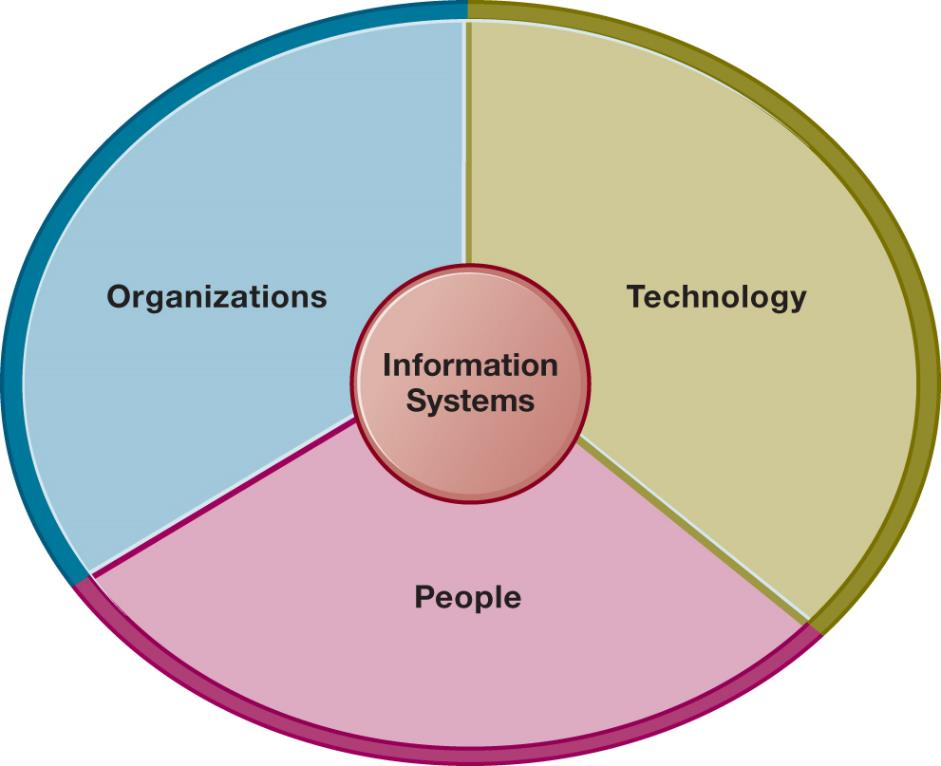
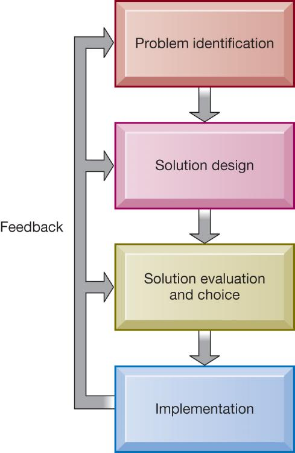

```{r, echo=FALSE, message=FALSE}
library(rstudioapi)
library(stringr)
library(tools)

this_file <- knitr::current_input()
this_file_split <- str_split(file_path_sans_ext(knitr::current_input()),"_")
this_title <- this_file_split[[1]][2]
this_session_no <- as.numeric(this_file_split[[1]][1])

source("../../Templates/render_toc.R")

```


---
class: segue, left, bottom

```{r message=FALSE, echo=FALSE, results='asis'}
pandoc.header(this_title, 1)
```
### ERP Systems

#### Dominik Böhler, Deggendorf Institute of Technology


---
class: agenda

Agenda
------

```{r, echo=FALSE, message=FALSE}
render_toc(this_file, toc_depth = 1)
```


---

Learning Components
-------------------

#### ERP Systems, Summer 2021


.pull-left[

### `r icon::fontawesome("book-open")` PREPARATION

Skim-read, get the essentials, prepare discussion. 


Laudon & Laudon (2020), ** Essentials of Management Information Systems**

Fourteenth Edition,
Global Edition.

.content-box-gray[
```{r, echo=FALSE, message=FALSE, results='asis'}
  
put_reading(this_session_no)

```
  ]
]

.pull-right[

### `r icon::fontawesome("chalkboard-teacher")` LECTURE

- Get perspectives and understanding
- Discuss with peers
- (maybe) Entertainment

### `r icon::fontawesome("rocket")` EXCERCISE

- Apply knowledge in practical excercises
- Build your digital skillset in a project
- Prepare directly for the exam
  
]

---

Learning Objectives
-------------------

__1.1__ Why are information systems so essential for running and managing a business today?

__1.2__ What exactly is an information system? How does it work? What are its people, organizational, and technology components?

__1.3__ How will a four-step method for business problem solving help you solve information system-related problems?

__1.4__ What information systems skills and knowledge are essential for healthcare careers?

__1.5__ How will IS help my career?


---

Non-Objectives
--------------

__1.1.__ You will NOT learn how to use an information system or ERP System

__1.2.__ We only touch upon theory from time to time. This is a practical course :-)

__1.3.__ You will NOT learn how to customize off-the-shelf ERP Systems

---

Video Case Studies
==================

<!-- TODO  Enter Healthcare Video Cases Study
      - IBM Watson
      - Current Situation in GER
      - IDEA: Vision vs. Reality in GER
-->


---
class: segue-red

# From ERP Systems to Management Information Systems


---
background-image:url(https://media1.giphy.com/media/XgE4LlECZjw6k/giphy.gif)

## One Ring to Rule them All - The (old) Idea of One Integrated Monolithical System

 

---

## Let's unwrap the term ERP together


.fl.w-third[
  Enterprises
  ]

.fl.w-third[
  Resources
  ]
  
.fl.w-third[
  Planning
  ]
    
    
    
---

## Enterprises - What is you perspective on Organization?

- What is organized? Organized == Ordered?
- How can you enforce coordinated action?
- Information only? 
- Leadership + Real-time Information (True Agility)


---

## Resources - What is and what will be valuable

.content-box-blue[

#### In the digital Age some of the basic presumptions of the industrial economy are being challenged

]

.columns-2[
  .content-box-army[
    Old Economy:
    
    - Physical Goods
    - Protection of IP
    - Local Recombination of Physical Goods
    - Economies of Scale
    - Linearity]

  .content-box-yellow[
    New Economy:
  
    - Virtual Goods
    - Sharing of Ideas
    - Global Real-time Collaboration
    - Network Effects
    - Complexity]
]


---

## Planning 
#### How are we supposed to know what we did until we did it?

- Switch from a producer to a consumer-centric industrial production
- From:  Mass Custumization, 3D-Printing, Industry 4.0
- To: Hyperpersonlization and Servitization


---

## Wrap-up

- ERP-Systems put strict models on current sitations 
- Reasonable in particular "Standard Processes"
- However, less and less "Standard Processes" more Agility
- Less Orders, More Discourse

<!-- 
TODO Images 
-->


---
class: segue, center, middle

## SO, LET'S TALK ABOUT **INFORMATION SYSTEMS**


---
class: segue, center, middle

## ... AND SOME ERP **(but later...) **


---
class: segue-red

# The Digital Revolution

---

## The advent and connection of digital technologies fueled digital transformation

*__Industrial Age__: Technology has fundamentally changed business.
*__Information Age:__ Production, distribution, control of information primary economic drivers.
*__Digital Transformation:__ New forms of work and value creation emerge.

.content-box-gray[**WHAT'S NEXT?!**]

---

## Understanding the Forces Pushing the Evolution of New Digital Devices

####Bell’s Law

```{r, message=FALSE, echo=FALSE}

library(vistime)

data <- data.frame(
  event = c("Main Frame", "PC"        ,"Cloud Computing", "Smartphones", "Quantum Computer"),
  start   = c("1945-01-01", "1975-01-01", "1995-01-20"    , "2008-01-01" , "2017-01-01"),
  end     = c("1995-01-01", "2021-01-01", "2021-01-01"    , "2021-01-01" , "2021-01-01"),
  group   = "Consumer"
)

hc_vistime(data, width = "100%", height = "60%")

```


???

- New class of computers establishes a new industry each decade.
- New platforms, programming environments, industries, networks, and information systems.
- Understand how next digital evolution will affect businesses.
- What an industry does and how does it will change.


---
## Gartner Hypecycle


???

[Understanding the Hype Cycle](https://www.gartner.com/en/documents/3887767/understanding-gartner-s-hype-cycles)
[Hype Cycle History](https://flowingdata.com/2020/10/14/visual-tour-through-the-technology-hype-cycle/)
[DataSet 1995-2020](https://drive.google.com/file/d/1y_fzgknqRdPa0KfXiGq44blGqDN3NYv3/view?usp=sharing)

---

## Moore's Law - The number of Transistors per Microprocessor doubles every .can-edit[XX] months?


```{r, echo=FALSE, message=FALSE}

#library(ggplot2)
#library(dplyr)
#library(plotly)
#library(hrbrthemes)
#library(lubridate)

#data <- read.csv("1_DATA_transistors-per-microprocessor.csv", header = TRUE)
#data$Year <- ymd(sprintf("%d-01-01",data$Year))

# head(data)

# Usual area chart
#p <- data %>%
#  ggplot( aes(x=Year, y=Transistors.per.microprocessor)) +
#    geom_area(fill="#69b3a2", alpha=0.5) +
#    geom_line(color="#69b3a2")

# Turn it interactive with ggplotly
#p <- ggplotly(p, width =  1000)
#p

```

???

Source: [Karl Rupp - GitHub Repo](https://github.com/karlrupp/microprocessor-trend-data)


---
class: video

<iframe width="100%" height="100%" src="https://www.youtube.com/embed/7uvUiq_jTLM" frameborder="0" allow="accelerometer; autoplay; clipboard-write; encrypted-media; gyroscope; picture-in-picture" allowfullscreen></iframe>

---
class: segue-red, center, middle

## Interactive Execercise 2

Let's head to Miro!

---

## Technological Change is Accelerating

Bell’s Law: Today’s highly successful business could be bankrupt quickly because technology changed and it didn’t.

> Example: Blockbuster
* In 2004, Blockbuster had $5.9B in revenues
* In 2010, Blockbuster filed for bankruptcy
* High-speed network connections and streaming video changed the competitive landscape

.content-box-gray[
- Which other industries have been strongly affected by Digital Transformation?
- Which Industries may suffer from the spread of Quantum Computing and AI?
]

---
class: segue-red, middle, center

# How Information Systems are Transforming Business and Organizations


---
class: picture-cols-3

## Key Challenges in Management Information Systems

<!-- TODO: Find good study on this! -->

.fl.w-third[
<!-- TODO: Find Image for New Tech-->
   **New technologies**
  - Artificial intelligence
  - Cloud computing, Big Data, Internet of Things
  - Mobile digital platform
]

.fl.w-third[
<!-- TODO: Find image for Management -->
  **Management**
  - Return on investment (ROI)
  - Online collaboration
  - Social networking
]

.fl.w-third[
<!-- TODO: Find image for  Organizations -->
  **Organizations**
  - Security and privacy
  - Social business
  - Telework gains
]


???

In our current environment the key challenges for Management Information Systems are in coping with new technologies, (performance) Management, and organizing IT Systems. Due to the rapid and somewhat forced virtualization of all enterprises these are almost identical to General Management Challenges. The question arises if there is a substantial difference between General and IS Management at the moment and also in the future.

---

## Globalization Challenges and Opportunities: A Flattened World

Internet and global communications have greatly reduced economic and cultural advantages of developed countries.

  - Drastic reduction of costs of operating and transacting on global scale
  - Competition for jobs, markets, resources, ideas
  - Dependence on imports and exports
  - Requires new understandings of skills, markets, opportunities


---
class: list-overview


## Business Drivers of Information Systems

Businesses invest in IT to achieve six important business objectives.

- Operational excellence
- New products, services, and business models
- Customer and supplier intimacy
- Improved decision making
- Competitive advantage
- Survival


---

## Operational Excellence

* Improved efficiency results in higher profits.
* Information systems and technologies help improve efficiency and productivity.
* Example: Walmart
  * Power of combining information systems and best business practices to achieve operational efficiency—and over $514 billion in sales in 2019
  * Most efficient retail store in world as result of digital links between suppliers and stores

---

## New Products, Services, and Business Models

<!-- TODO Apple Business Model -->

???

* Information systems and technologies enable firms to create new products, services, and business models.
* Business model: how a company produces, delivers, and sells its products and services
* Example: Apple
  * Transformed old model of music distribution with iTunes
  * Constant innovations—iPod,iPhone,iPad, etc.

---

## Customer and Supplier Intimacy

* Customers who are served well become repeat customers who purchase more.
  * Mandarin Oriental Hotel uses IT to foster an intimate relationship with its customers, keeping track of preferences, and so on
* Close relationships with suppliers result in lower costs.
  * JCPenney
    * IT to enhance relationship with supplier in Hong Kong

---

## Improved Decision Making

If managers rely on forecasts, best guesses, and luck, they will misallocate employees, services, and inventory.

Real-time data improves ability of managers to make decisions.

Verizon: web-based digital dashboard to update managers with real-time data on customer complaints, network performance, and line outages

---

## Competitive Advantage

* Often results from achieving previous business objectives
* Advantages over competitors:
  * Charging less for superior products, better performance, and better response to suppliers and customers
  * Examples: Apple, Walmart, andU P Sare industry leaders because they know how to use information systems for this purpose

---

## Survival

* Businesses may need to invest in information systems out of necessity; it is simply the cost of doing business.
* Keeping up with competitors
  * Citibank’s introduction ofA T Ms
* Federal and state regulations and reporting requirements
  * Toxic Substances Control Act and the Sarbanes-Oxley Act

---

# What Is an Information System?

* Information technology: the hardware and software a business uses to achieve objectives
* Information system: interrelated components that manage information to:
  * Support decision making and control
  * Help with analysis, visualization, and product creation
* Data: streams of raw facts
* Information: data shaped into meaningful, useful form

* Activities in an information system that produce information:
  * Input
  * Processing
  * Output
  * Feedback
  
* Sharp distinction between __computer__ or __computer program__ versus __information system__

---

## Figure 1.1 Data and Information

{height=80%, width=80%}

---

## Figure 1.2 Functions of an Information System

{height=80%, width=80%}

---

## The Role of People and Organizations

* Information systems literacy
  * Includes behavioral and technical approach
* Computer literacy
  * Focuses mostly on knowledge ofI T
* Management information systems (M I S)
  * Focuses on broader information systems literacy
  * Issues surrounding development, use, impact of information systems used by managers and employees
  * Focuses on firm performance, productivity, and competitive challenges

---

## Figure 1.3 Information Systems Are More Than Computers

{height=80%, width=80%}

---

## Dimensions of Information Systems

.fl.w-third[
 ### Organizations
  - Coordinate work through structured hierarchy and business processes
  - Business processes: related tasks and behaviors for accomplishing work
  ]

.fl.w-third[
  ### People
   - Information systems require skilled people to build, maintain, and use them.
   - Employee attitudes affect their ability to use systems productively.
  ]
  
.fl.w-third[
  ### Technology
  * IT Infrastructure: Foundation or platform that information systems are built on
    * Computer hardware
    * Computer software
    * Data management technology
    * Networking and telecommunications technology
  ]


---
## CRITICAL THINKING: <br \> In the Digital Age, do these statements hold true?

### Statement on Organizational Structure
> Coordinate work through structured hierarchy and business processes

### Statement on Management
> Role of managers:
    - Perceive business challenges
    - Set organizational strategy
    - Allocate human and financial resources
    - Creative work: new products, service
    
---

## Interactive Session – Technology: US Competes Globally with Information Technology

* Class discussion
  * What are the inputs, processing, and outputs of UPS’s package tracking system?
  * What technologies are used by UPS? How are these technologies related to UPS’s business strategy?
  * What strategic business objectives do UPS’ sinformation systems address?
  * What would happen if UPS’ sinformation systems were not available?

---

# A Problem-solving Mindset

* Few business problems are simple or straightforward.
* Most business problems involve a number of major factors that can fall into three main categories:
  * Organization
  * Technology
  * People

---

## A Model of the Problem-Solving Approach

Problem solving: four-step process
  * Problem identification
  * Solution design
  * Choice
  * Implementation

---

## Problem identification includes:
  * Agreement that problem exists
  * Definition of problem
  * Causes of problem
  * What can be done given resources of firm
  
---

## Typical organizational problems

  * Outdated business processes
  * Unsupportive culture and attitudes
  * Political in-fighting
  * Turbulent business environment, change
  * Complexity of task
  * Inadequate resources
  
---

## Typical technology problems

  * Insufficient or aging hardware
  * Outdated software
  * Inadequate database capacity
  * Insufficient telecommunications capacity
  * Incompatibility of old systems with new technology
  * Rapid technological change

---

## Typical people problems
  * Lack of employee training
  * Difficulties of evaluating performance
  * Legal and regulatory compliance
  * Work environment, ergonomics
  * Poor or indecisive management
  * Lack of employee support and participation


---
## Solution design
  * Often many possible solutions
  * Consider as many as possible to understand range of solutions

---
## Solution Evaluation and Choice – factors include:
  * Cost
  * Feasibility given resources and skills
  * Length of time needed to implement solution


---
## Implementation
  * Building or purchasing solution
  * Testing solution, employee training
  * Change management
  * Measurement of outcomes
  * Feedback, evaluation of solution
* Problem solving is a continuous process, not a single event
  * Sometimes chosen solution doesn’t work or needs adjustment

---

## Figure 1.4 Problem Solving Is a Continuous Four-Step Process

{height=80%, width=80%}

---

## The Role of Critical Thinking in Problem Solving (1 of 2)

* Without critical thinking, easy to jump to conclusions, misjudge a problem, and waste resources
* Critical thinking:
  * Sustained suspension of judgment with an awareness of multiple perspectives and alternatives
  * Ability to collect and analyze data that might help understand the nature of the problem; a “data driven” approach

* Four elements of critical thinking:
  * Maintaining doubt and suspending judgment
  * Being aware of different perspectives

    * Including technology, organization, and people perspectives
  * Testing alternatives and letting experience guide
  * Being aware of organizational and personal limitations

---

## The Connections Among Business Objectives, Problems, and Solutions

When firms cannot achieve business objectives these objectives become challenges.

Information systems often present solutions, partially or fully, to these challenges.

---

## How Information Systems Will Affect Business Careers

- Success in today’s job market requires a broad set of skills.
- Job candidates must have problem-solving skills as well as technical skills so that they can complete specific tasks.
- The service sector will account for 95 percent of the new jobs that are created or open up by 2022.

.panelset[
  
  .panel[.panel-name[Accounting]
      Accountants increasingly rely on information systems to summarize transactions, create financial records, organize data, and perform financial analysis.
    
    Skills:
    - Knowledge of databases and networks
    - Online financial transactions and reporting systems
    - How systems are used to achieve accounting functions
    
    ]
    
  .panel[.panel-name[Finance]
    Relationship between information systems and financial management and services is so strong that many advise finance majors to co-major in information systems.
    
    Skills:
    - Use systems for financial reporting, direct investment activities, implementation of cash management strategies
    - Plan, organize, implement information systems strategies for the firm
    
    ]
  
  .panel[.panel-name[Marketing]
    No field has undergone more technology-driven change in the past five years than marketing and advertising.
    
    Skills:
    - Work with databases for tracking and reporting on customer behavior, product performance, customer feedback, product development
    - Enterprise systems for product management, sales force management, customer relationship management
    
    ]
  
  .panel[.panel-name[Operations]
     Operations management in services and manufacturing: Production managers, administrative service managers, and operations analysts
  
    Skills:
    - Hardware and software platforms for operations management
    - Use database and analytical software for coordinating and optimizing resources required for producing goods and services

  
  ]
  
  .panel[.panel-name[Management]
    The job of management has been transformed by information systems. Impossible to manage business today without information systems
    
    Skills:
    - Use of information systems for each function of job, from desktop productivity tools to applications coordinating the entire enterprise
  ]
  
  .panel[.panel-name[Information Systems]
    Fast changing and dynamic profession because information technologies are among most important tools for achieving business firms’ key objectives. Domestic and offshore outsourcing
  
    Skills:
    - Uses of new and emerging hardware and software to achieve six business objectives
    - An ability to take a leadership role in the design and implementation of new information systems
  ]
  
  .panel[.panel-name[Outsourcing]
  Two types: outsourcing to domestic U.S. firms and outsourcing to low-wage countries such as India, China. Production programming, system maintenance, call centers
  
  Benefits:
  - Lower cost of building and maintaining systems within U.S. or Europe
  - Increased need for managerial positions
  ]
]


  


---

## Common requirements for all majors

  - How IT helps achieve six business objectives
  - Central role of databases
  - Business analytics and intelligence systems
  - Working with specialists and systems designers
  - Ethical, social, legal environment and issues and the Use of IT to meet legal requirements

---

# CLASS DISCUSSION – Will AI Kill Jobs in Healthcare?

```{r, echo=FALSE}
  library(countdown)
  countdown(minutes = 20)
```


--

.question[
    - Identify the problem described in this case study. In what sense is it an ethical dilemma?
]
    
--

.question[
    - Should more tasks be given to AI? Why or why not? Explain your answer.
]

--

.question[
    - Can the problem of AI reducing employment be solved? Explain your answer.
]


---

## How Will MIS Help My Career in Digital Healthcare?

- Research the Impact of AI and Quantum Computing on Healthcare
- Which Applications may become possible through Quantum Computing
- Which Routines may change through AI?


.excercise[ 
  
  EXCERCISE
  
  1. Get together in Groups of 2 (Random Zoom Assignment)
  2. Discuss with your peer about a clincal field/function
  3. Create a Hypotheses ("AI will/will not kill radiology")
  4. Find one supporting and one contradicting piece of evidence
  5. Bring your arguments together on 1 Slide (See here: )

]

```{r, echo=FALSE}
library(countdown)
countdown(minutes = 60)

```
