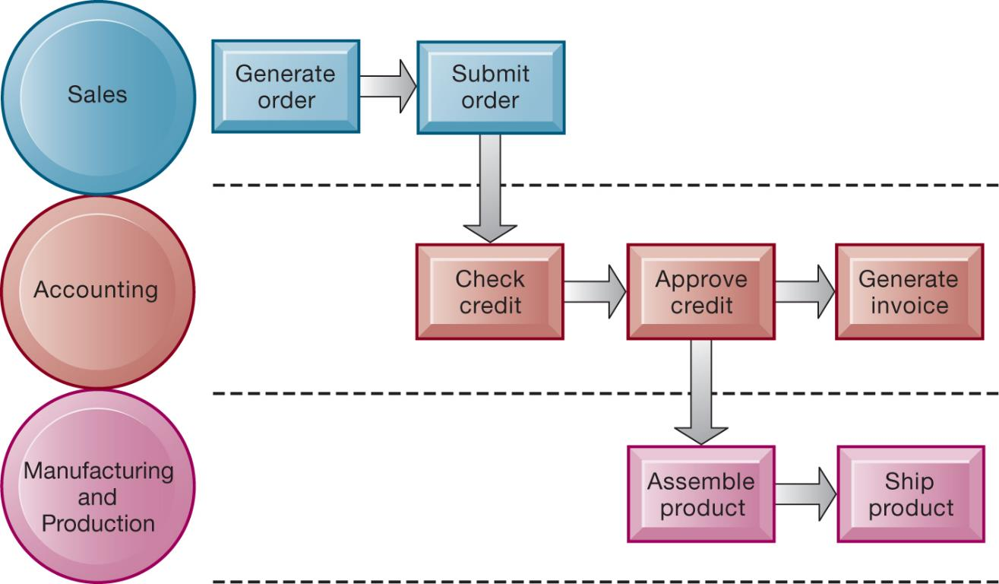

```{r, echo=FALSE, message=FALSE}
library(rstudioapi)
library(stringr)
library(tools)

this_file <- knitr::current_input()
this_file_split <- str_split(file_path_sans_ext(knitr::current_input()),"_")
this_title <- this_file_split[[1]][2]
this_session_no <- as.numeric(this_file_split[[1]][1])

source("../../Templates/render_toc.R")

```


---
class: segue, left, bottom

```{r message=FALSE, echo=FALSE, results='asis'}
pandoc.header(this_title, 1)
```
### ERP Systems

#### Dominik Böhler, Deggendorf Institute of Technology


---
class: agenda

Agenda
------

```{r, echo=FALSE, message=FALSE}
render_toc(this_file, toc_depth = 1)
```


---

Learning Components
-------------------

#### ERP Systems, Summer 2021


.pull-left[

### `r icon::fontawesome("book-open")` PREPARATION

Skim-read, get the essentials, prepare discussion. 


Laudon & Laudon (2020), ** Essentials of Management Information Systems**

Fourteenth Edition,
Global Edition.

.content-box-gray[
```{r, echo=FALSE, message=FALSE, results='asis'}
  
put_reading(this_session_no)

```
  ]
]

.pull-right[

### `r icon::fontawesome("chalkboard-teacher")` LECTURE

- Get perspectives and understanding
- Discuss with peers
- (maybe) Entertainment

### `r icon::fontawesome("rocket")` EXCERCISE

- Apply knowledge in practical excercises
- Build your digital skillset in a project
- Prepare directly for the exam
  
]

---

## Learning Objectives

__2.1__ What major features of a business are important for understanding the role of information systems?

__2.2__ How do systems serve different management groups in a business,and how do systems that link the enterprise improve organizational performance?

__2.3__ Why are systems for collaboration and social business so important,and what technologies do they use?

__2.4__ What is the role of the information systems function in a business?

__2.5__ How will MIS help my career?

---
class: segue-red

# Organization and Business Processes

---

## Enterprise Social Networking creates a More Innovative Connected Organization

Take a look at Slacks's Customer Success Stories: https://slack.com/customer-stories

- How did Slack help these companies? What Problems did they solve?
- How benefitted these companies economically?

TASK: Choose one Success Story and answer these questions with your (randomly assigned) group mate.

```{r, echo=FALSE}
library(countdown)
countdown(minutes = 15)

```


???

* Problem
  * Hierarchical top-down processes and culture
  * New competitors
* Solutions
  * Improve productivity
  * Reduce costs
  * Increase innovation

Use of new information systems to improve their performance and remain competitive

Demonstratesimportance of teamwork and collaboration to innovation and profit growth

Illustratesimportance of organizational culture and business processes for knowledge dissemination

---

## Organizing a Business: Basic Business Functions (1 of 2)

* Business: formal organization that makes products or provides a service in order to make a profit
* Business Model: Logic of making a profit

* Four basic business functions
  * Manufacturing and production
  * Sales and marketing
  * Finance and accounting
  * Human resources


---

## Organizing a Business: Basic Business Functions (2 of 2)

* Five basic business entities
  * Suppliers
  * Customers
  * Employees
  * Invoices/payments
  * Products and services


---

## Figure 2.1 The Four Major Functions of a Business


---

## Business Processes

* Logically related set of tasks that define how specific business tasks are performed
  * The tasks each employee performs,in what order,and on what schedule
  * E.g.,Steps in hiring an employee
* Some processes tied to functional area
  * Sales and marketing: identifying customers
* Some processes are cross-functional
  * Fulfilling customer order

---

## Figure 2.2 The Order Fulfillment Process



---

## How IT Enhances Business Processes

- Automation of manual processes
- Change the flow of information
- Replace sequential processes with simultaneous activity
- Transform how a business works
- Drive new business models


---

## Managing a Business and Firm Hierarchies

* Firms coordinate work of employees by developing hierarchy in which authority is concentrated at top.
  * Senior management
  * Middle management
  * Operational management
  * Knowledge workers
  * Data workers
  * Production or service workers
* Each group has different needs for information.

---

## Figure 2.3 Levels in a Firm


---

## The Business Environment

* Businesses depend heavily on their environments for capital,labor,supplies,and more.
* Global environment
  * Technology and science,economy,politics,international change
* Immediate environment
  * Customers,suppliers,competitors,regulations,stockholders

---

## Figure 2.4 The Business Environment


---
## From Environments to Ecosystems

- Higher degree of Digitalization leads to a diffusion of the boundaries of the firm
- Many Digital Players with Ecosystems ("API Economy")


???

[@HowBusinessEcosystems]
[@EmergingArtEcosystem2020]
[API Economy](https://wirtschaftslexikon.gabler.de/definition/api-economy-54284/version-277330)

---
class: segue-red

# Information Systems in Business

---

## The Role of Information Systems in a Business

* Firms invest in information systems in order to:
  * Achieve operational excellence
  * Develop new products and services
  * Attain customer intimacy and service
  * Improve decision making
  * Promote competitive advantage
  * Ensure survival

---

## Systems for Different Management Groups

* Transaction processing systems \(T P S\)
  * Keep track of basic activities and transactions of organization
* Systems for business intelligence
  * Address decision-making needs of all levels of management
    * Management information systems \(M I S\)
    * Decision support systems \(D S S\)
    * Executive support systems \(E S S\)

---

## Transaction Processing Systems

* Serve operational managers
* Principal purpose is to answer routine questions and to track the flow of transactions through the organization
  * E.g.,inventory questions,granting credit to customer
* Monitor status of internal operations and firm’s relationship with external environment
* Major producers of information for other systems
* Highly central to business operations and functioning

---

## Figure 2.5 A Payroll T P S


---

## Management Information Systems

Provide middle managers with reports on firm’s performance,to help monitor firm and predict future performance

Summarize and report on basic operations using data fromT P S

Provide weekly,monthly,annual results,but may enable drilling down into daily or hourly data

Typically not very flexible systems with little analytic capability

---

## Figure 2.6 How M I S Obtain Their Data from the Organization’s T P S


---

## Figure 2.7 Sample M I S Report


---

## Decision Support Systems

* Serve middle managers
* Support nonroutine decision making
  * Example: What is impact on production schedule if December sales double?
* Often use external information as well fromT P SandM I S
* Model drivenD S S
  * Voyage-estimating systems
* Data drivenD S S
  * Intrawest’s marketing analysis systems

---

## Figure 2.8 Voyage-Estimating Decision Support System


---

## Executive Support Systems

* Serve senior managers
* Address strategic issues and long-term trends
  * E.g.,what products should we make in five years?
* Address nonroutine decision making
* Provide generalized computing capacity that can be applied to changing array of problems
* Draw summarized information fromM I S\,D S S,and data from external events
* Typically use portal with web interface,or digital dashboard,to present content

---

## A Digital Dashboard


---

## Systems for Linking the Enterprise

* Enterprise applications
  * Systems that span functional areas,focus on executing business processes across the firm,and include all levels of management
* Four major types
  * Enterprise systems
  * Supply chain management systems
  * Customer relationship management systems
  * Knowledge management systems

---

## Figure 2.9 Enterprise Application Architecture


---

## Enterprise Systems

Also called enterprise resource planning \(ERP\) systems

Integrate data from key business processes into single system

Speed communication of information throughout firm

Enable greater flexibility in responding to customer requests,greater accuracy in order fulfillment

Enable managers to assemble overall view of operations

---

## Supply Chain Management (S C M ) Systems

* Manage relationships with suppliers,purchasing firms,distributors,and logistics companies
* Manage shared information about orders,production,inventory levels,and so on
  * Goal is to move correct amount of product from source to point of consumption as quickly as possible and at lowest cost
* Type of interorganizational system
  * Automating flow of information across organizational boundaries

---

## Customer Relationship Management (C R M ) Systems

* Help manage relationship with customers
* Coordinate business processes that deal with customers in sales,marketing,and customer service
* Goals:
  * Optimize revenue
  * Improve customer satisfaction
  * Increase customer retention
  * Identify and retain most profitable customers
  * Increase sales

---

## Knowledge Management Systems

Manage processes for capturing and applying knowledge and expertise

Collect relevant knowledge and make it available wherever needed in the enterprise to improve business processes and management decisions

Link firm to external sources of knowledge

---

## Intranets and Extranets

* Technology platforms that increase integration and expedite the flow of information
* Intranets:
  * Internal networks based on Internet standards
  * Often are private access area in company’s website
* Extranets:
  * Company websites accessible only to authorized vendors and suppliers
  * Facilitate collaboration

---

## E-Business, E-Commerce, and E-Government

E-business
: Use of digital technology and Internet to drive major business processes

E-commerce
: Subset of e-business,  Buying and selling goods and services through Internet

E-government
: Using Internet technology to deliver information and services to citizens, employees, and businesses

---
class: segue-red

# Collaboration & Open Innovation

---

## What is Collaboration?

* Growing importance of collaboration:
  * Changing nature of work
  * Growth of professional work
  * Changing organization of the firm
  * Changing scope of the firm
  * Emphasis on innovation
  * Changing culture of work and business
  
???

[@moesleinOpenInnovation2009]

---

## What is Social Business?

- Use of social networking platforms to engage employees,customers,suppliers
- Conversations to strengthen bonds
- Requires information transparency
- Seen as way to drive operational efficiency,spur innovation,accelerate decision making

---

## Business Benefits of Collaboration and Social Business

- Investment in collaboration technology can return large rewards,especially in sales and marketing,research and development.
- Productivity: sharing knowledge and resolving problems
- Quality: faster resolution of quality issues
- Innovation: more ideas for products and services
- Customer service: complaints handled more rapidly
- Financial performance: generated by improvements in factors above

---

## Figure 2.10 Requirements for Collaboration


---

## Tools and Technologies for Collaboration and Teamwork

* Email and instant messaging \(IM\)
* Wikis
* Virtual worlds
* Collaboration and social business environments
  * Virtual meeting systems \(telepresence\)
  * Cloud collaboration services
    * Google Drive, Dropbox, OneDrive
  * Microsoft SharePoint and IBM Notes
  * Enterprise social networking tools
    * Slack, MS Teams, Discord


---
class: segue-red

# CLASS DISCUSSION: The Future of Work

---

## Digital Companies employ new forms of Organizing

[VALVE Handbook for new Employees](https://cdn.cloudflare.steamstatic.com/apps/valve/Valve_NewEmployeeHandbook.pdf)

> Hierarchy is great for maintaining predictability and
repeatability. It simplifies planning and makes it easier to
control a large group of people from the top down, which
is why military organizations rely on it so heavily.
But when you’re an entertainment company that’s spent
the last decade going out of its way to recruit the most
intelligent, innovative, talented people on Earth, telling
them to sit at a desk and do what they’re told obliterates
99 percent of their value. 

> We want innovators, and that means maintaining an environment where they’ll flourish.
That’s why Valve is flat. It’s our shorthand way of saying
that we don’t have any management, and nobody “reports
to” anybody else. We do have a founder/president, but
even he isn’t your manager. This company is yours to
steer—toward opportunities and away from risks. You have
the power to green-light projects. You have the power to
ship products. 

![[VALVE Logo]](img/1280px-Valve_logo.svg.png)

???

[@kroghValveOrganizationOpportunities2015]

---

## Interactive Session – Welcome to Flatland!

* Class discussion
 - What are the benefits and challenges of Valve's approach and culture for employees?
 - How does this culture relate to the Information Systems used in the Company?
 - What are potential threats for such a culture? What is important to counter these threats?

```{r, echo=FALSE}
library(countdown)
countdown(minutes = 30)

```

---

## Evaluating and Selecting Collaboration Tools

- What are your firm’s collaboration challenges?
- What kinds of solutions are available?
- Analyze available products’ cost and benefits.
- Evaluate security risks.
- Consult users for implementation and training issues.
- Select candidate tools and evaluate vendors.

???

[@kochEnterprisePlanungEinfuehrung2009]

---

## Figure 2.11 The Time/Space Collaboration and Social Tool Matrix


---

## Systems for Knowledge Management

* Structured vs. tacit knowledge
* Systems for knowledge management
  * Enterprise Content Management  \(ECM\) Systems
  * Locating and sharing expertise
  
  
---

## Figure 2.12 Enterprise Content Management System


