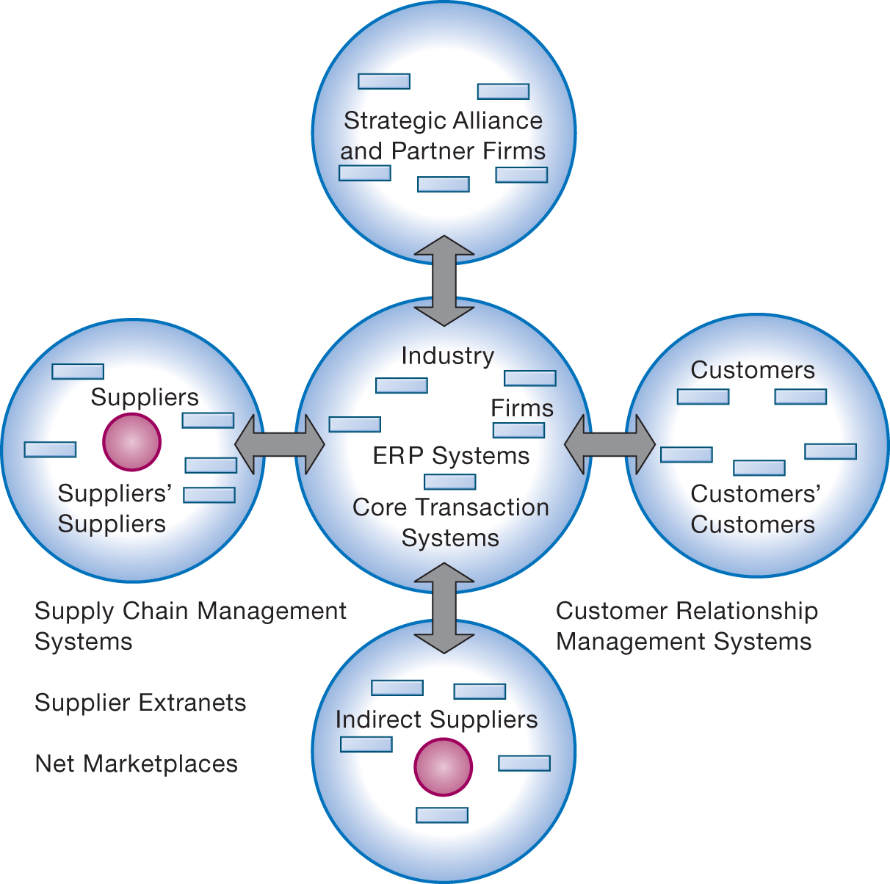

```{r, echo=FALSE, message=FALSE}
library(rstudioapi)
library(stringr)
library(tools)

this_file <- knitr::current_input()
this_file_split <- str_split(file_path_sans_ext(knitr::current_input()),"_")
this_title <- this_file_split[[1]][2]
this_session_no <- as.numeric(this_file_split[[1]][1])

source("../../Templates/render_toc.R")

```


---
class: segue, left, bottom

```{r message=FALSE, echo=FALSE, results='asis'}
pandoc.header(this_title, 1)
```
### ERP Systems

#### Dominik Böhler, Deggendorf Institute of Technology


---
class: agenda

Agenda
------

```{r, echo=FALSE, message=FALSE}
render_toc(this_file, toc_depth = 1)
```


---

Learning Components
-------------------

#### ERP Systems, Summer 2021


.pull-left[

### `r icon::fontawesome("book-open")` PREPARATION

Skim-read, get the essentials, prepare discussion. 


Laudon & Laudon (2020), ** Essentials of Management Information Systems**

Fourteenth Edition,
Global Edition.

.content-box-gray[
```{r, echo=FALSE, message=FALSE, results='asis'}
  
put_reading(this_session_no)

```
  ]
]

.pull-right[

### `r icon::fontawesome("chalkboard-teacher")` LECTURE

- Get perspectives and understanding
- Discuss with peers
- (maybe) Entertainment

### `r icon::fontawesome("rocket")` EXCERCISE

- Apply knowledge in practical excercises
- Build your digital skillset in a project
- Prepare directly for the exam
  
]

---

Learning Objectives
-----------
__3.1__ How do Porter’s competitive forces model, the value chain model, synergies, core competencies, and network-based strategies help companies use information systems for competitive advantage?

__3.2__ How do information systems help businesses compete globally?

__3.3__ How do information systems help businesses compete using quality and design?

__3.4__ What is the role of business process management (BPM) in enhancing competitiveness?

---

## N26: A Bank Without Branches


* Problem
  * Improving operational efficiency
  * Improve customer experience
* Solutions
  * Online customer-centric processes
  * Improved cash-based operations
  * Security systems
* Illustrates use of IT to differentiate services and improve customer experience

---
class: segue-red

# Competitive Strategy


---

## Porter’s Competitive Forces Model

* Five competitive forces shape fate of firm
  * Traditional competitors
  * New market entrants
  * Substitute products and services
  * Customers
  * Suppliers

---

## Figure 3.1 Porter’s Competitive Forces Model


---

## Information System Strategies for Dealing with Competitive Forces

.panelset[
  .panel[.panel-name[Basic Strategy]
      Align IT with business objectives
      * Identify business goals and strategies
      * Break strategic goals into concrete activities and processes
      * Identify metrics for measuring progress
      * Determine how IT can help achieve business goals
      * Measure actual performance
  ]
  .panel[.panel-name[Low-cost leadership]
    * Use information systems to achieve the lowest operational costs and the lowest prices
    * E.g. Walmart
      * Inventory replenishment system sends orders to suppliers when purchase recorded at cash register
      * Minimizes inventory at warehouses, operating costs
      * Efficient customer response system
  ]
  .panel[.panel-name[Product differentiation]
    * Use information systems to enable new products and services, or greatly change the customer convenience in using your existing products and services
    * E.g., Google's continuous innovations, Apple's iPhone
    * Use information systems to customize, personalize products to fit specifications of individual consumers
    * E.g., Nike's NIKEi Dprogram for customized sneakers
  ]
  .panel[.panel-name[Focus on market niche]
    * Use information systems to enable specific market focus, and serve narrow target market better than competitors.
    * Analyzes customer buying habits, preferences
    * Advertising pitches to smaller and smaller target markets
  
    E.g., Hilton Hotel’s OnQSystem
    * Analyzes data collected on guests to determine preferences and guest's profitability
  ]
  .panel[.panel-name[Strengthen customer and supplier intimacy]
    * Strong linkages to customers and suppliers increase switching costs and loyalty
    * Toyota: usesI Sto facilitate direct access from suppliers to production schedules
      * Permits suppliers to decide how and when to ship supplies to plants, allowing more lead time in producing goods
    * Amazon: keeps track of user preferences for purchases, and recommends titles purchased by others
    ]
]


---

## The Internet’s Impact on Competitive Advantage

- Enables new products and services
- Encourages substitute products
- Lowers barrier to entry
- Changes balance of power of customers and suppliers
- Transforms some industries
- Creates new opportunities for creating new markets, building brands, and large customer bases
- Smart products and the Internet of Things

---
class: segue-red

# Value Chain


---

## The Business Value Chain Model

* Highlights specific activities in a business where competitive strategies can best be applied and where information systems are likely to have a strategic impact.
  * Primary activities
  * Support activities
  * Benchmarking
  * Best practices

---

Figure 3.2 The Value Chain Model
--------


---

## The Value Web

* A firm’s value chain is linked to the value chains of its suppliers, distributors, and customers.
* Value web
  * Collection of independent firms that use information technology to coordinate their value chains to produce a product collectively
  * Value webs are flexible and adapt to changes in supply and demand

---

## Figure 3.3 The Value Web





---
class: segue-red

# Synergies, Core Competencies, and Network-Based Strategies

* Large corporations comprised of business units
  * Financial returns overall are tied to performance of business units
* Information systems improve performance of business units by promoting
  * Communication
  * Synergies (Revenue, Cost, Financial)
  * Core competencies, Dynamic Capabilities

---

## Synergies


### Types of Synergies

- Revenue
- Cost
- Financial


### Examples

- When output of some business units can be used as inputs to other units
- When two firms can pool markets and expertise (e.g., recent bank mergers) to lower costs and generate profits
- Enabled by information systems that ties together disparate units so they act as whole

???


---

## Core Competency

* Activities for which firm is world-class leader
  * E.g., world’s best miniature parts designer, best package delivery service, etc
* Relies on knowledge gained over years of experience as well as knowledge research
* Any information system that encourages the sharing of knowledge across business units enhances competency
  * E.g., Procter & Gamble uses intranet to help people working on similar problems share ideas and expertise.

---

## Network-Based Strategies


* Network economics
  * Marginal costs of adding another participant are near zero, whereas marginal gain is much larger
  * E.g., larger number of participants in Internet, greater value to all participants
  
* Virtual company
  * Uses networks to link people, resources, and ally with other companies to create and distribute products without traditional organizational boundaries or physical locations


---

## Disruptive Technologies

* Technologies with disruptive impact on industries and businesses, rendering existing products, services and business models obsolete
  * Personal computers
  * World Wide Web
  * Internet music services
* First movers versus fast followers
  * First movers of disruptive technologies may fail to see potential, allowing second movers to reap rewards (fast followers)

---

## The Internet and Globalization

* Prior to the Internet, competing globally was only an option for huge firms able to afford factories, warehouses, and distribution centers abroad.
* The Internet drastically reduces costs of operating globally.
* Globalization benefits
  * Scale economies and resource cost reduction
  * Higher utilization rates, fixed capital costs, and lower cost per unit of production
  * Speeding time to market

---

## Figure 3.4 Apple i Phone’s Global Supply Chain


---

## Global Business and System Strategies

Domestic exporters

Multinationals

Franchisers

Transnationals

---

## Global System Configuration

Centralized systems

Duplicated systems

Decentralized systems

Networked systems

---

## Figure 3.5 Global Business Organization Systems Configurations


---
class: segue-red

# Quality and Business Processes

---

## What is Quality?

* Producer perspective
  * Conformance to specifications and absence of variation from specs
* Customer perspective
  * Physical quality (reliability), quality of service, psychological quality
* Total quality management (TQM)
  * Quality control is end in itself
  * All people, functions responsible for quality
* Six sigma
  * Measure of quality: 3.4 defects/million opportunities

---

## How Information Systems Improve Quality

* Reduce cycle time and simplify production
* Benchmark
* Use customer demands to improve products and services
* Improve design quality and precision
  * Computer-aided design (CAD) systems
* Improve production precision and tighten production tolerances

---

## What is Business Process Management (BPM)?

* Technology alone is often not enough to improve business
* Organizational changes often necessary
  * Minor changes in work habits
  * Redesigning entire business processes
* Aims to continuously improve processes
* Uses variety of tools and methodologies to
  * Understand existing processes
  * Design and optimize new processes

---

## Steps in BPM

Identify processes for change

Analyze existing processes

Design new process

Implement new process

Continuous measurement

---

## Figure 3.6 As-Is Business Process for Purchasing a Book from a Physical Bookstore


---

## Figure 3.7 Redesigned Process for Purchasing a Book Online


---

## Business Process Reengineering

A radical form of fast change

Not continuous improvement, but elimination of old processes, replacement with new processes, in a brief time period

Can produce dramatic gains in productivity

Can produce more organizational resistance to change

