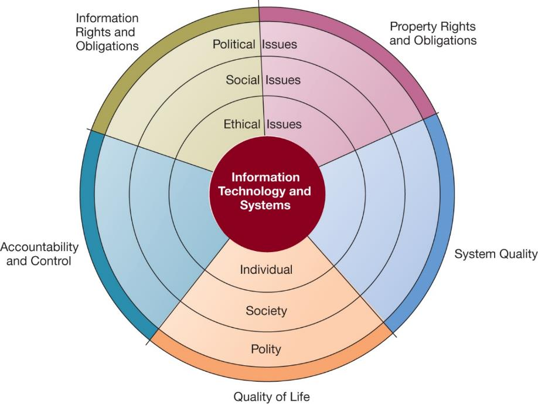
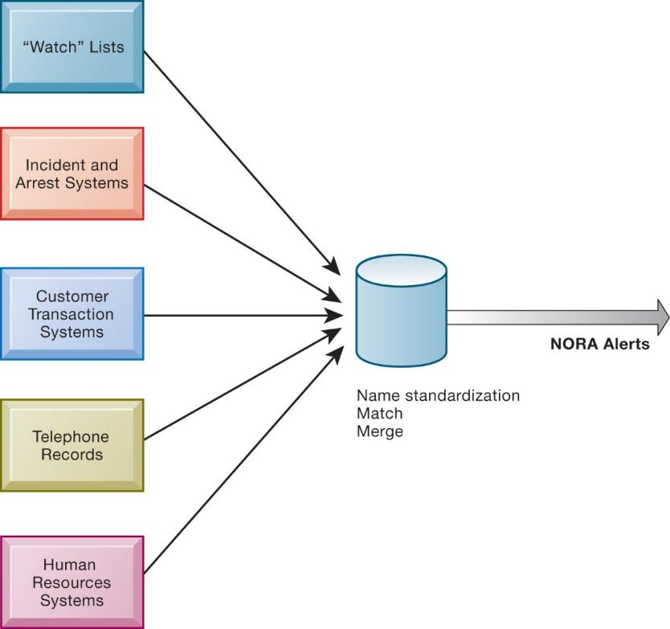
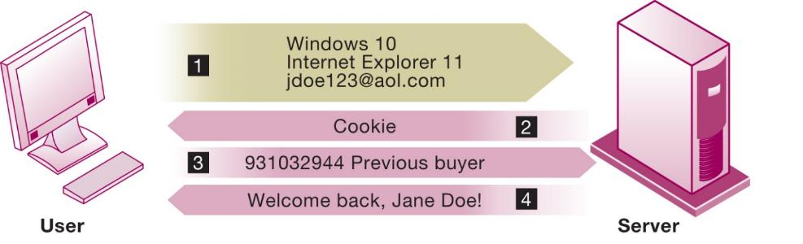

```{r, echo=FALSE, message=FALSE}
library(rstudioapi)
library(stringr)
library(tools)

this_file <- knitr::current_input()
this_file_split <- str_split(file_path_sans_ext(knitr::current_input()),"_")
this_title <- this_file_split[[1]][2]
this_session_no <- as.numeric(this_file_split[[1]][1])

source("../../Templates/render_toc.R")

```


---
class: segue, left, bottom

```{r message=FALSE, echo=FALSE, results='asis'}
pandoc.header(this_title, 1)
```
### ERP Systems

#### Dominik Böhler, Deggendorf Institute of Technology


---
class: agenda

Agenda
------

```{r, echo=FALSE, message=FALSE}
render_toc(this_file, toc_depth = 1)
```


---

Learning Components
-------------------

#### ERP Systems, Summer 2021


.pull-left[

### `r icon::fontawesome("book-open")` PREPARATION

Skim-read, get the essentials, prepare discussion. 


Laudon & Laudon (2020), ** Essentials of Management Information Systems**

Fourteenth Edition,
Global Edition.

.content-box-gray[
```{r, echo=FALSE, message=FALSE, results='asis'}
  
put_reading(this_session_no)

```
  ]
]

.pull-right[

### `r icon::fontawesome("chalkboard-teacher")` LECTURE

- Get perspectives and understanding
- Discuss with peers
- (maybe) Entertainment

### `r icon::fontawesome("rocket")` EXCERCISE

- Apply knowledge in practical excercises
- Build your digital skillset in a project
- Prepare directly for the exam
  
]


---

## Learning Objectives

__4.1__ What ethical, social, and political issues are raised by information systems?

__4.2__ What specific principles for conduct can be used to guide ethical decisions?

__4.3__ Why do contemporary information systems technology and the Internet pose challenges to the protection of individual privacy and intellectual property?

__4.4__ How have information systems affected laws for establishing accountability, liability, and the quality of everyday life?

__4.5__ How will MIS help my career?

---
class: segue-red, center, middle

# The ethical questions of Digital Transformation

---

## Video Cases

Case 1: What Net Neutrality Means for You

Case 2: Facebook and Google Privacy: What Privacy?

---

## Are Cars Becoming Big Brother on Wheels? (1 of 2)

* Problem
  * Vehicle and driver monitoring systems
  * Opportunities from new technology
  * Undeveloped legal environment
* Solutions
  * Increases safety
  * Increases efficiency
  * Creates need for new privacy protection laws and policies

Illustrates an IT-created ethical dilemma

Privacy vs. other values

Lack of meaningful privacy laws

---

## What Ethical, Social, and Political Issues are Raised by Information Systems?

* Recent cases of failed ethical judgment in business
  * Volkswagen AG, Wells Fargo, General Motors, Takata Corporation
  * In many, information systems used to bury decisions from public scrutiny
  
* Ethics
  * Principles of right and wrong that individuals, acting as free moral agents, use to make choices to guide their behaviors

* Information systems raise new ethical questions because they create opportunities for:
  * Intense social change, threatening existing distributions of power, money, rights, and obligations
  * New kinds of crime

---

## A Model for Thinking About Ethical, Social, and Political Issues

* Society as a calm pond
* I Tas rock dropped in pond, creating ripples of new situations not covered by old rules
* Social and political institutions cannot respond overnight to these ripples—it may take years to develop etiquette, expectations, laws
  * Requires understanding of ethics to make choices in legally gray areas

---

## Figure 4.1 The Relationship Between Ethical, Social, and Political Issues in an Information Society



---

## Five Moral Dimensions of the Information Age

+ Information rights and obligations
+ Property rights and obligations
+ Accountability and control
+ System quality
+ Quality of life

---

## Key Technology Trends That Raise Ethical Issues

+ Computing power doubles every 18 months
+ Data storage costs rapidly decline
+ Data analysis advances
+ Networking advances
+ Mobile device growth impact

---

## Advances in Data Analysis Techniques

* Profiling
  * Combining data from multiple sources to create dossiers of detailed information on individuals
* Nonobvious relationship awareness (N O R A)
  * Combining data from multiple sources to find obscure hidden connections that might help identify criminals or terrorists

---

## Figure 4.2 Nonobvious Relationship Awareness (N O R A )



---
class: segue-red

# The Basic Concepts of Ethics

---

## Basic Concepts: Responsibility, Accountability, and Liability

* Responsibility
  * Accepting the potential costs, duties, and obligations for decisions
* Accountability
  * Mechanisms for identifying responsible parties
* Liability
  * Permits individuals (and firms) to recover damages done to them
* Due process
  * Laws are well-known and understood, with an ability to appeal to higher authorities

---

## Ethical Analysis

* Five-step process for ethical analysis
  * Identify and clearly describe the facts.
  * Define the conflict or dilemma and identify the higher-order values involved.
  * Identify the stakeholders.
  * Identify the options that you can reasonably take.
  * Identify the potential consequences of your options.

---

## Candidate Ethical Principles

* Golden Rule
  * Do unto others as you would have them do unto you.
  
* Immanuel Kant’s Categorical Imperative
  * If an action is not right for everyone to take, it is not right for anyone.
  
* Slippery Slope Rule
  * If an action cannot be taken repeatedly, it is not right to take at all.

* Utilitarian Principle
  * Take the action that achieves the higher or greater value.
  
* Risk Aversion Principle
  * Take the action that produces the least harm or potential cost.
  
* Ethical “No Free Lunch” Rule
  * Assume that virtually all tangible and intangible objects are owned by someone unless there is a specific declaration otherwise.

---

## Professional Codes of Conduct

* Promulgated by associations of professionals
  * American Medical Association (AMA)
  * American Bar Association (ABA)
  * Association for Computing Machinery (ACM)
* Promises by professions to regulate themselves in the general interest of society


---
class: segue-red, center, middle

# Ethics in the Real World

---

## Real-World Ethical Dilemmas

* One set of interests pitted against another
* Examples
  * Monitoring employees: right of company to maximize productivity of workers versus workers’ desire to use Internet for short personal tasks
  * Facebook monitors users and sells information to advertisers and app developers

---

## Information Rights: Privacy and Freedom in the Internet Age

* Privacy
  * Claim of individuals to be left alone, free from surveillance or interference from other individuals, organizations, or state; claim to be able to control information about yourself
* In the United States, privacy protected by:
  * First Amendment (freedom of speech and association)
  * Fourth Amendment (unreasonable search and seizure)
  * Additional federal statues (e.g., Privacy Act of 1974)

* Fair information practices
  * Set of principles governing the collection and use of information
    * Basis of most U.S. and European privacy laws
  * Used to drive changes in privacy legislation
    * COPPA
    * Gramm-Leach-Bliley Act
    * HIPAA

* FTCFIP principles
  * Notice/awareness (core principle)
  * Choice/consent (core principle)
  * Access/participation
  * Security
  * Enforcement

---

## European Directive on Data Protection

+ Requires unambiguous explicit informed consent of customer

+ EU member nations cannot transfer personal data to countries without similar privacy protection

+ Applies across all EU countries to any firms operating in EU or processing data on EU citizens or residents

+ Strengthens right to be forgotten

+ Privacy Shield : all countries processing EU data must conform to GDPR requirements

+ Heavy fines: 4% of global daily revenue

---

## Internet Challenges to Privacy

* Cookies
  * Identify browser and track visits to site
  * Super cookies (Flash cookies)
  
* Web beacons (web bugs)
  * Tiny graphics embedded in emails and web pages
  * Monitor who is reading email message or visiting site
  
* Spyware
  * Surreptitiously installed on user’s computer
  * May transmit user’s keystrokes or display unwanted ads
  
* Google services and behavioral targeting

* The United States allows businesses to gather transaction information and use this for other marketing purposes.

* Opt-out vs. opt-in model

* Online industry promotes self-regulation over privacy legislation.
  * Complex/ambiguous privacy statements
  * Opt-out models selected over opt-in
  * Online “seals” of privacy principles

---

## Figure 4.3 How Cookies Identify Web Visitors



The Web server reads the user's Web browser and determines the operating system, browser name, version number, Internet address, and other information.

The server transmits a tiny text file with user identification information called a cookie, which the user's browser receives and stores on the user's computer.

When the user returns to the Web site, the server requests the contents of any cookie it deposited previously in the user's computer.

The Web server reads the cookie, identifies the visitor, and calls up data on the user.

---

## Technical Solutions

* Solutions include:
  * Email encryption
  * Anonymity tools
  * Anti-spyware tools
  
* Overall, technical solutions have failed to protect users from being tracked from one site to another
  * Browser features
    * “Private” browsing
    * “Do not track” options

---

## Property Rights: Intellectual Property

* Intellectual property
  * Tangible and intangible products of the mind created by individuals or corporations
* Protected in four main ways:
  * Copyright
  * Patents
  * Trademarks
  * Trade secret

---

## Challenges to Intellectual Property Rights

* Digital media different from physical media
  * Ease of replication
  * Ease of transmission (networks, Internet)
  * Ease of alteration
  * Compactness
  * Difficulties in establishing uniqueness
* Digital Millennium Copyright Act (D M C A)


class:segue-red, center, middle

# CLASS DISCUSSION: Hacking the Hospital


???

[https://parallaxview.ghost.io/the-parallax-view-130-new-direction/](https://parallaxview.ghost.io/the-parallax-view-130-new-direction/)
https://apnews.com/article/technology-hacking-europe-cf8f8eee1adcec69bcc864f2c4308c94


## System Quality: Data Quality and System Errors

* What is an acceptable, technologically feasible level of system quality?
  * Flawless software is economically unfeasible
* Three principal sources of poor system performance
  * Software bugs, errors
  * Hardware or facility failures
  * Poor input data quality (most common source of business system failure)

## Quality of Life: Equity, Access, Boundaries

+ Negative social consequences of systems

+ Big tech: Concentrating economic and political power

+ Rapidity of change

+ Maintaining boundaries: family, work and leisure

+ Dependence and vulnerability

* Computer crime and abuse
  * Computer crime
  * Computer abuse
  * Spam
  * CAN-SPAMAct of 2003
  
* Employment
  * Trickle-down technology
  * Reengineering job loss

* Equity and access
  * The digital divide
  
* Health risks
  * Repetitive stress injury (RSI)
  * Carpal tunnel syndrome (CTS)
  * Computer vision syndrome (CVS)
  * Technostress

---

## Computer-Related Liability Problems

+ If software fails, who is responsible?
+ If seen as part of a machine that injures or harms, software producer and operator may be liable
+ If seen as similar to book, difficult to hold author/publisher responsible
+ If seen as a service, would this be similar to telephone systems not being liable for transmitted messages?


???

- What is free will and what is reason?

Who should be liable:
- The driver? (Nooo... didn't do anything...)
- The car company?
- The software engineer?
- The car itself?

Guiding Questions:
- Who owns the code and data center
- Where is the code executed?
- How much learning war involved in the process?
- When can we speak about free will?
  - Memories and distributed decision?
  - Did someone tell the car to do it or did it infer that
  - 


---

