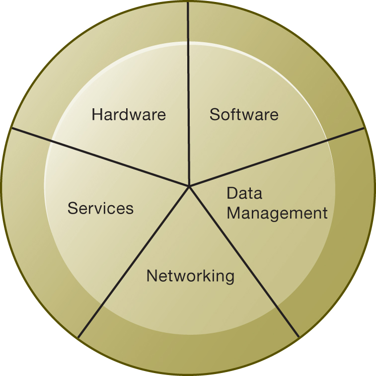
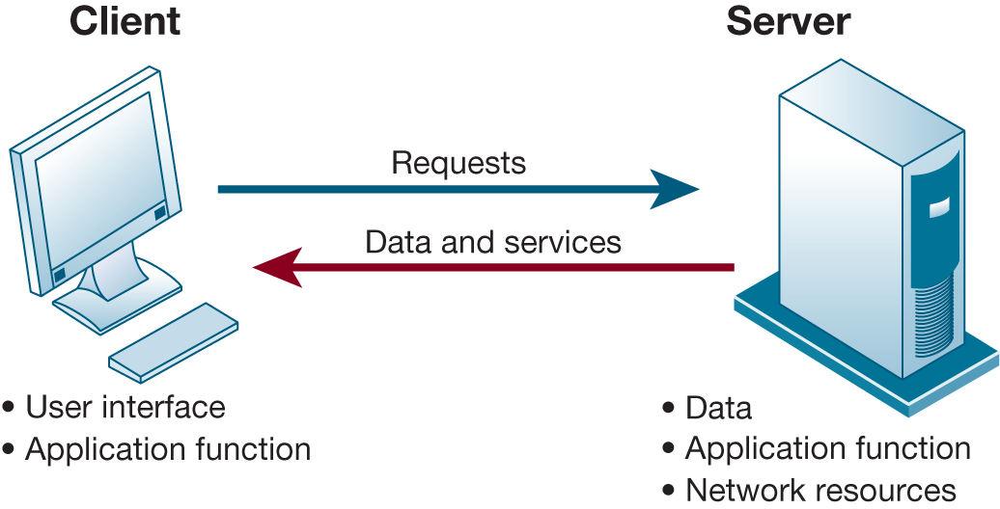
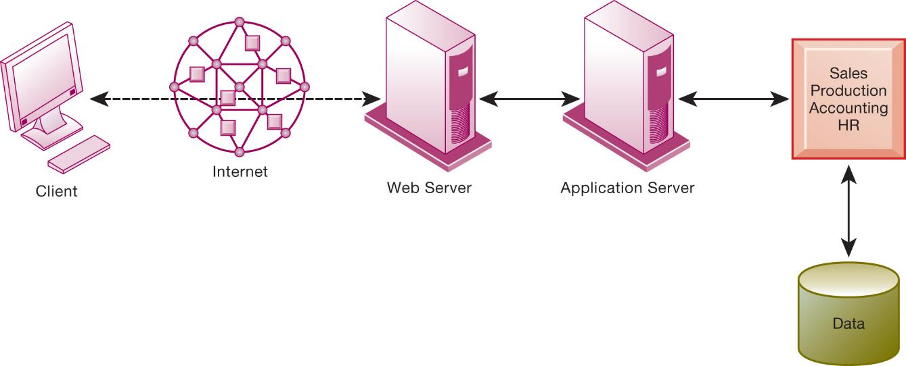
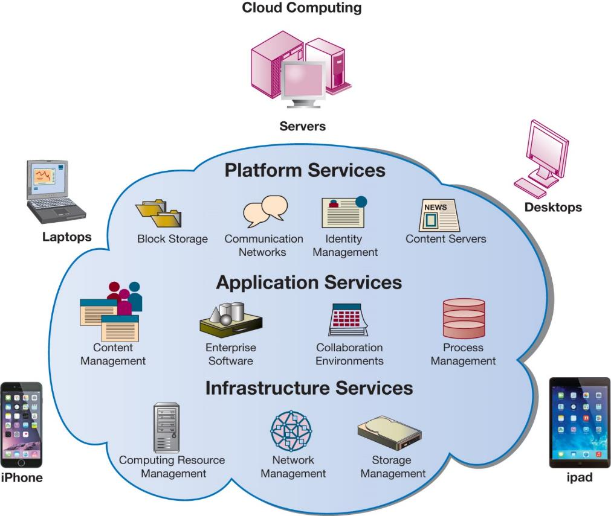
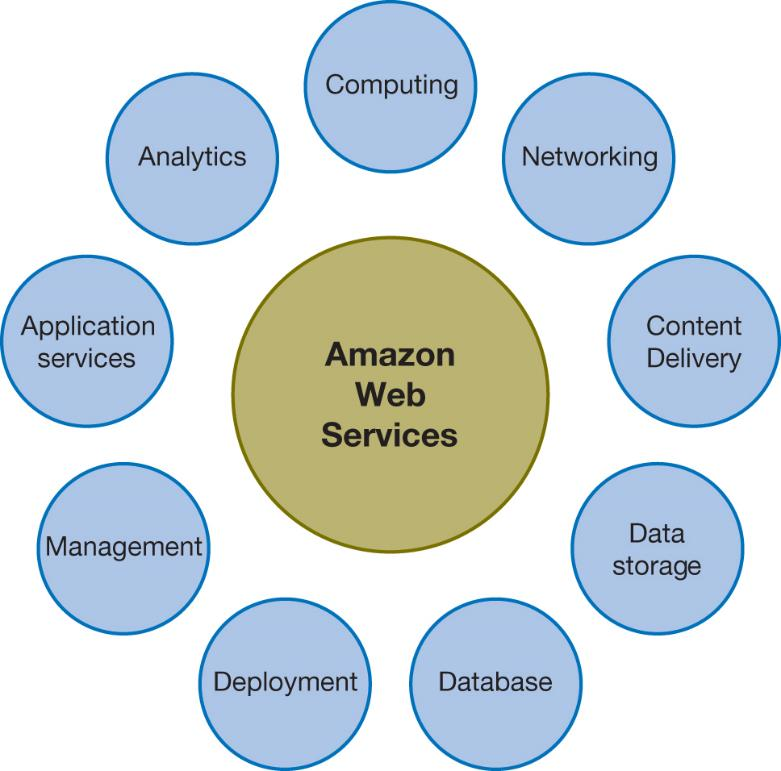
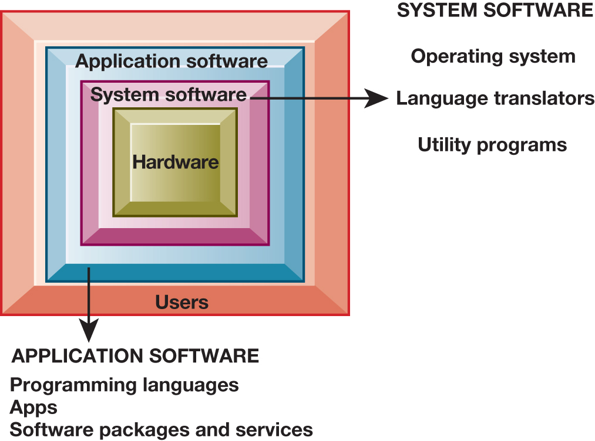
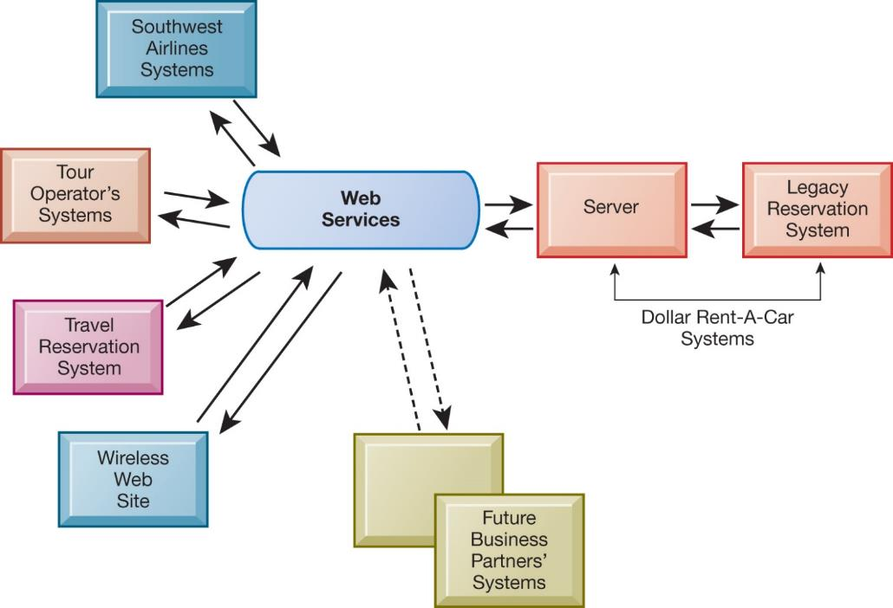

```{r, echo=FALSE, message=FALSE}
library(rstudioapi)
library(stringr)
library(tools)

this_file <- knitr::current_input()
this_file_split <- str_split(file_path_sans_ext(knitr::current_input()),"_")
this_title <- this_file_split[[1]][2]
this_session_no <- as.numeric(this_file_split[[1]][1])

source("../../Templates/render_toc.R")

```


---
class: segue, left, bottom

```{r message=FALSE, echo=FALSE, results='asis'}
pandoc.header(this_title, 1)
```
### ERP Systems

#### Dominik Böhler, Deggendorf Institute of Technology


---
class: agenda

Agenda
------

```{r, echo=FALSE, message=FALSE}
render_toc(this_file, toc_depth = 1)
```


---

Learning Components
-------------------

#### ERP Systems, Summer 2021


.pull-left[

### `r icon::fontawesome("book-open")` PREPARATION

Skim-read, get the essentials, prepare discussion. 


Laudon & Laudon (2020), ** Essentials of Management Information Systems**

Fourteenth Edition,
Global Edition.

.content-box-gray[
```{r, echo=FALSE, message=FALSE, results='asis'}
  
put_reading(this_session_no)

```
  ]
]

.pull-right[

### `r icon::fontawesome("chalkboard-teacher")` LECTURE

- Get perspectives and understanding
- Discuss with peers
- (maybe) Entertainment

### `r icon::fontawesome("rocket")` EXCERCISE

- Apply knowledge in practical excercises
- Build your digital skillset in a project
- Prepare directly for the exam
  
]

---

Learning Objectives
--------

__5.1__ What are the components of IT infrastructure?
__5.2__ What are the major computer hardware, data storage, input, and output technologies used in business and the major hardware trends?
__5.3__ What are the major types of computer software used in business and the major software trends?
__5.4__ What are the principal issues in managing hardware and software technology?
__5.5__ How will MIS help my career?

---

## Video Cases

Case 3 – Netflix: Building a Business in the Cloud

---

# Infrastructure Components

* IT infrastructure
  * Platform for supporting all information systems in the business
* Computer hardware
* Computer software
* Data management technology
* Networking and telecommunications technology
* Technology services

---

## Figure 5.1 I T Infrastructure Components



---

## Types of Computers

+ Personal computers and mobile devices
+ Workstations
+ Server
+ Mainframes
+ Supercomputers
+ Grid computing


---

## Client/Server Computing

* Form of distributed computing
* Splits processing between “clients” and “servers”
* Two-tiered client/server architecture
* Multi-tiered client/server architecture \(N-tier\)
  * Web servers
  * Application servers

---

## Figure 5.2 Client/Server Computing



---

## Figure 5.3 A Multitiered Client/Server Network (N-Tier)



---

## Storage, Input, and Output Technology

* Primary secondary storage technologies
  * Magnetic disk
    * SSDs
  * Optical disks
  * Magnetic tape
  * Storage networking: SANs
* Input devices
  * E.g. keyboard
* Output devices
  * E.g. monitor

---

## Contemporary Hardware Trends        (1 of 3)

* The mobile digital platform
  * Smartphones
  * Tablet computers
  * eText readers
* Consumerization of IT and BYOD
* Nanotechnology and quantum computing
* Virtualization
  * Software-defined storage \(SDS\)

---

## Interactive Session – Technology: Open Source Innovation: The New Competitive Advantage

* Class discussion
  * What is open source software? How is it different from proprietary software?
  * How can open source software support the healthcare industry in both administrative and medical processes?

---

## Examples of Nanotubes


©forance/123R F

---

## Contemporary Hardware Trends        (2 of 3)

* Cloud computing:
  * Computing resources obtained over the Internet
    * Infrastructure as a service \(IaaS\)
    * Software as a service \(SaaS\)
    * Platform as a service \(PaaS\)
  * Public vs. private clouds
  * Utility computing, on-demand computing
  * Hybrid cloud
  * Data storage security is in hands of provider

---

## Figure 5.4 Cloud Computing Platform



---

## Figure 5.5 Major Amazon Web Services



---

## Contemporary Hardware Trends        (3 of 3)

* Green computing
  * Green IT
  * Practices and technologies for minimizing impact on environment
* High-performance and power-saving processors
  * Multicore processors
  * Reduced power consumption

---

## Interactive Session – Organizations: Look to the Cloud

* Class discussion
  * What business benefits do cloud computing services provide? What problems do they solve?
  * What are the disadvantages of cloud computing?
  * What kinds of businesses are most likely to benefit from using cloud computing? Why?

---

## Figure 5.6 The Major Types of Software



---

## Operating System Software

* Software that controls computer activities
* G U Is
* Multitouch
* P Coperating systems
  * Windows, Mac
  * UNIX
  * Linux \(open source\)
* Mobile operating systems
  * Chrome, Android,iO S

---

## Application Software and Desktop Productivity Tools (1 of 2)

* Programming languages for business
  * C
  * C\+\+ - newer, object-oriented version of C
  * Visual Basic: Visual programming language forM SWindows applications
  * Java:O S-independent object-oriented programming language
    * Migrated to mobile applications, game machines, cableT Vsystems
    * Java Virtual Machine

* Software packages and desktop productivity tools
  * Word processing software
  * Spreadsheetsoftware
  * Data management software
  * Presentation graphics
  * Software suites
  * Web browsers

---

## HTML  and HTML5

* Hypertextmarkuplanguage \(HTML\):
  * Page description language for specifying how elements are placed on a web page and for creating links to other pages and objects
* HTML5
  * Next evolution of HTML
  * Enables multimedia embedding without 3rd party plugins like Flash

---

## Web Services

* Software components that exchange information with one another using universal web communication standards and languages
* XML\(eXtensibleMarkupLanguage\)
  * Foundation of web services
* Service oriented architecture \(SOA\)
  * Collection of services used to build an organization’s software systems

---

## Figure 5.7 How Dollar Rent-A-Car Uses Web Services



---

## Software Trends

* Open source software
  * Linux, Apache
* Cloud-based software and tools
  * SaaS\(software as a service\)
    * Google Docs
  * Mashups
    * Zip Realty uses Google Maps and[Zillow.com](Zillow.com)
  * Apps
    * Mobile apps
  * Workstream Collaboration: Slack
  
---

## Capacity Planning and Scalability

* Capacity planning
  * Predicting when hardware system becomes saturated
  * Ensuring computing power for current and future needs
  * Factors include:
    * Maximum number of users
    * Impact of current, future software
    * Performance measures
* Scalability
  * Ability of system to expand to serve large number of users without breaking down

---

## Total Cost of Ownership (TCO) model

* Analyzing direct and indirect costs to determine the actual cost of owning a specific technology
  * Direct costs: hardware, software purchase costs
  * Indirect costs: on going administration costs, upgrades, maintenance, etc.
  * Hidden costs: support staff, downtime, etc.
* TCO can be reduced through increased centralization, standardization of hardware and software resources.

---

## Using Technology Service Providers

* Outsourcing
  * Using external provider to run computercenterand networks
  * Web hosting service
  * Offshore software outsourcing
  * Service level agreements \(SLAs\)
* Using cloud services
  * Appealing to businesses with smallerI Tbudgets
  * Pricing is per hour, per-use
  * Switching costs

---

## Managing Mobile Platforms

+ Mobile devices provide productivity gains
+ Expenses of equipping employees with devices
+ Network configuration
+ Software
+ Device security
+ Stolen or compromised devices
+ Mobile device management \(MDM\) software


---

## Managing Software Localization for Global Business

* Software localization
  * Local language interfaces
  * Complex software interfaces
* Differences in local cultures
* Differences in business processes
* These factors add to TCO of using technology service providers

---

## How Will MIS Help My Career?

+ The Business: A1 Tech IT Consulting
+ Position Description
+ Job Requirements
+ Interview Questions


