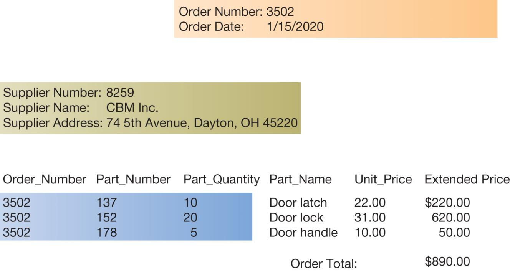
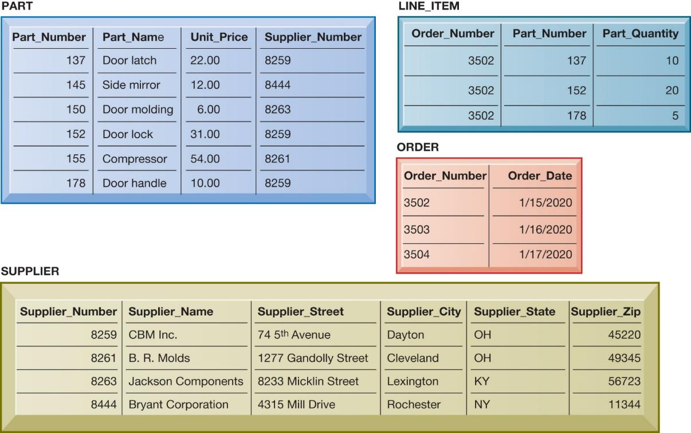
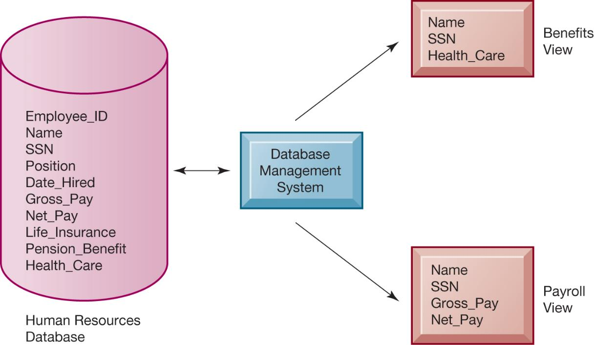
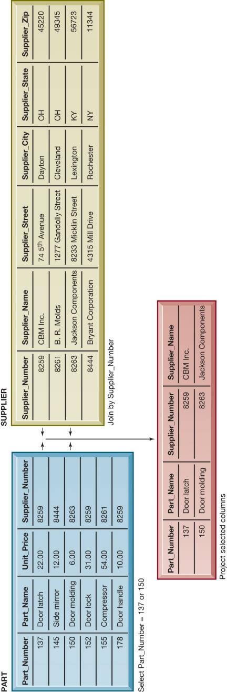
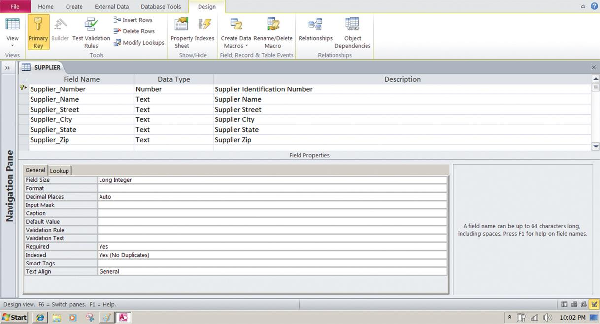
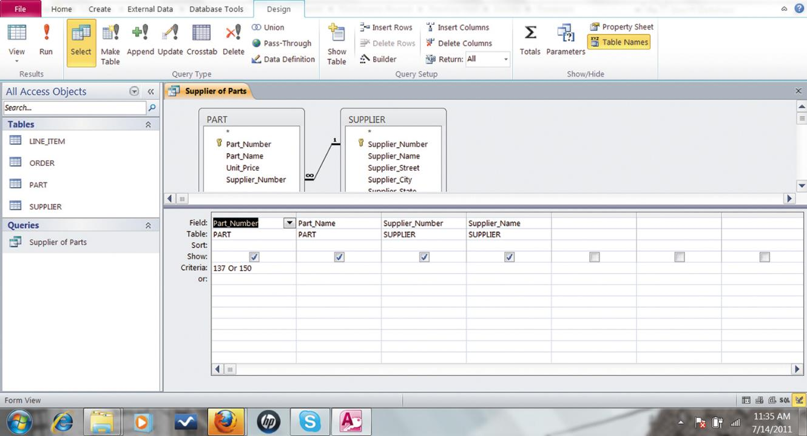
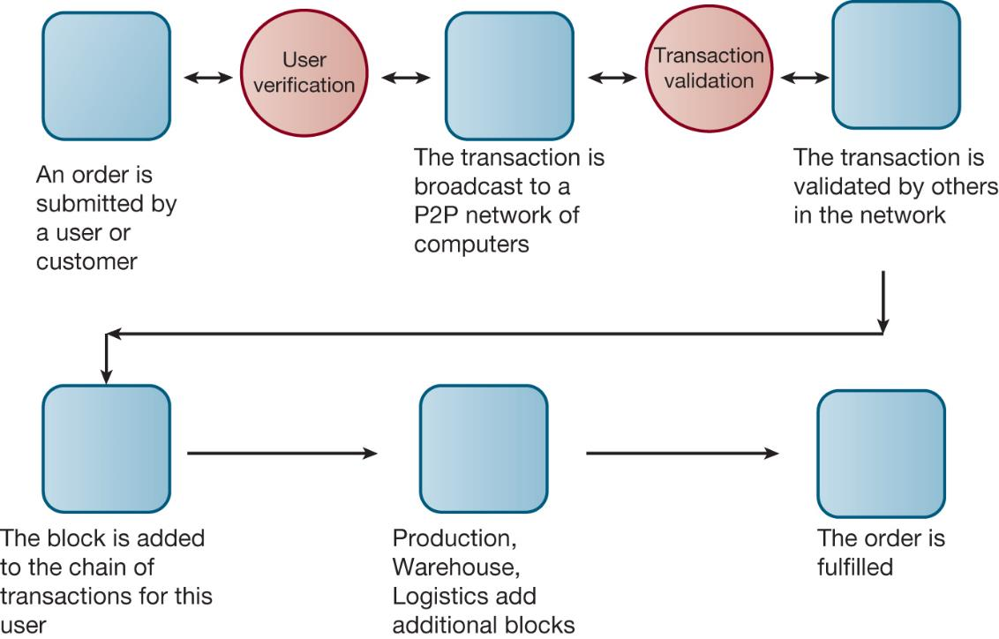
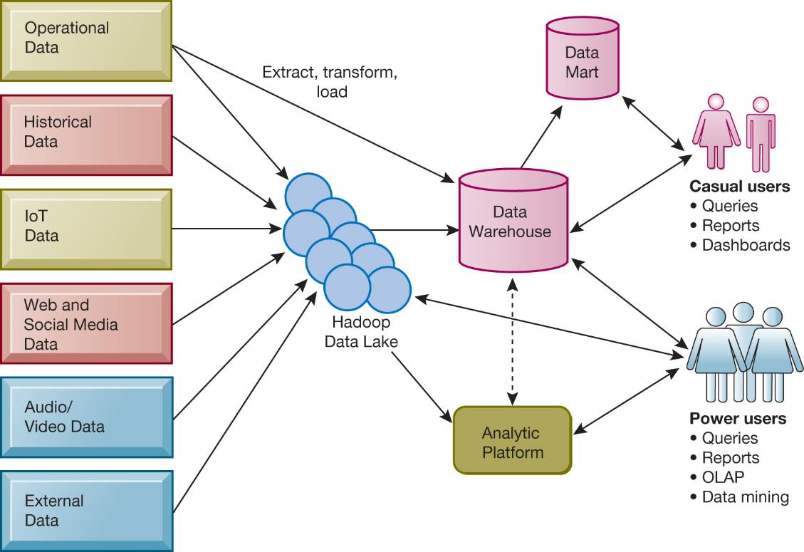
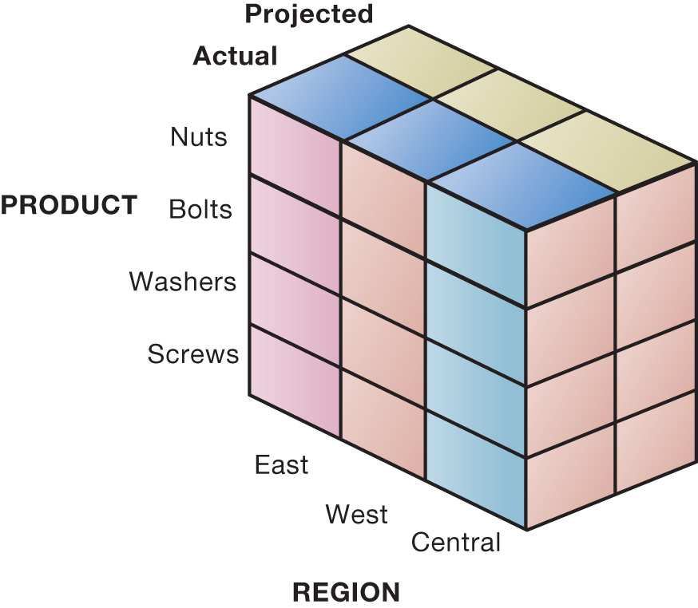
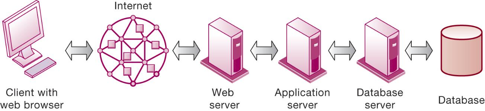

```{r, echo=FALSE, message=FALSE}
library(rstudioapi)
library(stringr)
library(tools)

this_file <- knitr::current_input()
this_file_split <- str_split(file_path_sans_ext(knitr::current_input()),"_")
this_title <- this_file_split[[1]][2]
this_session_no <- as.numeric(this_file_split[[1]][1])

source("../../Templates/render_toc.R")

```


---
class: segue, left, bottom

```{r message=FALSE, echo=FALSE, results='asis'}
pandoc.header(this_title, 1)
```
### ERP Systems

#### Dominik Böhler, Deggendorf Institute of Technology


---
class: agenda

Agenda
------

```{r, echo=FALSE, message=FALSE}
render_toc(this_file, toc_depth = 1)
```


---

Learning Components
-------------------

#### ERP Systems, Summer 2021


.pull-left[

### `r icon::fontawesome("book-open")` PREPARATION

Skim-read, get the essentials, prepare discussion. 


Laudon & Laudon (2020), ** Essentials of Management Information Systems**

Fourteenth Edition,
Global Edition.

.content-box-gray[
```{r, echo=FALSE, message=FALSE, results='asis'}
  
put_reading(this_session_no)

```
  ]
]

.pull-right[

### `r icon::fontawesome("chalkboard-teacher")` LECTURE

- Get perspectives and understanding
- Discuss with peers
- (maybe) Entertainment

### `r icon::fontawesome("rocket")` EXCERCISE

- Apply knowledge in practical excercises
- Build your digital skillset in a project
- Prepare directly for the exam
  
]

---

## Learning Objectives
-----------

__6.1__ What is a database, and how does a relational database organize data?

__6.2__ What are the principles of a database management system?

__6.3__ What are the principal tools and technologies for accessing information from databases to improve business performance and decision making?

__6.4__ Why are information policy, data administration, and data 	quality assurance essential for managing the firm’s data 	resources?

__6.5__ How will MIS help my career?


---
class: segoe, middle, center

# What is a Database

---
## What Is a Database?

* Database:
  * Collection of related files containing records on people, places, or things
* Entity:
  * Generalized category representing person, place, thing
  * E.g., SUPPLIER, PART
* Attributes:
  * Specific characteristics of each entity:
    * SUPPLIER name, address
    * PART description, unit price, supplier


---
class: segue, middle, center

# Relational Databases


---

## Relational Databases

* Organize data into two-dimensional tables (relations) with columns and rows
* One table for each entity:
  * E.g., (CUSTOMER, SUPPLIER, PART, SALES)
  * Fields (columns) store data representing an attribute
  * Rows store data for separate records, or tuples
* Key field: uniquely identifies each record
* Primary key

---

## Figure 6.2 A Relational Database Table

---

## Figure 6.3 The PART Table

---

## Establishing Relationships (1 of 2)

* Entity-relationship diagram
  * Used to clarify table relationships in a relational database
* Relational database tables may have:
  * One-to-one relationship
  * One-to-many relationship
  * Many-to-many relationship
    * Requires “join table” or intersection relation that links the two tables to join information

---

## Figure 6.4 A Simple Entity-Relationship Diagram


---

## Establishing Relationships (2 of 2)

* Normalization
  * Streamlining complex groups of data
  * Minimizes redundant data elements
  * Minimizes awkward many-to-many relationships
  * Increases stability and flexibility
* Referential integrity rules
  * Ensure that relationships between coupled tables remain consistent

---

## Figure 6.5 Sample Order Report



---

## Figure 6.6 The Final Database Design with Sample Records



---

## Figure 6.7 Entity-Relationship Diagram for the Database with Four Tables


---
class: segue, center, middle

# Database Management Systems (DBMS)


---

## Database Management Systems (DBMS)

* Software for creating, storing, organizing, and accessing data from a database
* Separates the logical and physical views of the data
  * Logical view: how end users view data
  * Physical view: how data are actually structured and organized
* Examples: Microsoft Access, DB2, Oracle Database, MicrosoftSQL Server, MySQL

---

## Figure 6.8 Human Resources Database with Multiple Views



---

## Operations of a Relational DBMS

* Select:
  * Creates a subset of all records meeting stated criteria
* Join:
  * Combines relational tables to present the server with more information than is available from individual tables
* Project:
  * Creates a subset consisting of columns in a table
  * Permits user to create new tables containing only desired information



---

## Figure 6.9 The Three Basic Operations of a Relational DBMS

---

## Capabilities of Database Management Systems

* Data definition capabilities:
  * Specify structure of content of database
* Data dictionary:
  * Automated or manual file storing definitions of data elements and their characteristics
* Querying and reporting:
  * Data manipulation language
    * Structured query language (S Q L)
    * Microsoft Access query-building tools
  * Report generation, e.g., Crystal Reports

---

## Figure 6.10 Access Data Dictionary Features



---

## Figure 6.11 Example of an S Q L Query

SELECT PART.Part_Number, PART.Part_Name, SUPPLIER.Supplier_Number,

SUPPLIER.Supplier_Name

FROM PART, SUPPLIER

WHERE PART.Suplier_Number = SUPPLIER.Supplier_Number AND

Part_Number = 137 OR Part_Number = 150;

---

## Figure 6.12 An Access Query




---
class: segue, center, middle

# Non-Relational Databases

---

## Non-Relational Databases

* “NoSQL”
* Handle large data sets of data that are not easily organized into tables, columns, and rows
* Use more flexible data model
  * Don’t require extensive structuring
* Can manage unstructured data, such as social media and graphics
* E.g. Amazon’s SimpleDB, MetLife’s MongoDB

---

## Cloud Databases and Distributed Databases

* Relational database engines provided by cloud computing services
  * Pricing based on usage
  * Appeal to small or medium-sized businesses
* Amazon Relational Database Service
  * Offers MySQL, MicrosoftSQL Server, Oracle Database engines
* Distributed databases
  * Stored in multiple physical locations
  * Google’s Spanner cloud service

---

## The Challenge of Big Data

* Massive quantities of unstructured and semi-structured data from Internet and more
  * 3Vs: Volume, variety, velocity
  * Petabytes and exabytes
* Big datasets offer more patterns and insights than smaller datasets, e.g.
  * Customer behavior
  * Weather patterns
* Requires new technologies and tools

---

## Interactive Session – The Paradise Papers and Big Data Journalism

* Class Discussion
  * Why was it a challenge to place all the documents from the Paradise Papers in one database?
  * Protecting the identity of a whistleblower or whistleblowers is of vital importance to journalists. Give at least one reason why this is so important.
  * Explain why cooperation between data experts and journalists was vital to the efficient analysis of data.
  * News outlets have been experiencing a severe crisis of profitability. What do you think are the causes of this crisis? What role can big data analytics play in countering it?

---
class: segue, center, middle

# Blockchain


---

## Blockchain

+ Distributed database of transactions
+ Operates on a network without central authority
+ Maintains a growing list of records called blocks
+ Once recorded, blocks cannot be changed
+ Reduces cost of processing transactions and enhances security


---

## Figure 6.13 How Blockchain Works



---

## Business Intelligence Infrastructure

* Array of tools for obtaining useful information from internal and external systems and big data
  * Data warehouses
  * Data marts
  * Hadoop
  * In-memory computing
  * Analytical platforms

---

## Data Warehouses

* Data warehouse:
  * Database that stores current and historical data that may be of interest to decision makers
  * Consolidates and standardizes data from many systems, operational and transactional databases
  * Data can be accessed but not altered
* Data mart:
  * Subset of data warehouses that is highly focused and isolated for a specific population of users

---

## Hadoop

* Open-source software framework for big data
* Breaks data task into sub-problems and distributes the processing to many inexpensive computer processing nodes
* Combines result into smaller data set that is easier to analyze
* Key services
  * Hadoop Distributed File System (H D F S)
  * MapReduce

---

## In-Memory Computing

+ Relies on computer’s main memory (RAM) for data storage
+ Eliminates bottlenecks in retrieving and reading data
+ Dramatically shortens query response times
+ Enabled by high-speed processors, multicore processing
+ Lowers processing costs

---

## Analytic Platforms

* Preconfigured hardware-software systems
* Designed for query processing and analytics
* Use both relational and non-relational technology to analyze large data sets
* Include in-memory systems, NoS Q LD B M S
* E.g.I B MPure Data System for Analytics
  * Integrated database, server, storage components
* Data lakes

---

## Figure 6.14 Business Intelligence Technology Infrastructure



---

## Analytical Tools: Relationships, Patterns, Trends

* Once data is gathered, tools are required for consolidating, analyzing, to use insights to improve decision making
  * Software for database querying and reporting
  * Multidimensional data analysis (OLAP)
  * Data mining

---

## Online Analytical Processing (OLAP)

* Supports multidimensional data analysis, enabling users to view the same data in different ways using multiple dimensions
  * Each aspect of information—product, pricing, cost, region, or time period—represents a different dimension
  * E.g., comparing sales in East in June versus May and July
* Enables users to obtain online answers to ad hoc questions such as these in a fairly rapid amount of time

---

## Figure 6.15 Multidimensional Data Model



---
class: segue, center, middle

# Data Mining

---

## Data Mining

* Finds hidden patterns and relationships in large databases and infers rules from them to predict future behavior
* Types of information obtainable from data mining
  * Associations: occurrences linked to single event
  * Sequences: events linked over time
  * Classifications: patterns describing a group an item belongs to
  * Clustering: discovering as yet unclassified groupings
  * Forecasting: uses series of values to forecast future values

---

## Text Mining

* Unstructured data (mostly text files) accounts for 80 percent of an organization’s useful information.
* Text mining allows businesses to extract key elements from, discover patterns in, and summarize large unstructured data sets.
* Sentiment analysis
  * Mines online text comments online or in email to measure customer sentiment

---

## Web Mining

* Discovery and analysis of useful patterns and information from the web
  * E.g. to understand customer behavior, evaluate website, quantify success of marketing
* Content mining – mines content of websites
* Structure mining – mines website structural elements, such as links
* Usage mining – mines user interaction data gathered by web servers

---

## Databases and the Web

* Firms use the web to make information from their internal databases available to customers and partners.
* Middleware and other software make this possible
  * Web server
  * Application servers orC G I
  * Database server
* Web interfaces provide familiarity to users and savings over redesigning legacy systems.

---

## Figure 6.16 Linking Internal Databases to the Web



---

## Establishing an Information Policy

* Information policy
  * States organization’s rules for organizing, managing, storing, sharing information
* Data administration
  * Responsible for specific policies and procedures through which data can be managed as a resource
* Database administration
  * Database design and management group responsible for defining and organizing the structure and content of the database, and maintaining the database.

---

## Ensuring Data Quality

* Poor data quality: major obstacle to successful customer relationship management
* Data quality problems caused by:
  * Redundant and inconsistent data produced by multiple systems
  * Data input errors
* Data quality audit
* Data cleansing
