```{r, echo=FALSE, message=FALSE}
library(rstudioapi)
library(stringr)
library(tools)

this_file <- knitr::current_input()
this_file_split <- str_split(file_path_sans_ext(knitr::current_input()),"_")
this_title <- this_file_split[[1]][2]
this_session_no <- as.numeric(this_file_split[[1]][1])

source("../../Templates/render_toc.R")

```


---
class: segue, left, bottom

```{r message=FALSE, echo=FALSE, results='asis'}
pandoc.header(this_title, 1)
```
### ERP Systems

#### Dominik Böhler, Deggendorf Institute of Technology


---
class: agenda

Agenda
------

```{r, echo=FALSE, message=FALSE}
render_toc(this_file, toc_depth = 1)
```


---

Learning Components
-------------------

#### ERP Systems, Summer 2021


.pull-left[

### `r icon::fontawesome("book-open")` PREPARATION

Skim-read, get the essentials, prepare discussion. 


Laudon & Laudon (2020), ** Essentials of Management Information Systems**

Fourteenth Edition,
Global Edition.

.content-box-gray[
```{r, echo=FALSE, message=FALSE, results='asis'}
  
put_reading(this_session_no)

```
  ]
]

.pull-right[

### `r icon::fontawesome("chalkboard-teacher")` LECTURE

- Get perspectives and understanding
- Discuss with peers
- (maybe) Entertainment

### `r icon::fontawesome("rocket")` EXCERCISE

- Apply knowledge in practical excercises
- Build your digital skillset in a project
- Prepare directly for the exam
  
]

---

Learning Objectives
-----------

__7.1__ What are the principal components of telecommunications networks and key networking technologies?

__7.2__ What are the different types of networks?

__7.3__ How do the Internet and Internet technology work, and how do they support communication and e-business?

__7.4__ What are the principal technologies and standards for wireless networking, communication, and Internet access?


---

# Networking and Communication Trends

* Convergence
  * Telephone networks and computer networks converging into single digital network using Internet standards
* Broadband
  * The majority of U.S. households now have broadband access
* Broadband wireless
  * Voiceand data communications now exclusively use broadband cable and wireless platforms

---

## What Is a Computer Network?

* Two or more connected computers
* Major components in simple network
  * Client and server computers
  * Network interfaces (NICs)
  * Connection medium
  * Network operating system (NOS)
  * Hubs, switches, routers
* Software-defined networking (SDN)
  * Functions of switches and routers managed by central program

---

## Figure 7.1 Components of a Simple Computer Network

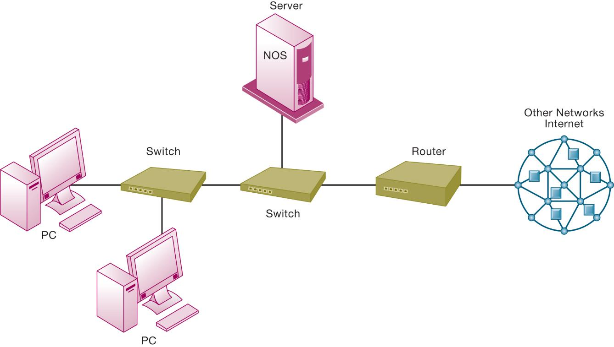

---

## Networks in Large Companies

* Hundreds of local area networks (LANs) linked to firm-wide corporate network
* Various powerful servers
  * Website, corporate intranet, extranet
  * Backend systems
* Mobile wirelessL A Ns (Wi-Fi networks)
* Videoconferencing system
* Telephone network, wireless cell phones

---

## Figure 7.2 Corporate Network Infrastructure

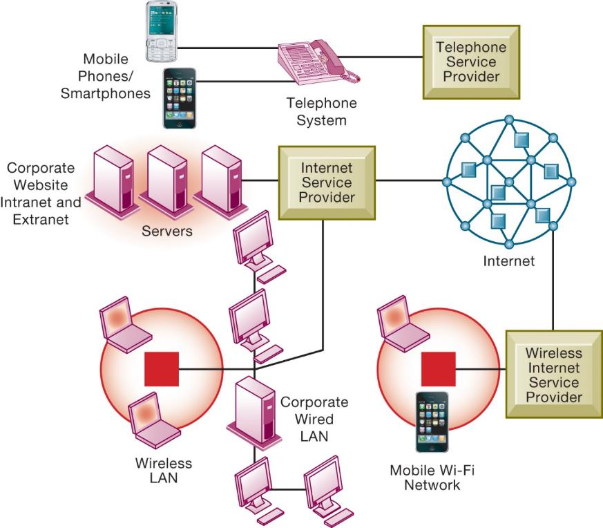

---

## Key Digital Networking Technologies (1 of 3)

* Client/server computing
  * Distributed computing model
  * Clients linked through network controlled by network server computer
  * Server sets rules of communication for network and provides every client with an address so others can find it on the network
  * Has largely replaced centralized mainframe computing
  * The Internet: largest implementation of client/server computing

* Packet switching
  * Method of slicing digital messages into parcels (packets), sending packets along different communication paths as they become available, and then reassembling packets at destination
  * Previous circuit-switched networks required assembly of complete point-to-point circuit
  * Packet switching more efficient use of network’s communications capacity

---

## Figure 7.3 Packet-Switched Networks and Packet Communications

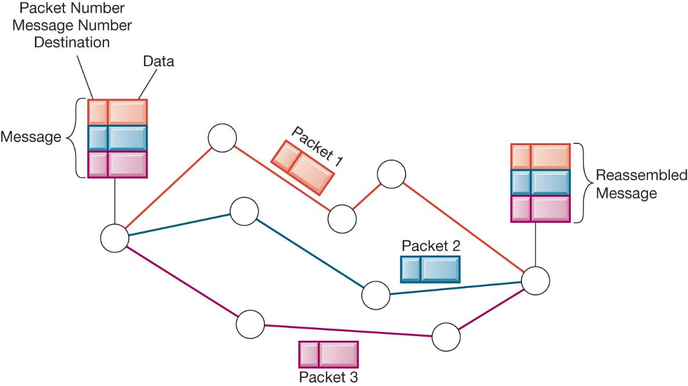

---

## Key Digital Networking Technologies (3 of 3)

* T C P/I Pand connectivity
  * Protocols: rules that govern transmission of information between two points
  * Transmission Control Protocol/Internet Protocol (T C P/ IP)
    * Common worldwide standard that is basis for the Internet
  * Department of Defense reference model forT C P/ IP
    * Four layers
      * Application layer
      * Transport layer
      * Internet layer
      * Network interface layer

---

## Figure 7.4 The Transmission Control Protocol/Internet Protocol (TCP/IP) Reference Model

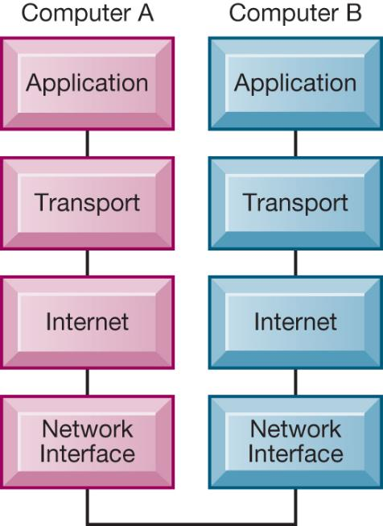

---

## Types of Networks

* Signals: Digital versus analog
  * Modem: translates digital signals into analog form (and vice versa)
* Types of networks
  * Local area networks (L A Ns)
    * Ethernet
    * Client/server vs. peer-to-peer
  * Wide area networks (W A Ns)
  * Metropolitan area networks (M A Ns)
  * Campus area networks (C A Ns)

---

## Figure 7.5 Functions of the Modem

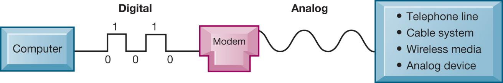

---

## Transmission Media and Transmission Speed

* Physical transmission media
  * Twisted pair wire (CAT5)
  * Coaxial cable
  * Fiber optics cable
  * Wireless transmission media and devices
    * Satellites
    * Cellular systems
* Transmission speed
  * Bits per second (b ps)
  * Hertz
  * Bandwidth

---

# What Is the Internet?

* The Internet
  * World’s most extensive network
  * Internet service providers (I S Ps)
    * Provide connections
    * Types of Internet connections
      * Dial-up: 56.6K b ps
      * Digital subscriber line (D SL/F I OS): 385K b ps –40M b ps
      * Cable Internet connections: 1–50M b ps
      * Satellite
      * T1/T3 lines: 1.54–45M b ps

---

## Internet Addressing and Architecture

* Each device on Internet assigned Internet Protocol (IP) address
* 32-bit number, e.g. 207.46.250.119
* The Domain Name System (DNS)
  * Converts IP addresses to domain names
  * Hierarchical structure
  * Top-level domains

---

## Figure 7.6 The Domain Name System


---

## Internet Architecture and Governance

* Network service providers
  * Own trunk lines (high-speed backbone networks)
* Regional telephone and cable T V companies
  * Provide regional and local access
* Professional organizations and government bodies establish Internet standards
  * IAB
  * ICANN
  * W3C

---

## Figure 7.7 Internet Network Architecture

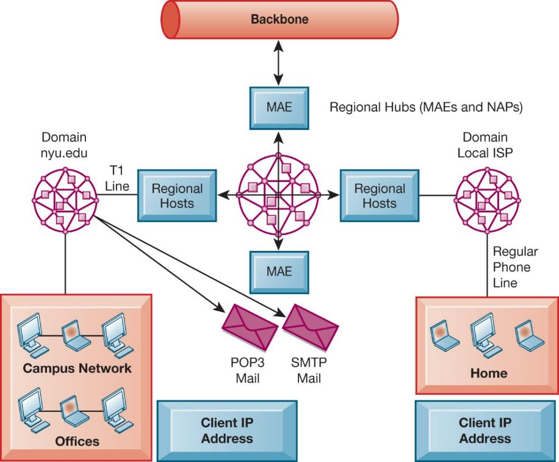

---

## The Future Internet: IPv6 and Internet 2

* IPv6
  * New addressing scheme for IP numbers
  * Will provide more than a quadrillion new addresses
  * Not compatible with current IPv5 addressing
* Internet2
  * Advanced networking consortium
    * Universities, businesses, government agencies, other institutions
  * Developed high-capacity 100 Gbps testing network
  * Testing leading-edge new technologies for Internet

---

## Internet Services and Communication Tools (1 of 2)

* Internet services
  * Email
  * Chatting and instant messaging
  * Newsgroups
  * Telnet
  * File Transfer Protocol (F TP)
  * World Wide Web
* Voice overI P(V o IP)
  * Digital voice communication usingIP, packet switching

---

## Figure 7.8 Client/Server Computing on the Internet

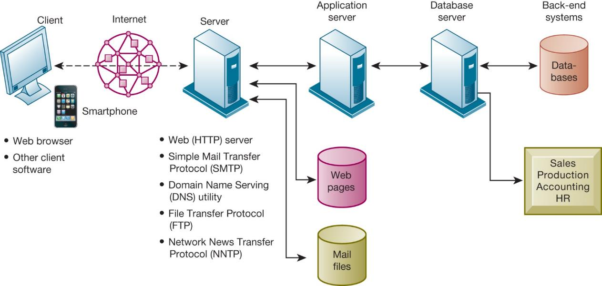

---

## Internet Services and Communication Tools (2 of 2)

* Unified communications
  * Communications systems that integrate voice, data, email, conferencing
* Virtual private network (VPN)
  * Secure, encrypted, private network run over Internet
  * PPTP
  * Tunneling

---

## Figure 7.9 How Voice over IP Works

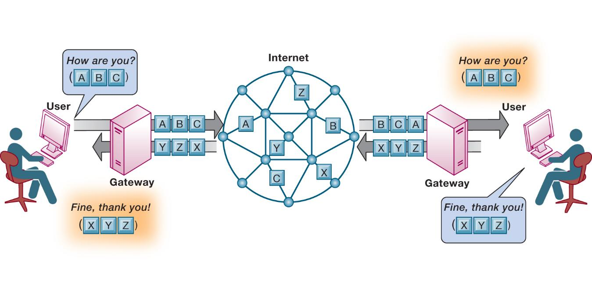

---

## Interactive Session – Management: Singapore Shuts Down 2G Network

* Class discussion
  * What do 2G, 3G, and 4G refer to? Explain one difference among them.
  * What is meant by “wireless spectrum” and “spectrum crunch”? What measures were taken to alleviate the spectrum scarcity?
  * The decision to shut down 2G was easy technically but hard in terms of implementation.” Do you agree with this statement? Why or why not?

---

## Figure 7.10 A Virtual Private Network Using the Internet

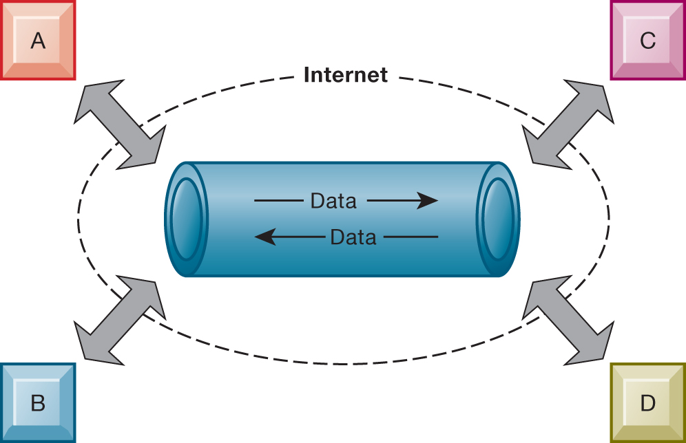

---

# The Web

* Hypertext
  * Hypertext Markup Language (HTML)
  * Hypertext Transfer Protocol (HTTP):
  * Uniform resource locator example (URL):

    * [http://www.megacorp.com/content/features/082602.html](http://www.megacorp.com/content/features/082602.html)

* Web servers
    * Software for locating and managing web pages

---

## Searching for Information on the Web

+ Mobile search

+ Semantic search

+ Social search

+ Visual search

+ Intelligent agent shopping bots

+ Search engine marketing

+ Search engine optimization (SEO)


---

## Figure 7.11 Top Desktop/Laptop Web Search Engines Worldwide

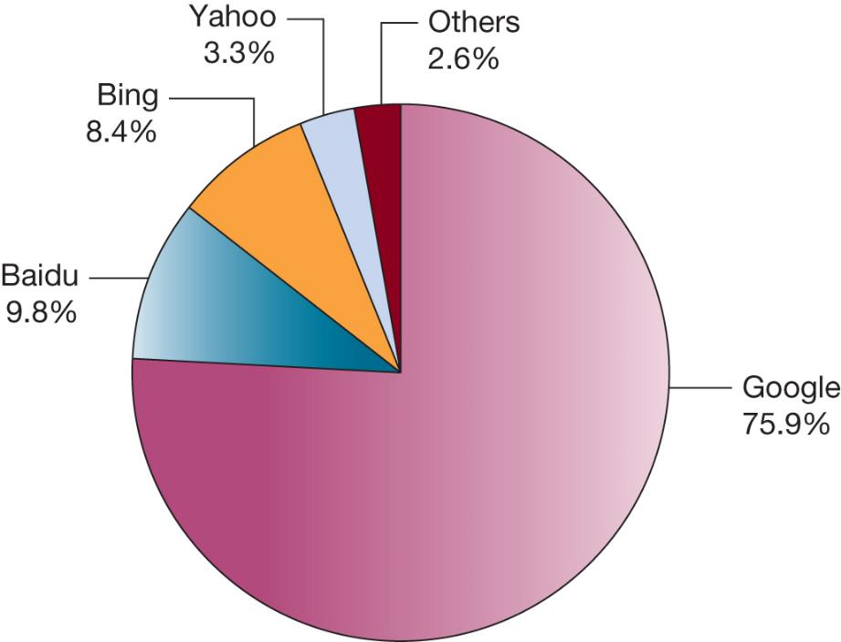

---

## Figure 7.12 How Google Works

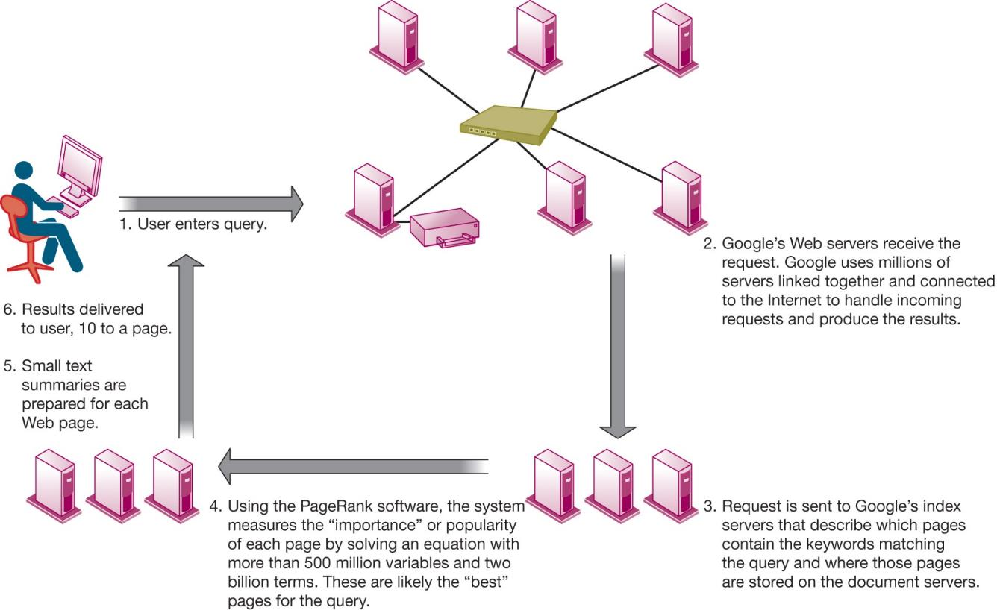

---

## Sharing Information on the Web

+ Blogs

+ RSS

+ Wikis

+ Social networking


---

# The Future Web

+ More tools to make sense of trillions of pages on the Internet

+ Pervasive web

+ Internet of Things (I oT)

+ Internet of People

+ App Internet

+ Increased cloud computing andS a aS

+ Ubiquitous mobile connectivity

+ Greater seamlessness of web as a whole

---

## Cellular Systems (1 of 2)

* Competing standards
  * CDMA : United States only
  * GSM: Rest of world,AT&T, T-Mobile
* Third-generation (3G) networks
  * 144 kbps
  * Suitable for email access, web browsing

* Fourth-generation (4G) networks
  * Up to 100 Mbps
  * Suitable for email access, web browsing, Internet video
  * LTE and Wi Max

* 5G networks
  * Gigabit capacity
  * Currently under development and field testing

---

## Wireless Computer Networks and Internet Access (1 of 2)

* Bluetooth (802.15)
  * Links up to 8 devices in a 10-m area using low-power, radio-based communication
  * Useful for personal networking (PANs) s
* Wi-Fi(802.11)
  * Set of standards: 802.11
  * Used for wireless LAN and wireless Internet access
  * Use access points: device with radio receiver/transmitter for connecting wireless devices to a wired LAN

* Wi-Fi (802.11) continued
  * Hotspots: one or more access points in public place to provide maximum wireless coverage for a specific area
  * Weak security features
* W iMax (802.16)
  * Wireless access range of 31 miles
  * RequireW i M a xantennas

---

## Figure 7.13 A Bluetooth Network (PAN)

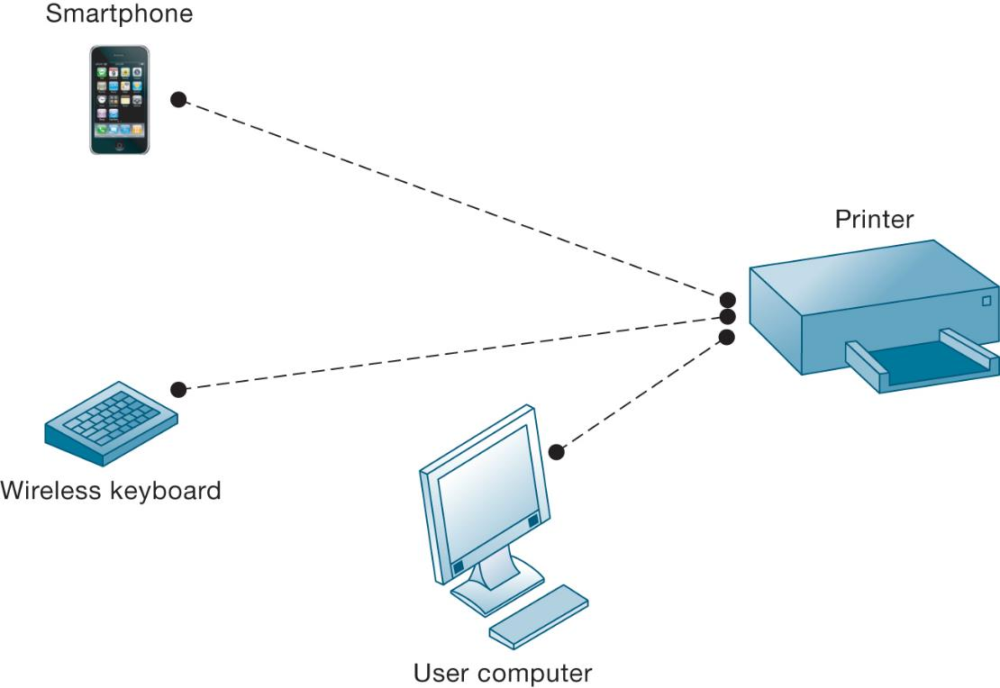

---

## Figure 7.14 An 802.11 Wireless LAN

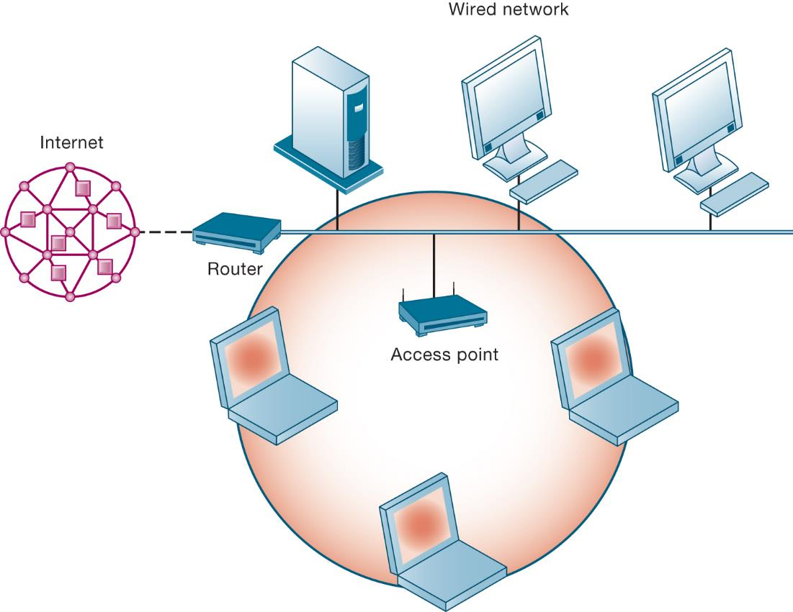

---

## Radio Frequency Identification (RFID)

* Use tiny tags with microchips containing data about an item and location
* Tag antennas to transmit radio signals over short distances to specialR F ID readers
* Common uses:
  * Automated toll-collection
  * Tracking goods in a supply chain
* Reduction in cost of tags making RFID viable for many firms

---

## Figure 7.15 How RFID Works

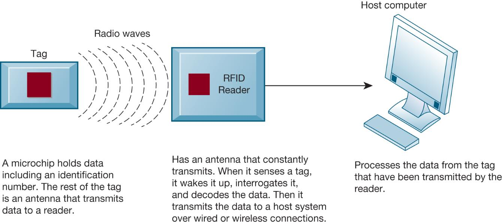

---

## Wireless Sensor Networks (WSNs)

+ Networks of hundreds or thousands of interconnected wireless devices

+ Used to monitor building security, detect hazardous substances in air, monitor environmental changes, traffic, or military activity

+ Devices have built-in processing, storage, and radio frequency sensors and antennas

+ Require low-power, long-lasting batteries and ability to endure in the field without maintenance

+ Major sources of “Big Data” and fueling “Internet of Things”


---

## Figure 7.16 A Wireless Sensor Network

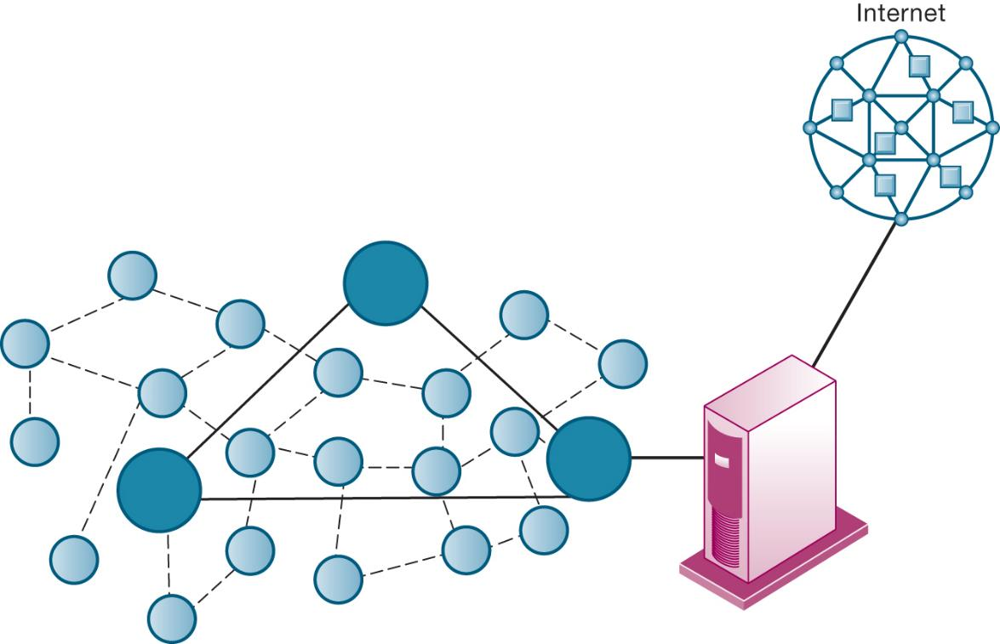

