# Experiencing M I S

Ninth Edition

__Chapter 2__

Organizational Strategy\, Information Systems\, and Competitive Advantage

Slides in this presentation contain hyperlinks\. JAWS users should be able to get a list of links by using INSERT\+F7

Copyright © 2019\, 2017\, 2016 Pearson Education\, Inc\. All Rights Reserved

# “We can’t be everything to everybody.”

Reputation as a company that is essentially a mobile\, door\-to\-door eBay

Current focus on selling products

Jessica wants to focus on partnering with local companies to sell new products too

Could expand to become a “shipping” company

Could drastically change the supply chain

# Study Questions

* __2\-1__  How does organizational strategy determine information systems structure?
* __2\-2__  What five forces determine industry structure?
* __2\-3__ How does analysis of industry structure determine competitive strategy?
* __2\-4__  How does competitive strategy determine value chain structure?
* __2\-5__ How do business processes generate value?
* __2\-6__ How does competitive strategy determine business processes and the structure of information systems?
* __2\-7__ How do information systems provide competitive advantages?

# Strategy Determines Information Systems

2\-1 How does organizational strategy determine information systems structure?

__Figure 2\-1__ Organizational Strategy Determines Information Systems

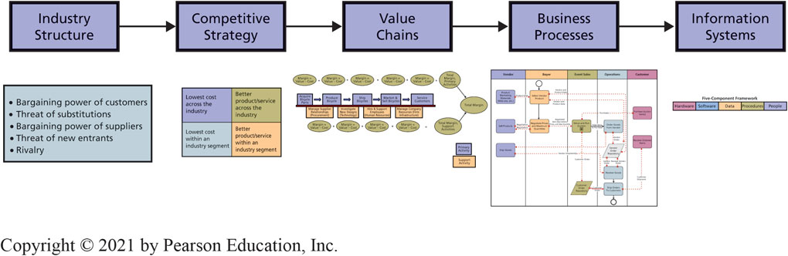

# Five Forces Determine Industry Structure

* 2\-2 What five forces determine industry structure?
* Competitive Forces
  * Competition from vendors who manufacture substitutes\.
  * Competition from new competitors\.
  * Competition from existing rivals\.
* Bargaining Power Forces
  * Bargaining power of suppliers\.
  * Bargaining power of customers\.

# Five Forces Examples

2\-2 What five forces determine industry structure?

 __Figure 2\-3__   Examples of Five Forces

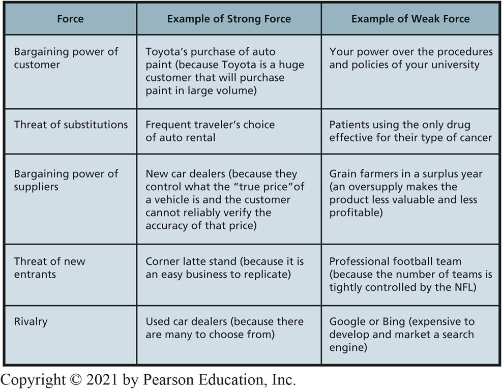

# Five Forces Determine Industry Structure (con’t)

2\-2 What five forces determine industry structure?

 __Figure 2\-4__   Five Forces at eHermes

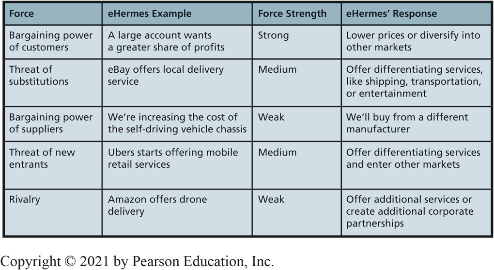

# Industry Structure Analysis Determines Competitive Strategy

2\-3 How does analysis of industry structure determine competitive strategy?

 __Figure 2\-5__   Porter’s Four Competitive Strategies

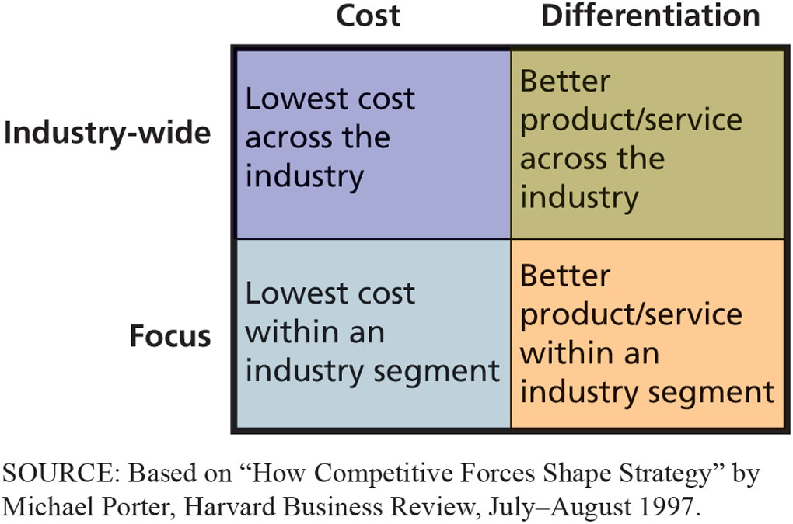

# Value Chain Concepts (1 of 3)

* 2\-4 How does competitive strategy determine value chain structure?
* Industry analysis leads to determining competitive strategy\.
* Business activities must align with the chosen strategy
  * Cost leader strategy requires activities performed at lowest possible cost
  * Differentiation strategy requires activities that support distinction
* Value: amount customers will pay for resource\, product\, or service
* Margin: value of activity – cost of the activity

* 2\-4 How does competitive strategy determine value chain structure?
*  __Value chain: network of value\-creating activities\.__ 
* Primary activities: business functions directly related to product or service production
  * Inbound Logistics
  * Operations/Manufacturing
  * Outbound Logistics
  * Sales and Marketing
  * Customer Service

* 2\-4 How does competitive strategy determine value chain structure?
* Support activities: business functions that assist the primary activities
  * Procurement
  * Technology
  * Human Resources
  * Firm Infrastructure

# Drone Manufacturer’s Value Chain

2\-4 How does competitive strategy determine value chain structure?

__Figure 2\-6__ Drone Manufacturer’s Value Chain

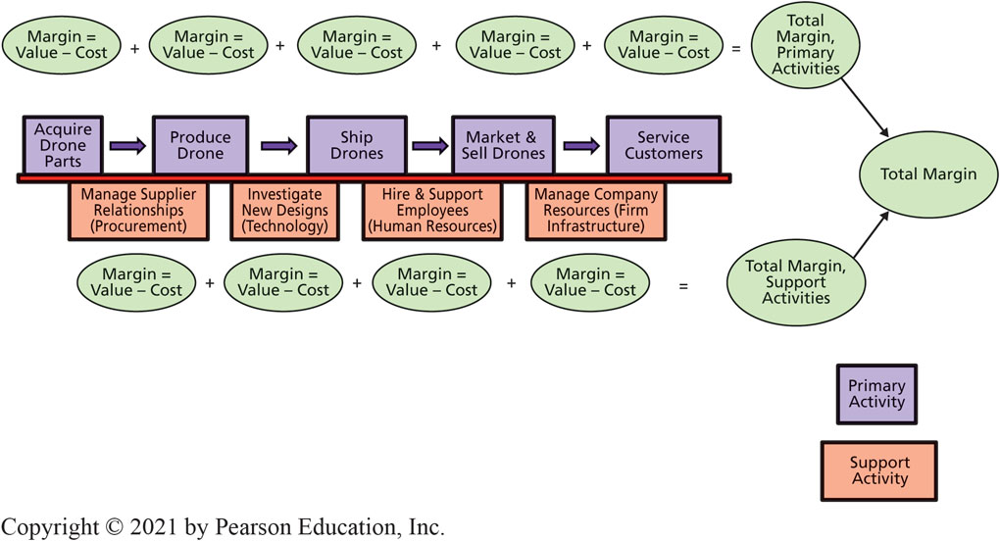

# Value Chain Primary Activities

2\-4 How does competitive strategy determine value chain structure?

__Figure 2\-7__ Task Descriptions for Primary Activities of the Value Chain

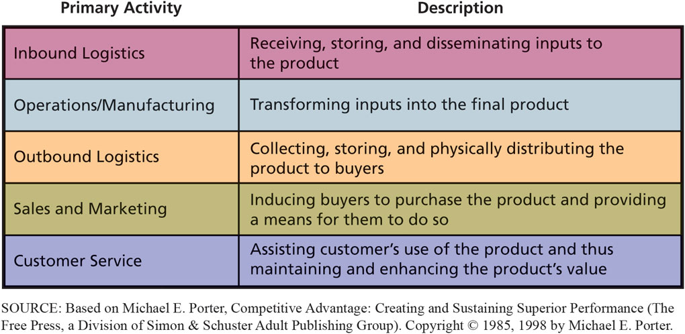

# Business Process Concepts

* 2\-5 How do business processes generate value?
* Business process: a network of activities that generate value by transforming inputs into outputs
* Business processes vary in terms of costs and effectiveness
* Streamlining business processes is a key to competitive advantage
  * Add value
  * Reduce costs
  * Add value and reduce costs
*  _How_   something is done \(the business process\) is just as important as   _what_   is done\.

# Depicting and Improving Business Processes (1 of 2)

2\-5 How do business processes generate value?

__Figure 2\-8__ Existing Best Bikes Business Process Using BPMN

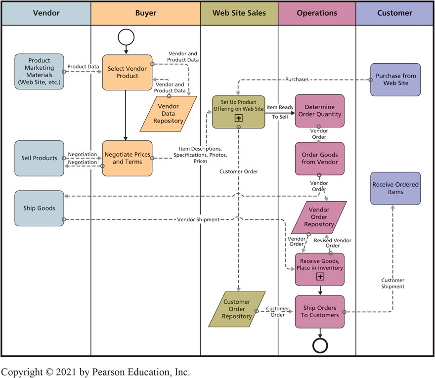

2\-5 How do business processes generate value?

__Figure 2\-10__ Revised Best Bikes Business Process Using BPMN

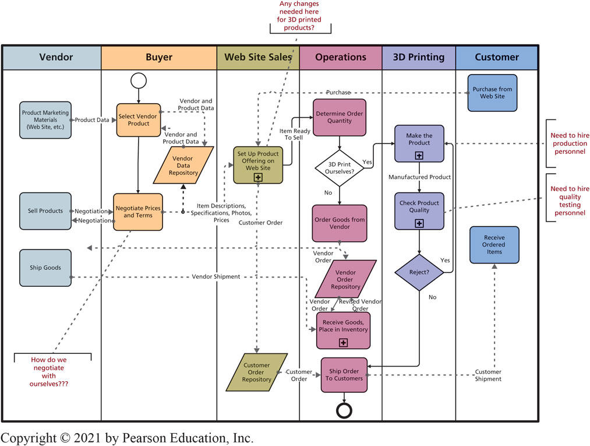

# Operations Value Chain Options: Low-Cost vs High-Service

2\-6 How does competitive strategy determine business processes and the structure of information systems?

 __Figure 2\-11__   Operations Value Chains for Bicycle Rental Companies

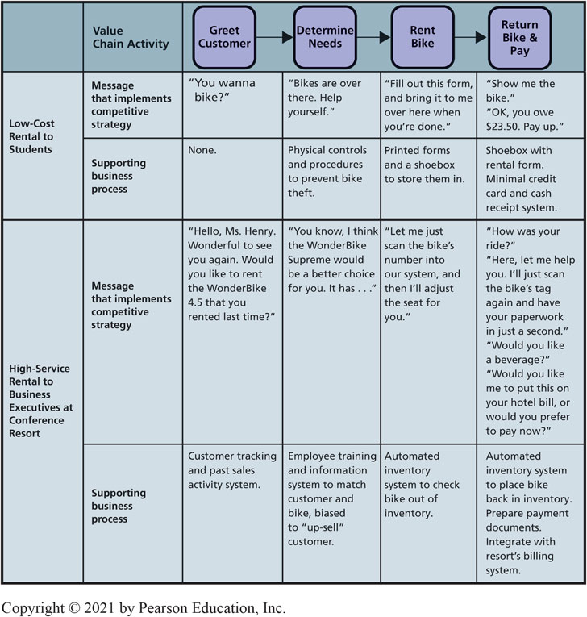

# High-Service Rental Value Chain

2\-7 How do information systems provide competitive advantages?

 __Figure 2\-12__   Business Process and Information Systems for High\-Service Bike Rental

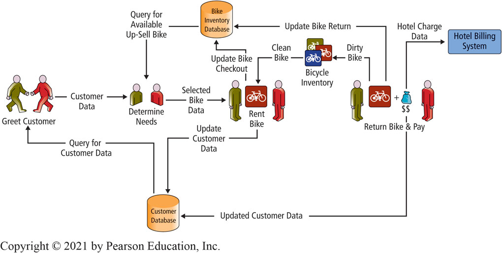

# Principles of Competitive Advantage

2\-7 How do information systems provide competitive advantages?

__Product Implementations__

Create a new product of service

Enhance products or services

Differentiate products or services

__Process Implementations__

Lock in customers and buyers

Lock in suppliers

Raise barriers to market entry

Establish alliances

Reduce costs

# Competitive Advantages Via Products and Processes

2\-7 How do information systems provide competitive advantages?

 __Figure 2\-13__   Principles of Competitive Advantage

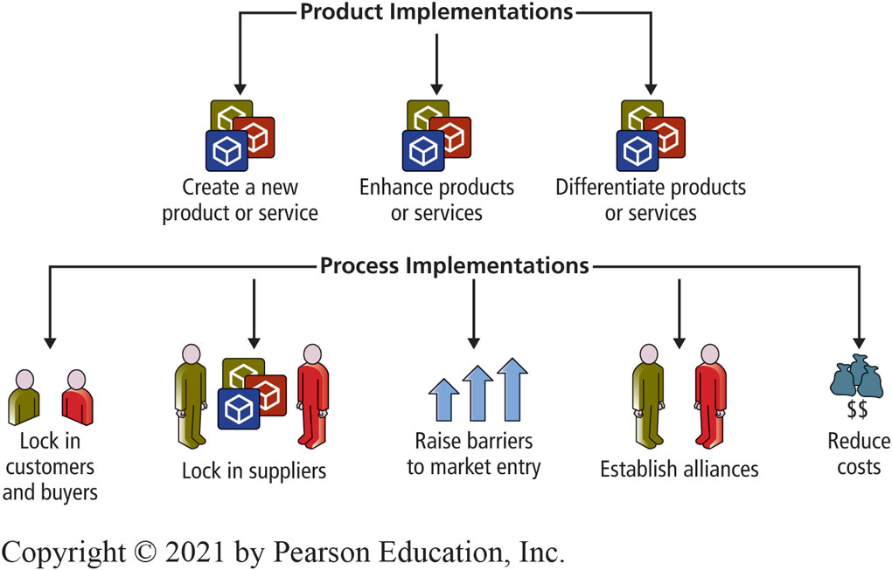

# Amazon Eats Whole Foods (1 of 2)

So What?

Amazon recently purchased the grocery retailer Whole Foods for more than $13 billion\.

This move is perceived by many as a strategic move against Amazon’s major competitor—Walmart\.

Walmart sells more groceries than any other company in the United States\.

Whole Foods will help Amazon increase its grocery business\.

So What?

Amazon Go has as no checkout lines or point\-of\-sale terminals\.

Do you think other grocery chains are concerned about this move by Amazon?

Do you see any downsides of the Amazon Go model?

Can you identify any other industries that Amazon may choose to enter in the next 5 years?

# Competitive Advantages Via Products

2\-7 How do information systems provide competitive advantages?

 __Figure 2\-14__   Two Roles for Information Systems Regarding Products

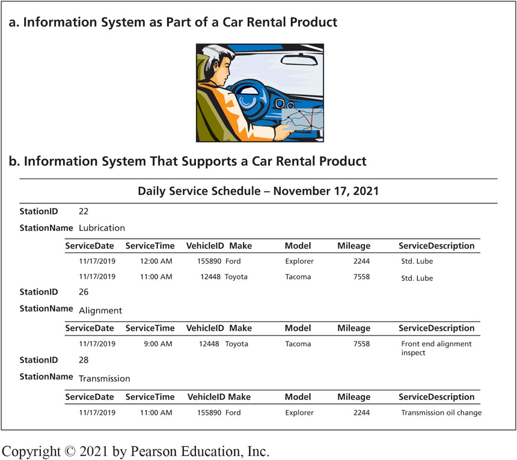

# Using I S to Create Competitive Advantages

* 2\-7 How do information systems provide competitive advantages?
* ABC Shipping Company Example:
  * Enhances existing products
  * Differentiates products
  * Locks in customers
  * Raises barriers to market entry
  * Increases profit margins by decreasing costs and decreasing errors

# How Does the Knowledge in This Chapter Help You?

Identify key points eHermes must address in deciding whether to diversify the types of services the company provides\.

Develop guidance for yourself about relationship between competitive strategy and information systems requirements

Summarize what you have learned from this example in a statement that you could make in a job interview

# The Lure of Love Bots

Ethics Guide

The problem: 15 percent of the total subscribers were female\, while 85 percent were male

“The key to maintaining subscribers on this type of site is keeping them interested”

To keep subscribers paying\, “all we have to do is send them some messages from a dummy account”

All interactions can be handled with A  I bots

Are the owner’s actions illegal? Unethical?

# Senior Learning and Development Specialist

* Career Guide
* Christin Dunlop in Learning and Development
  * Q\. What attracted you to this field?
    * A\. “As I started taking computer courses in college\, I quickly discovered that was how my brain worked\. …Learning how things work and the ‘magic’ behind the scenes really excites me\.”
  * Q\. What advice would you give to someone who is considering working in your field?
    * A\. “The biggest key to success within technology is a sense of adventure\, confidence in yourself\, and a willingness to try something new and step outside your comfort zone\. My advice is be confident you can learn something and go for it\!”

# Active Review

__2\-1__  How does organizational strategy determine information systems structure?

__2\-2__  What five forces determine industry structure?

__2\-3__  How does analysis of industry structure determine competitive strategy?

__2\-4__  How does competitive strategy determine value chain structure?

__2\-5__ How do business processes generate value?

__2\-6__ How does competitive strategy determine business processes and the structure of information systems?

__2\-7__ How do information systems provide competitive advantages?

# The Amazon of Innovation (1 of 2)

Case Study 2

__Figure 2\-15__ Innovation at Amazon

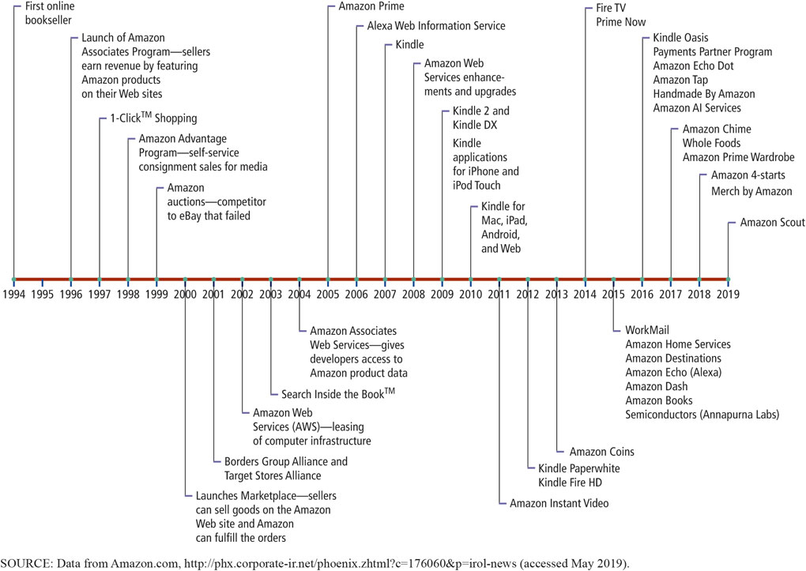

* Case Study 2
* Amazon’s business lines three categories:
* Online retailing
  * Own inventory
  * Associates program
  * Consignment
* Order fulfillment
* Cloud services

# Fulfillment Fees for Standard-Sized Products (as of May 2019)

Case Study 2

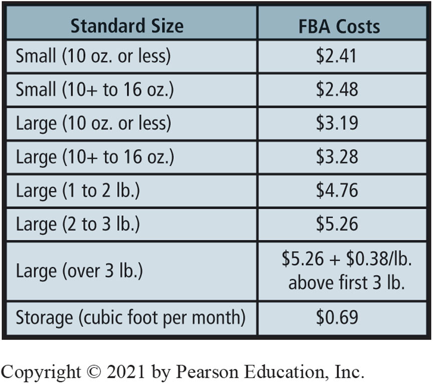

# Impact of F B A

Case Study 2

Amazon provides customer service for order processing \(handling returns\, fixing erroneously packed orders\, answering customer order queries\, etc\.\)\.

Using Web\-standard technology\, F  B  A customers’ order and payment data directly linked to Amazon’s information systems\.

Enables companies to outsource order fulfillment to Amazon\, thus avoiding the cost of developing their own processes\, facilities\, and information systems for this purpose\.

# Copyright

