# Experiencing M I S

Ninth Edition

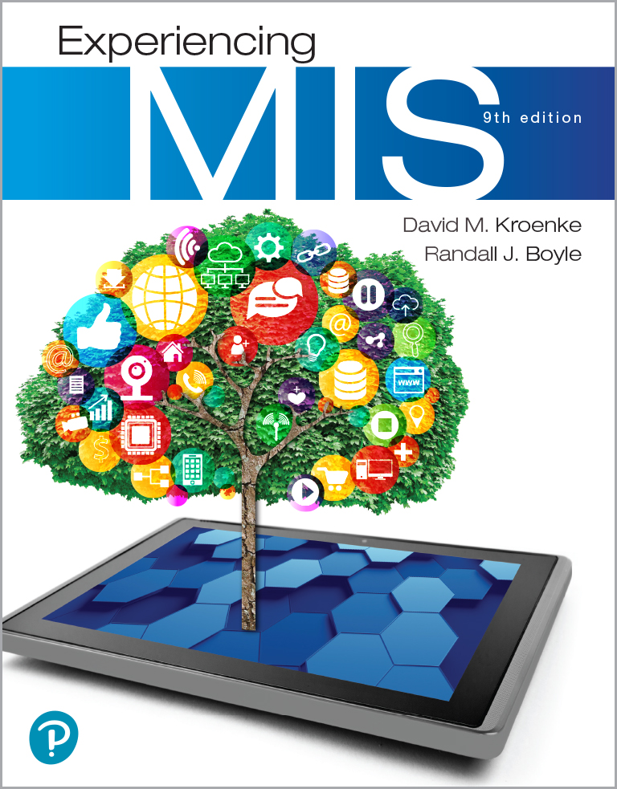

__Chapter 4__

Hardware and Software

Slides in this presentation contain hyperlinks\. JAWS users should be able to get a list of links by using INSERT\+F7

Copyright © 2021\, 2019\, 2017 Pearson Education\, Inc\. All Rights Reserved

# “How is the AI project going?”

* eHermes investigating using AI to improve operational efficiency
  * Cut costs by 20% and double efficiency
* Going much more slowly than anticipated
  * Employee expertise is self\-driving vehicles\, not AI
* Not enough data to train the AI
  * Data patterns constantly shifting
  * Need to hire team of AI experts
* Frustrating being on the “bleeding edge”

# Study Questions

__4\-1__  What do business professionals need to know about computer hardware?

__4\-2__  How can new hardware affect competitive strategies?

__4\-3__  What do business professionals need to know about software?

__4\-4__  Is open source software a viable alternative?

# Processors and Memory

4\-1 What do business professionals need to know about computer hardware?

 __Central processing unit__   \(C  P  U\)—“the brain\.”

 __Dual\-processor__   and   __Quad\-processor__   computers\.

C  P  U  s vary in speed\, function\, cost\.

C  P  U works in conjunction with   __main memory__   \(R  A  M\)\.

C  P  U reads data and instructions from memory\, and stores results of computation in memory\.

# Storage Hardware

* 4\-1 What do business professionals need to know about computer hardware?
* Save data and programs
* Common storage devices
  *  __Non\-volatile__ 
    * Magnetic disks \(Hard drive\)
    * Solid\-state storage \(S  S  D\)
    * USB flash drives
    * Optical disks \(C  D/D  V  D\)
  *  __Volatile__   —cache and main memory

# Basic Types of Hardware

4\-1 What do business professionals need to know about computer hardware?

__Figure 4\-1__ Basic Types of Hardware

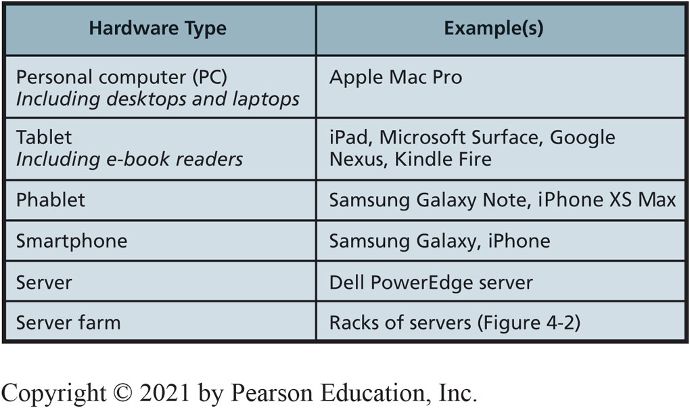

# Server Farm

4\-1 What do business professionals need to know about computer hardware?

__Figure 4\-2__ Server Farm

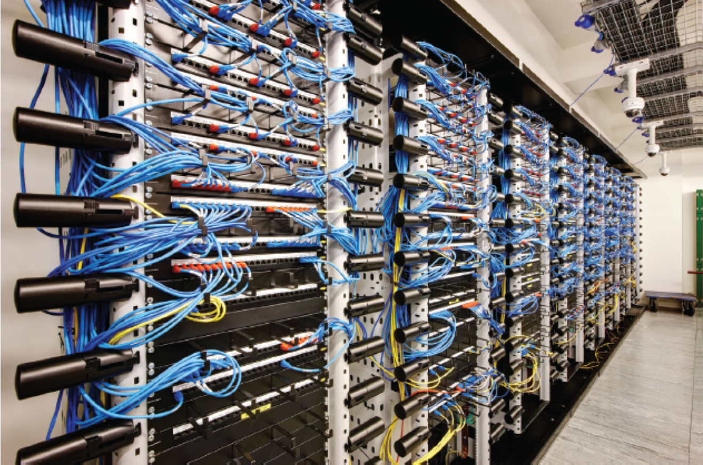

 __Source__   : © Andrew Twort/Alamy

# Computer Data: Binary Digits (Bits)

4\-1 What do business professionals need to know about computer hardware?

 __Figure 4\-3__   Bits Are Easy to Represent Physically

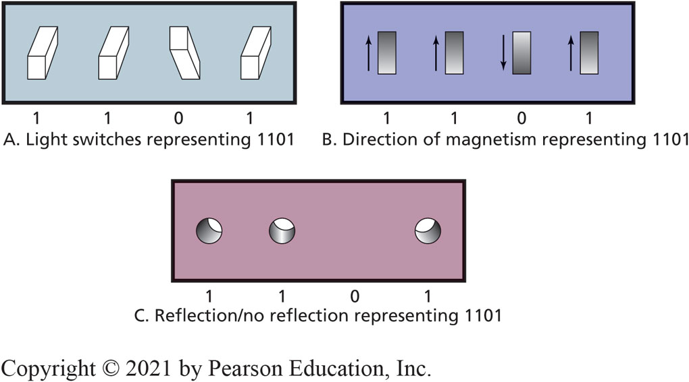

# Important Storage Capacity Terminology

4\-1 What do business professionals need to know about computer hardware?

__Figure 4\-4__ Important Storage\-Capacity Terminology

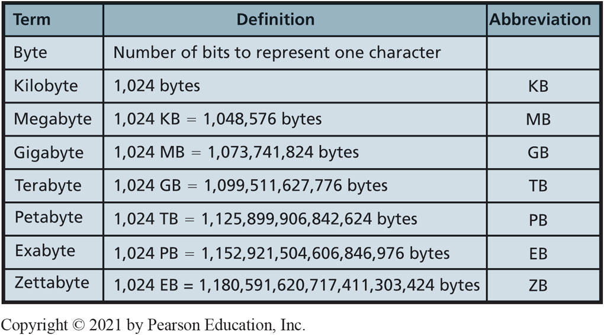

# Specifying Hardware with Computer Data Sizes

* 4\-1 What do business professionals need to know about computer hardware?
* Disk capacities specified by amount of bytes\.
  * 500 G iga B yte
* C  P  U speed expressed in cycles called hertz\.
  * Slow personal computer speed of 3\.0 Gigahertz\.
  * Fast P  C 3\.5\+ G iga H ert z\.

# Disruptive New Tech Hardware

4\-2 How can new hardware affect competitive strategies?

Potentially disruptive hardware developments for existing organizations\.

  * Internet of Things \(I  o  T\)
  * Digital Reality Devices
  * Self\-Driving Cars
  * 3D Printing
  * Cryptocurrencies

# Internet of Things (I o T)

4\-2 How can new hardware affect competitive strategies?

Everyday objects embedded with hardware capable of sensing\, processing\, transmitting data\.

Objects share data via a network with any other application\, service\, or device\.

__Figure 4\-5__ Smartphone Development

__Source__ : Grgroup/Fotolia

# Impact of the Internet of Things

* 4\-2 How can new hardware affect competitive strategies?
* G  E’s Industrial Internet
  * Increase efficiencies\, reduce waste\, improve decision making\.
  * Greatest potential for smart devices in hospitals\, power grids\, manufacturing plants\, and transportation\.
* Smart buildings \(Microsoft\)
  * I  D problems like wasteful lighting\, competing heating and cooling systems\, rogue fans\, etc\.

# Digital Reality Devices (1 of 3)

4\-2 How can new hardware affect competitive strategies?

Tremendous potential to revolutionize our daily lives\.

Will create entirely new types of companies\.

Change the way people live\, work\, shop\, and entertain themselves\.

Different levels of digital reality on a continuum from completely   __real__   environments to completely   __virtual__   environments\.

4\-2 How can new hardware affect competitive strategies?

 __Augmented__    __reality__   \(A  R\) is the altering of reality by   __overlaying__   digital information on real\-world objects\.

 __Mixed__    __reality__   \(M  R\) is the combination of the real physical world with   __interactive__   virtual images or objects\.

 __Virtual__    __reality__   \(V  R\)\, or a   __completely__   computer\-generated   __virtual world__   with interactive digital objects\.

4\-2 How can new hardware affect competitive strategies?

 __Figure 4\-7__   Levels of Digital Reality

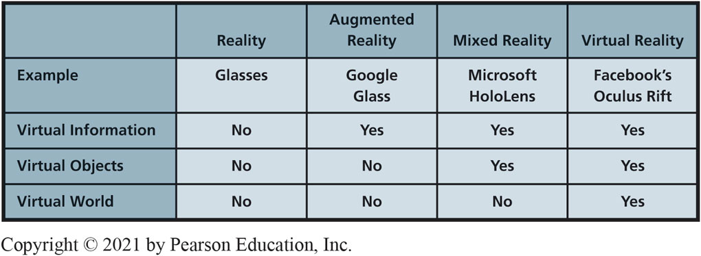

# Self-Driving Cars by 2021

* 4\-2 How can new hardware affect competitive strategies?
* Make things easier\, cheaper\, safer\.
* Automobile accidents may become a thing of the past\.
  * Car insurance eliminated \(?\)\.
* Eliminate need to have multiple cars\.
* Avoid costly traffic tickets\, parking tickets\, DUI citations\.

__Figure 4\-9__ Future Cars Will Drive Themselves

__Source__ : Dan Race/Shutterstock

# Self-Driving Cars Will Disrupt Businesses

4\-2 How can new hardware affect competitive strategies?

Auto sales—Fewer cars on road may mean fewer cars sold\.

Also fewer auto loans\, fewer auto insurance policies\, and fewer collision repair shops\.

More jobs for engineers\, programmers\, systems designers\.

More computer hardware\, sensors\, and cameras in vehicles\.

# New from C E S 2019

* So What?
* LG Signature OLED TV R—A Roll\-up TV
  * A 65\-inch 4K TV rolls up out of a silver box that doubles as a sound bar\.
  * A super\-thin\, super\-light TV that comes rolled up in a smallish rectangle\.
* Harley\-Davidson LiveWire—An all\-electric motorcycle
  * No noise\, 0 to 60 mph in 3\.5 secs\, 200 mile range
* Jabra Elite noise\-cancelling headphones
  * Uses AI to monitor the environment and adjust automatically

# 3D Printing

4\-2 How can new hardware affect competitive strategies?

Plastics\, metals\, wood\, ceramics\, foods\, biological material\.

Opportunities in aerospace\, defense\, automotive\, entertainment\, and healthcare industries\.

What happens when 3D print extra\-large objects like cars\, airplanes\, boats\, houses\, drones\, etc\. becomes possible?

__Figure 4\-10__ 3D Printer

__Source__ :Seraficus/Getty Images

# Existing 3D Printing Examples

    * 4\-2 How can new hardware affect competitive strategies?
* Nike Flyprint Running Shoes
  * World\-record setting marathon runner Eliud Kipchoge competes in 3D printed shoes custom designed by Nike

# Cryptocurrencies

4\-2 How can new hardware affect competitive strategies?

* Digital\-only currencies \(like Bitcoin\)
  * Use cryptographic protections to manage and record secure transactions
* Benefits: faster\, easier\, few to no fees
  * Governments can’t monitor\, tax\, seize
* Risks: price volatility\, not accepted everywhere\, bad reputation \(organized crime\(?\)\)
* Future: Blockchain—underlying technology\, making all types of transactions more secure

# Categories of Computer Software

4\-3 What do business professionals need to know about software?

__Figure 4\-11__ Categories of Computer Software

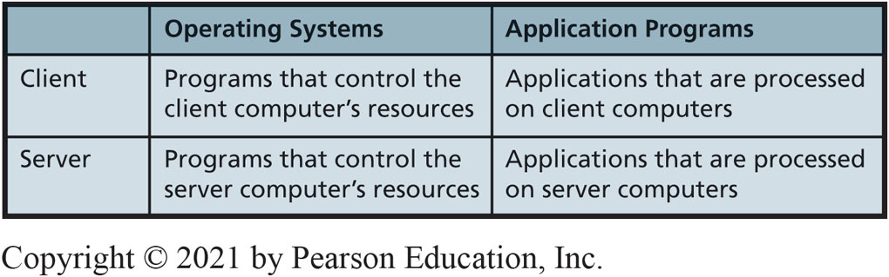

# Major Operating Systems (1 of 2)

4\-3 What do business professionals need to know about software?

__Figure 4\-12__ Major Operating Systems \(continues onnext slide\)

4\-3 What do business professionals need to know about software?

__Figure 4\-12__ Major Operating Systems \(con’t\.\)

# Example of the Modern-Style Interface

4\-3 What do business professionals need to know about software?

__Figure 4\-13__ Example of the Modern\-Style Interface

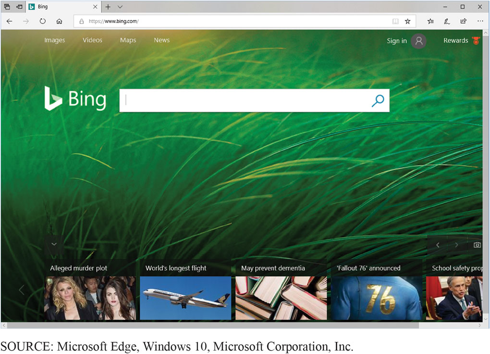

# Personal Computer Hosting Two Virtual Machines (Linux and Windows)

4\-3 What do business professionals need to know about software?

__Figure 4\-14__ Linux Mint Virtual Machine Running in Microsoft Windows

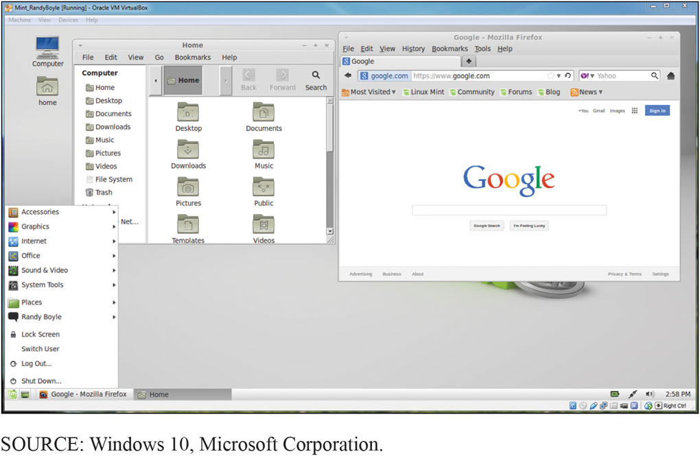

# Server Virtual Machine Example

4\-3 What do business professionals need to know about software?

__Figure 4\-15__ Windows Server Computer Hosting Virtual Machines

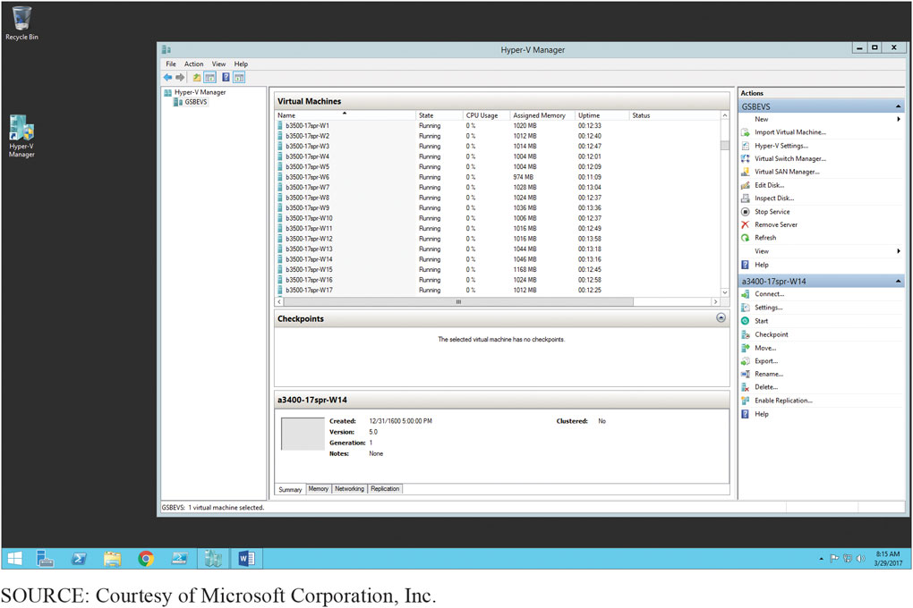

# How a Virtual Machine Looks to its User

4\-3 What do business professionals need to know about software?

__Figure 4\-16__ Virtual Machine Example

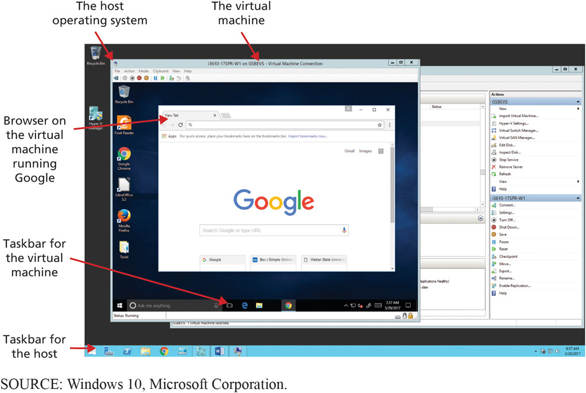

# Own Versus License

* 4\-3 What do business professionals need to know about software?
* “Buying software” means you buy a License\.
* Right to use specified number of copies\.
* Limits vendor’s liability\.
* Site License\.
  * Flat fee to install software product on all company computers or all computers at specific site\.
* Open source\.
  * No license fee\.

# What Types of Applications Exist, and How Do Organizations Obtain Them?

4\-3 What do business professionals need to know about software?

 __Figure 4\-17__   Software Sources and Types

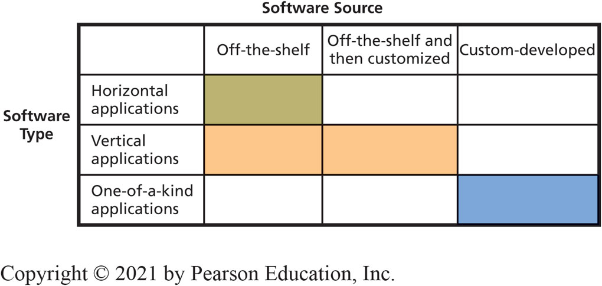

# What is Firmware?

* 4\-3 What do business professionals need to know about software?
* Special software installed on read\-only memory \(R  O  M\)\.
  * Printers\, print servers\, communication devices\.
  * As if program’s logic is designed into device’s circuitry\.
  * Can be changed and upgraded like other software\, but normally a task for I  S professionals\.

# Examples of Open Source Software

4\-4 Is open source software a viable alternative?

LibreOffice \(default office suite in Linux distributions\)

Firefox \(a browser\)

My  S  Q  L \(a D  B  M  S\, see Chapter 5\)

Apache \(a Web server\, see Chapter 6\)

Ubuntu \(a Windows\-like desktop operating system\)

Android \(a mobile\-device operating system\)

Cassandra \(a N  o  S  Q  L D  B  M  S\, see Chapter 5\)

Hadoop \(a BigData processing system\, see Chapter 3\)

# Why Do Programmers Volunteer Their Services to Open Source Projects?

4\-4 Is open source software a viable alternative?

Exercise creativity on interesting & fulfilling projects\.

Freedom to choose projects\.

Exhibit skills to get a job\.

Start a business selling services\.

Succeeds because of collaboration\.

# How Does Open Source Work?

* 4\-4 Is open source software a viable alternative?
* Closed\-source or proprietary software
  * Only available to trusted employees and carefully vetted contractors
* Open\-source software
  * available to public

 __[Source code](http://en.wikipedia.org/wiki/Source_code)__   : Human readable computer code

 __[Machine code](http://en.wikipedia.org/wiki/Machine_code)__   : Source code compiled into  instructions executed directly by computer’s C  P  U

# Source Code Sample

4\-4 Is open source software a viable alternative?

 __Figure 4\-18__   Source Code Sample

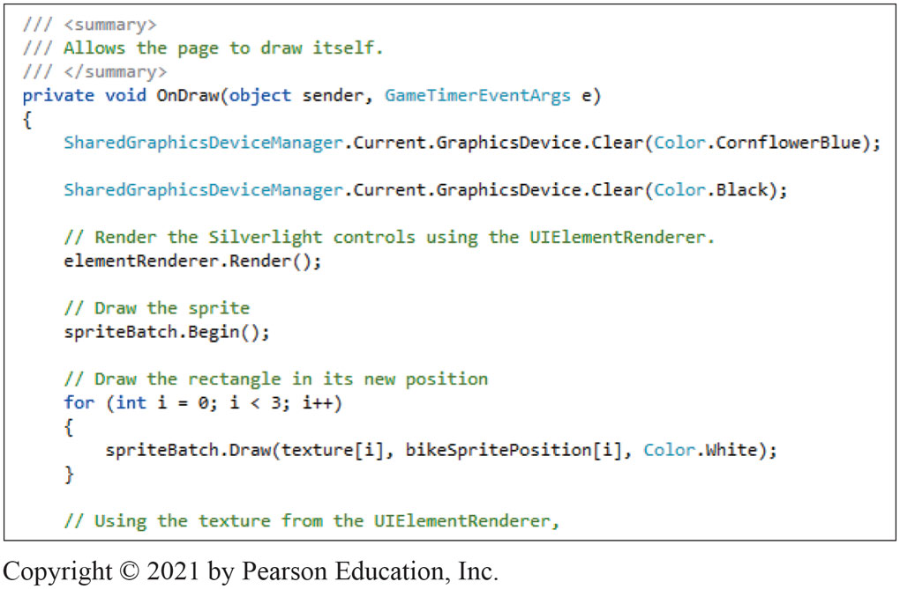

# So, Is Open Source Viable?

* 4\-4 Is open source software a viable alternative?
* Depends on requirements and constraints\.
* “Free” open source software might require support and operational costs exceeding cost of licensing fee\.
* Blending proprietary and open source software in future\.
* Closed source project\.
  * Highly protected source code\, only available to trusted employees and carefully vetted contractors\.

# How Does the Knowledge in This Chapter Help You?

Understand your involvement with technology in commerce

You learned about hardware and software

Gained knowledge of application software sources

Learned about open source software and why not always viable option

Learned hardware/software knowledge is perishable

# Ethics Guide: Free Apps for Data

* Ethics Guide
* How do you monetize “free” apps?
* “If you’re not paying for it\, you are the product\.
*  __Data__    __Brokers__ 
* SnoopWall  reports
  * Flashlight Apps
  * Require permission to access data about your location\, network connectivity\, U  S  B storage\, install shortcuts\, receive data to/from the Internet\, modify your system settings\, and disable your screen lock\.

# Free Apps for Data

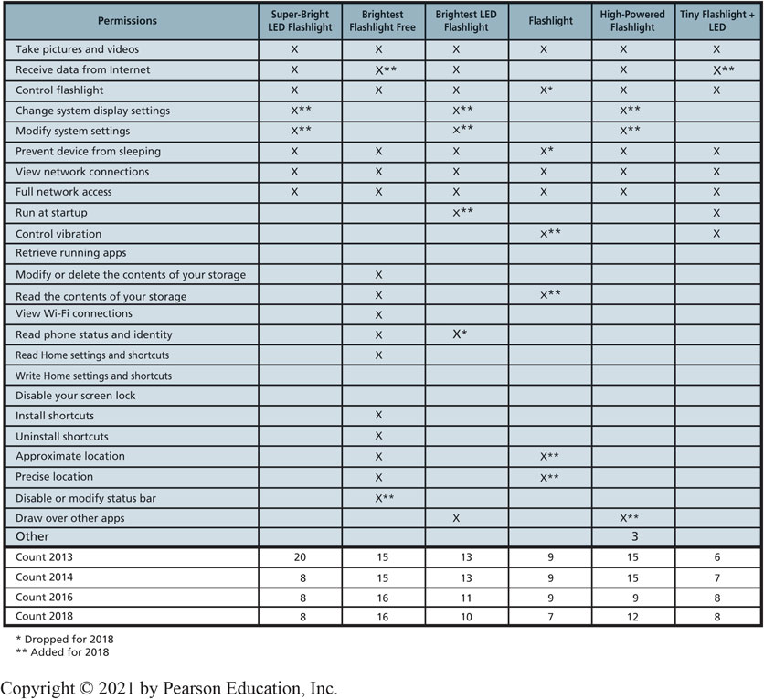

Ethics Guide

# Senior Software Engineer

* Career Guide
* Marshall Pettit at Preparis\, Inc\.
  * Q\. What attracted you to this field?
  * A\. “Web software development has always fascinated me since taking an elective during my undergraduate business management studies\. Building complex yet elegant business systems using commands in a text editor is as fulfilling as building a home from raw materials and seeing it take shape\.”
  * Q\. What advice would you give to someone who is considering working in your field?
  * A\. “Just do it\. Take a leap of faith and run with the challenges ahead\. Courageously tackling your dream job in spite of the imaginary barriers around it will be both fun and rewarding\.”

# Active Review

__4\-1__  What do business professionals need to know about computer hardware?

__4\-2__  How can new hardware affect competitive strategies?

__4\-3__  What do business professionals need to know about software?

__4\-4__  Is open source software a viable alternative?

# The Apple of Your i (1 of 2)

* Case Study 4
* Created mobile markets with i  Pod\, i  Phone\, i  Pad\.
* Opened own stores\.
  * Open and inviting sales floor\, Genius Bar help desk\, incredibly well\-trained and disciplined sales force\.
* Pioneered Internet sale of music and applications\.
* Sixth largest public company in world\.

Case Study 4

 __Figure 4\-19__   Growth in Apple Stock Price

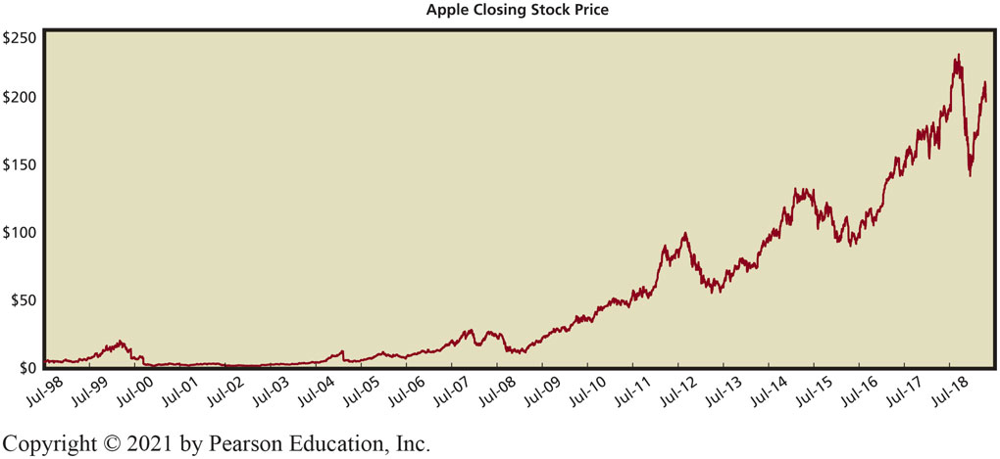

# Copyright

