# Experiencing M I S

Ninth Edition

__Chapter 5__

Database Processing

Slides in this presentation contain hyperlinks\. JAWS users should be able to get a list of links by using INSERT\+F7

Copyright © 2021\, 2019\, 2017 Pearson Education\, Inc\. All Rights Reserved

# “The tricky part is getting the computer to correctly identify the inventory item.”

eHermes is using Google’s image classifier API to identify images that customers upload\.

Costs a few dollars per 1000 images searched

Need new data storage

Need redesigned database

Need new DBMS

Will be sending and receiving data from multiple data sources

MongoDB for tracking image files?

# Study Questions

__5\-1__  Why do you need to know about databases?

__5\-2__  What is a database?

__5\-3__  What is a database management system \(D  B  M  S\)?

__5\-4__  How do database applications make databases more useful?

__5\-5__  How can eHermes benefit from a database system?

__5\-6__  What are nontraditional D  B  M  S products?

# Why Use a Database?

5\-1 Why do you need to know about databases?

Can database technology facilitate your project goals?

Databases are ubiquitous in commerce\.

How to turn data into useful information\.

Business adaptation requires changing database structure\.

As a future business professional\, you might need to build a database\.

# What is the Purpose of a Database?

* 5\-1 Why do you need to know about databases?
* Organize and keep track of things\.
* Keep track of multiple themes\.
* General rule:
  * Single theme—store in a spreadsheet\.
  * Multiple themes—use a database\.
  * What’s a theme?
    * Ex: student grades\, student emails\, student office visits\.

# A List of Student Grades Presented in a Spreadsheet – Single Theme

5\-1 Why do you need to know about databases?

__Figure 5\-1__ A List of Student Grades Presented in a Spreadsheet

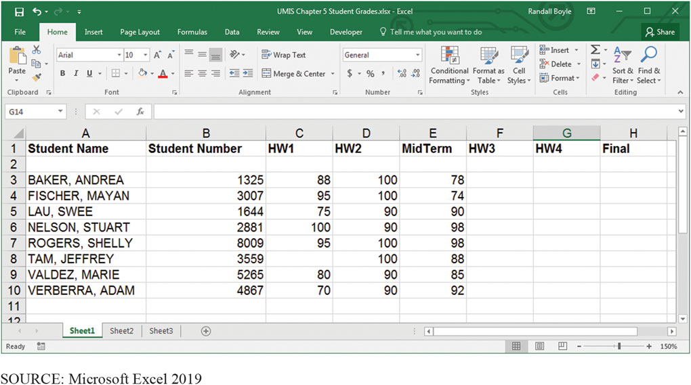

# Student Data Form for a Database Application

5\-1 Why do you need to know about databases?

__Figure 5\-2__ Student Data Shown in a Form from a Database

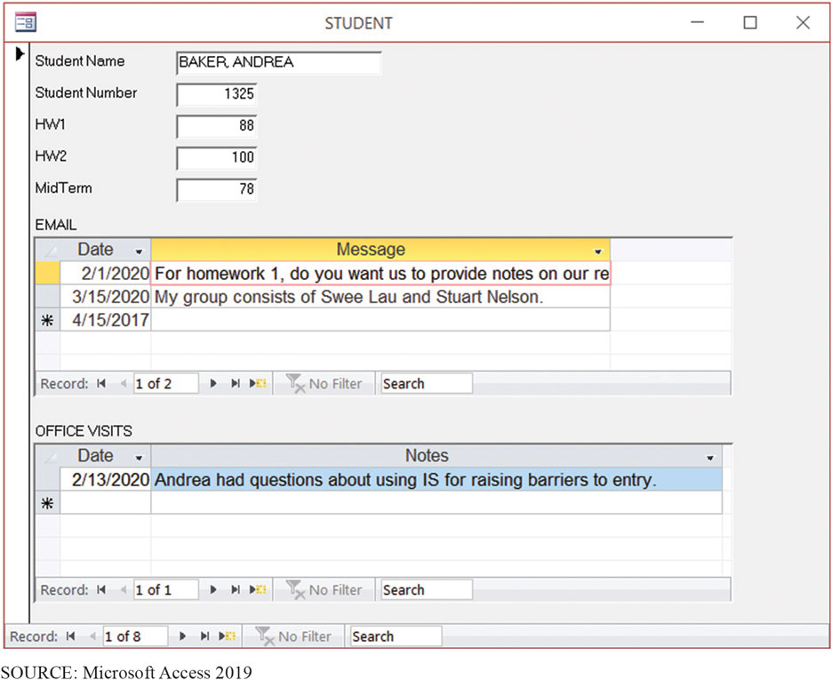

# What is a Database?

5\-2 What is a database?

 __Figure 5\-3__   Student Table \(also called a file\)

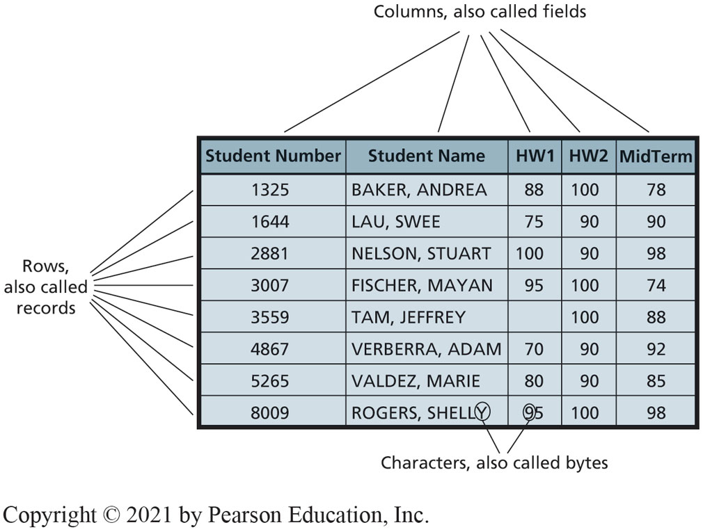

# Hierarchy of Data Elements

5\-2 What is a database?

__Figure 5\-4__ Hierarchy of Data Elements

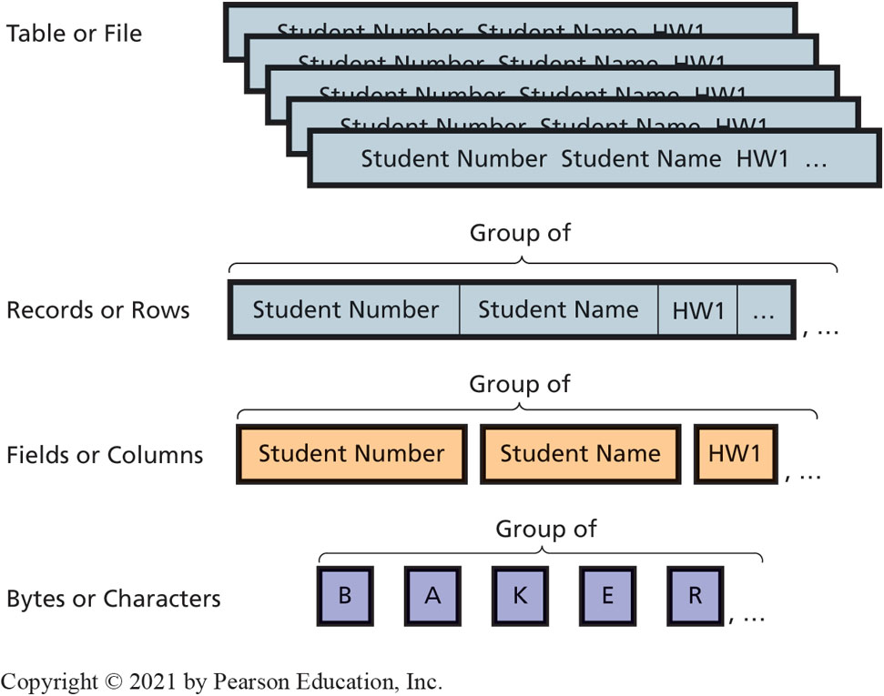

# Components of a Database

5\-2 What is a database?

__Figure 5\-5__ Components of a Database

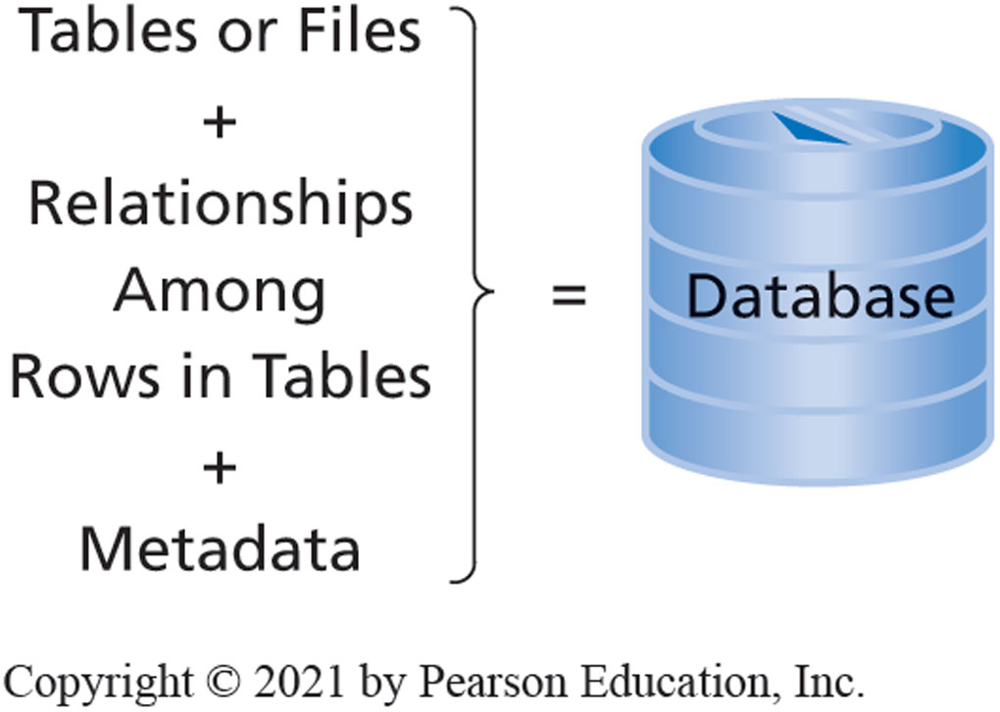

# Example of Relationships Among Rows

5\-2 What is a database?

__Figure 5\-6__ Example of Relationships Among Rows

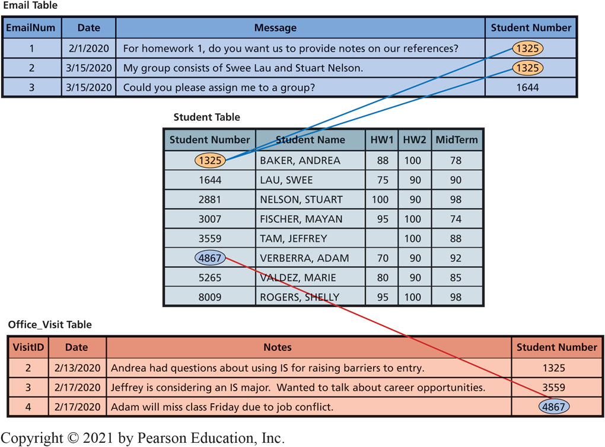

# Sample of Access Metadata

5\-2 What is a database?

__Figure 5\-7__ Sample Metadata \(in Access\)

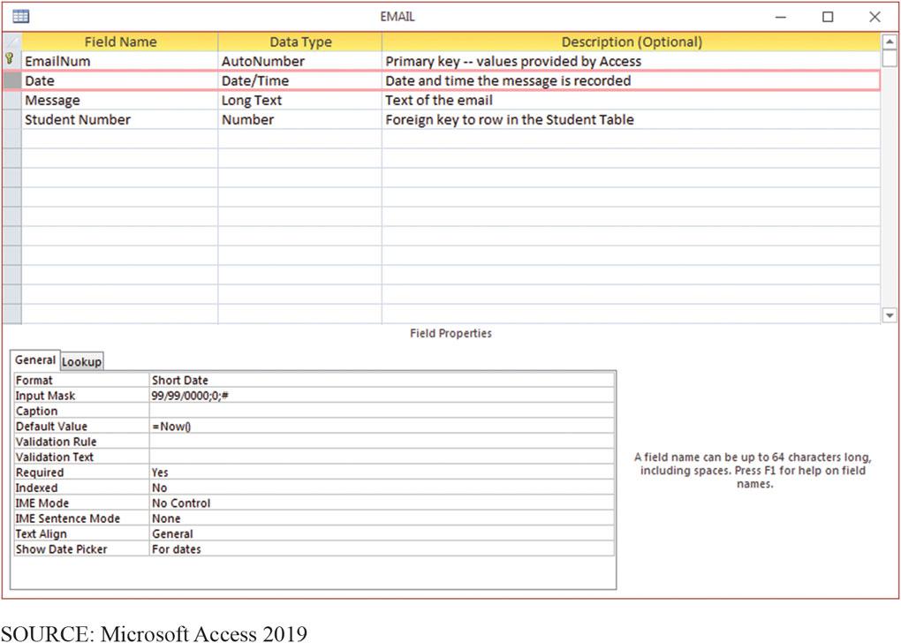

# Database Management System (D B M S)

5\-3 What is a database management system \(DBMS\)?

Functions of a D  B  M  S

  * Creating the Database and its structures
  * Processing the database
  * Administering the database

* Licensed from vendors
  * I  B  M\, Microsoft\, Oracle\, and others\.
    * D  B2\, Access\, S  Q  L Server\, Oracle Database\.
* Open source
  * My  S  Q  L: License\-free for most applications\.

# Processing the Database (1 of 2)

5\-3 What is a database management system \(DBMS\)?

Creating the database \(see form in Figure 5\-7\)

Modifying the database structure \(see Figure 5\-8\)

D  B  M  S Process Operations

  * Read
  * Insert
  * Modify
  * Delete data

# Adding a New Column to a Table (in Access 2019)

5\-3 What is a database management system \(DBMS\)?

__Figure 5\-8__ Adding a New Column to a Table \(in Access\)

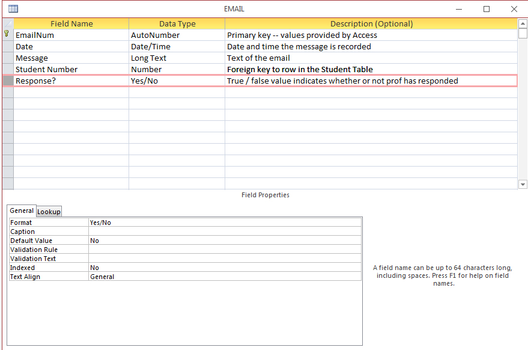

 __Source__   : Microsoft Access 2019

# Processing the Database (2 of 2)

* 5\-3 What is a database management system \(DBMS\)?
* Structured Query Language—S  Q  L \(see\-quell\)
  * International standard
  * Used by nearly all D  B  M  S
* S  Q  L Example
* INSERT INTO Student
  * \(\[Student Number\]\, \[Student Name\]\, H  W1\, H  W2\, MidTerm\)
* VALUES \(1000\, ‘Franklin\, Benjamin’\, 90\, 95\, 100\);

# Slick Analytics (1 of 2)

* So What?
* C  I  O  s are looking to merge the   __storage__   and   __analysis__   of cloud\-based data into one synergistic operation\.
* Laredo Petroleum\.
  * Old approach used numerous spreadsheets and manual calculations\.
  * Value of data diminished due to the time it took to analyze the data\.
  * New approach uses cloud storage and cloud analytics\.

* So What?
* Laredo Petroleum\.
  * Needs to know when it should clean chemical deposits in its wells\.
  * Cloud storage and analytics improved scalability\, robust data analysis\, and data accessibility\.
* Cloud analytics will grow by 46 percent through 2020\.
* Security and privacy concerns are drawbacks to cloud services\.

# Administering the Database

5\-3 What is a database management system \(DBMS\)?

Set up security system\, user accounts\, passwords\, permissions\, limits for processing\.

Limit user permissions\.

Back up database\, improve performance of database applications\, remove unwanted data\.

# Summary of Database Administration Tasks (1 of 2)

5\-3 What is a database management system \(DBMS\)?

__Figure 5\-9__ Summary of Database Administration \(DBA\) Tasks \(continues on next slide\)

5\-3 What is a database management system \(DBMS\)?

__Figure 5\-9__ Summary of Database Administration \(DBA\) Tasks \(con’t\.\)

# Forms, Queries, Reports, and Applications

5\-4 How do database applications make databases more useful?

# Users Accessing Databases

5\-4 How do database applications make databases more useful?

 __Figure 5\-10__   Processing Environment of a Traditional Database Application System

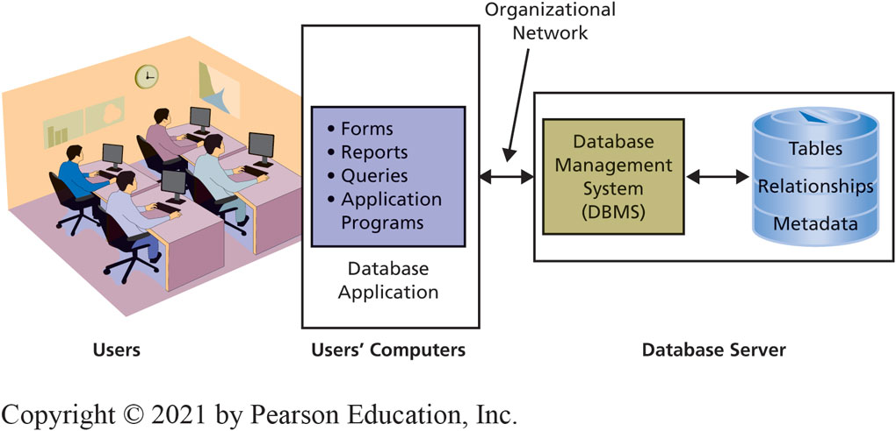

# Example of a Student Report

5\-4 How do database applications make databases more useful?

__Figure 5\-11__ Example of a Student Report

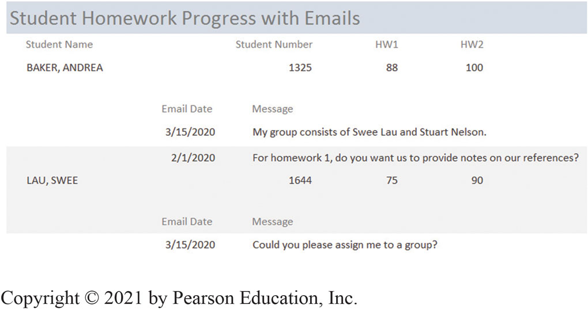

# Query Example

5\-4 How do database applications make databases more useful?

 __Figure 5\-12A__   Sample Query Form Used to Enter Phrase for Search

 __Figure 5\-12B__   Sample Query Results of Query Operation

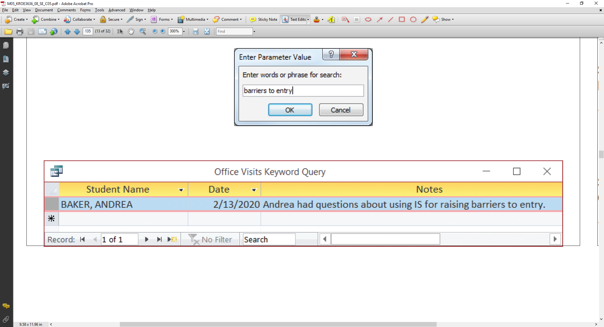

 __Source__   : Microsoft Corporation

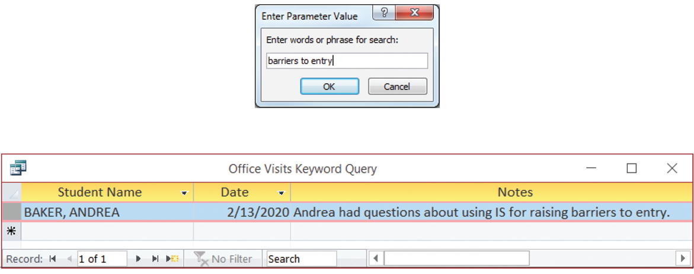

 __Source__   : Microsoft Access 2019

# Browser Forms, Reports, Queries, and Applications

5\-4 How do database applications make databases more useful?

 __Figure 5\-13__   Processing Environment of Browser\-Based Database Applications

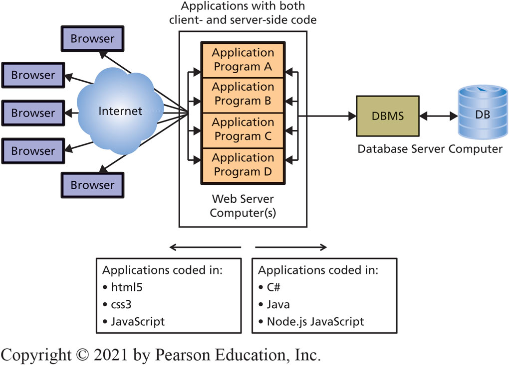

# Account Creation Browser Form

5\-4 How do database applications make databases more useful?

__Figure 5\-14__ Microsoft Office 365 User Account Form

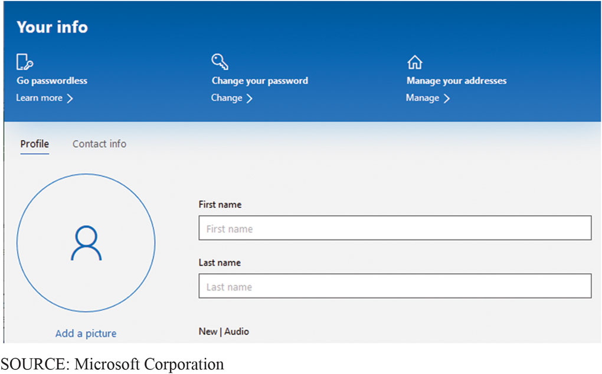

# Browser Report

5\-4 How do database applications make databases more useful?

__Figure 5\-15__ Browser Report for SharePoint Site

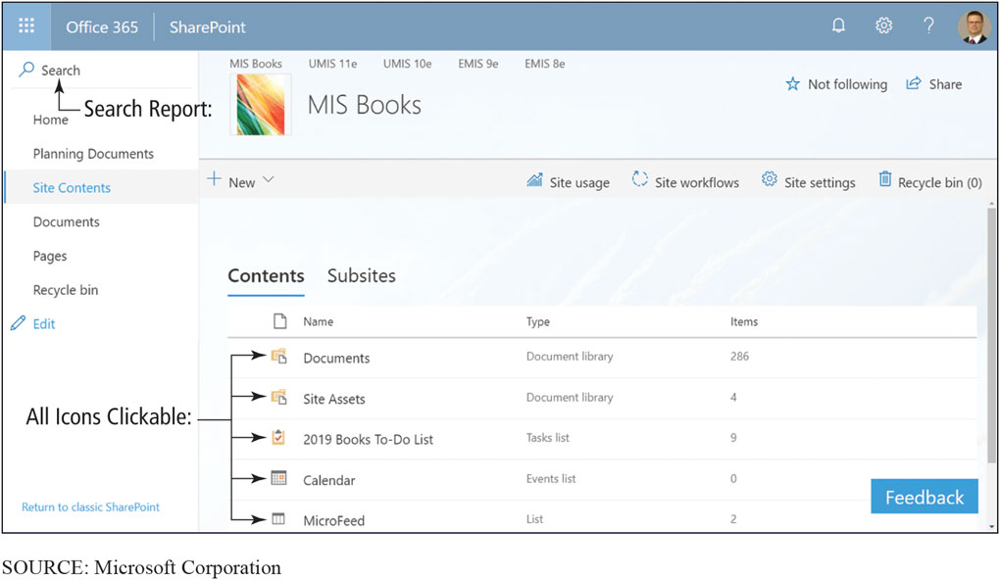

# Multiuser Processing Problem

5\-4 How do database applications make databases more useful?

Andrea reads available tickets record showing 2 tickets\.

5\. Andrea proceeds to checkout\. Someone will  be disappointed\.

3\. Andrea puts both in shopping basket\, but delays checking out\.

Jeffrey reads same record showing 2 available tickets\.

Jeffrey puts both in shopping basket and checks out  before Andrea\.

# A Database System at eHermes

* 5\-5 How can eHermes benefit from a database system?
* Speed up the process of inventorying new items received from sellers\.
  * “Can we add a new item’s entry in our database using a photo and Google’s image classifier to recognize the item\, search for product information from multiple sources\, and complete the database entry?”
* Choices
  * Store images on a file server and keep metadata about each image in a relational database to query with S  Q  L\.
  * Use No  S  Q  L   __Mongo__    __D__    __B__   to store images in same database as the metadata\.

# eHermes Chooses Option 1

5\-5 How can eHermes benefit from a database system?

Use Microsoft SQL Server to store metadata\.

Less risky: uses known technology\.

Creates E\-R diagram\.

Decide to keep design simple at first\.

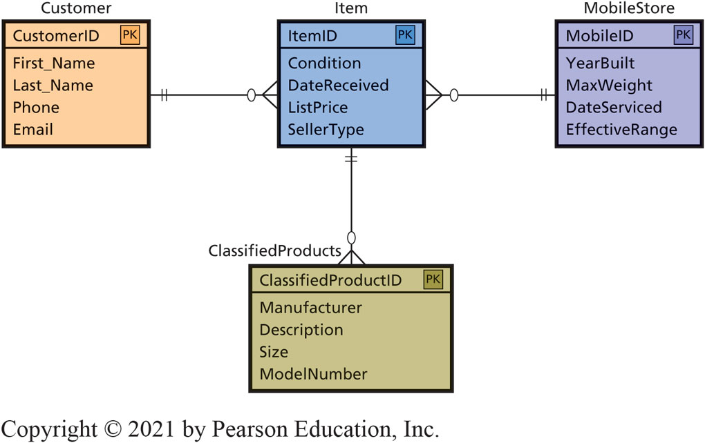

# Nontraditional D B M S Products

5\-6 What are nontraditional DBMS products?

 __Relational model is not needed today__ 

Need to store new data types differently

  *  __A__   tomic\,   __C__   onsistent\,   __I__   solated\,   __D__   urable transactions
  * Critical to traditional commercial applications
  * New Internet applications \(Twitter\) don’t need A  C  I  D
* NoSQL \(nonrelational\) DBMS
  * DBMS products that support high transaction rates\, simple data structures\, replicated on many servers in the cloud\, without ACID transaction support\.

# Need for Faster Processing Using Many Servers

* 5\-6 What are nontraditional DBMS products?
*  __Dynamo__ 
  * Amazon\-developed nonrelational data store
*  __Bigtable__ 
  * Google\-developed nonrelational data store
*  __Cassandra__ 
  * Facebook\-developed using concepts from both Dynamo and Bigtable
*  __Top\-Level Project__   \(T  L  P\)
  * Open\-source Cassandra by Apache

# New Categories of D B M S

* 5\-6 What are nontraditional DBMS products?
*  __New__    __S__    __Q__    __L D__    __B__    __M__    __S__ 
  * Process very high levels of transactions\, like No  S  Q  L D  B  M  S\, but provide A  C  I  D support\.
  * May or may not support relational model\.
  * Current hotbed of development\.
*  __In\-memory__    __D__    __B__    __M__    __S__    __using S__    __Q__    __L extension__ 
  * S  A  P H  A  N  A\, Tableau\.
  * High volume A  C  I  D transaction support with complex relational query processing\.

# Will These New Products Replace the Relational Model?

* 5\-6 What are nontraditional DBMS products?
* Probably not\.
  * Conversion enormously expensive and disruptive
  * No  S  Q  L D  B  M  S products very technical and require a deep background in computer science to use
* No  S  Q  L’s impact on D  B  M  S product market?
  * Database software market experience viable new entrants

# What Do Nonrelational DBMS Mean for You?

* 5\-6 What are nontraditional DBMS products?
* What do nonrelational D  B  M  S mean for you?
  * Knowledge is useful—stay abreast of developments
  * Watch nonrelational D  B  M  S product developments from an investor’s perspective
  * New opportunities and career paths will develop around nonrelational databases
  * Use knowledge to separate yourself from competition when it comes to job interviews

# How does the knowledge in this chapter help you?

Understand purpose of a database and ways databases are processed

Know about new categories of nontraditional D  B  M  S

This knowledge will enable you to be an effective team member when your organization has needs like those at eHermes

# Querying Inequality?

* Ethics Guide
* Increasing value of cryptocurrency makes mining an attractive prospect for Richard’s boss Steve\.
* Richard discovers a crypto\-mining program running on company servers\.
  * Only runs at night and during off hours
  * Probably will only increase electricity consumption
* What would you do from a categorical imperative and utilitarian perspectives?

# Data Engineer

* Career Guide
* Kailey Smith at Haven
* Q\. What attracted you to this field?
* A\.  “I've always enjoyed working with computers and figuring things out\, but after taking my first information systems course…I was sold\. This is a field that will be growing and expanding with new and exciting opportunities\. There are so many different areas to explore\, and you can definitely be paid pretty well\!”
* Q\. What advice would you give to someone who is considering working in your field?
* A\.  “Keep an open mind\. Try out new things\. When I was in school\, I was focused on the security side of things because it sounded more exciting\, but I ended up working more on the data side\. Figure out what really excites you\, but the more you learn\, the more opportunities will open up to you\.”

# Active Review

__5\-1__  Why do you need to know about databases?

__5\-2__  What is a database?

__5\-3__  What is a database management system \(D  B  M  S\)?

__5\-4__  How do database applications make databases more useful?

__5\-5__  How can eHermes benefit from a database system?

__5\-6__  What are nontraditional D  B  M  S products?

# Dean’s Piano Database

Case Study 5

Certified piano tuner and technician repairing and restoring pianos for many years\.

Clown entertainer at children’s parties\.

__Figure 5\-17__ Deano the Clown

__Source__ : Dean Petrich

# Pianos in Storage

Case Study 5

__Figure 5\-18__ Pianos in Storage

__Figure 5\-19__ Pianos in Tent

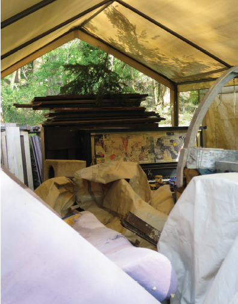

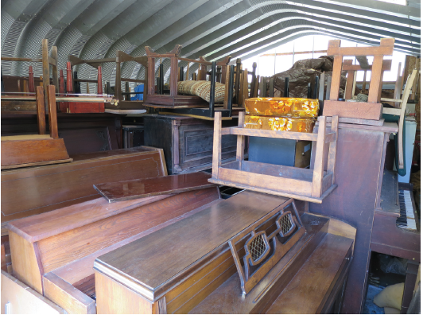

__Source:__ David Kroenke

__Source__ :David Kroenke

# Columns in the Piano Table

Case Study 5

__Figure 5\-20__ Columns in the Piano Table

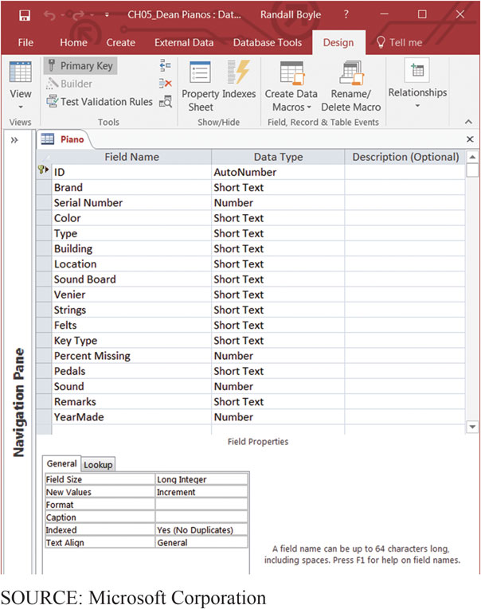

# Query Design and Result

Case Study 5

 __Figure 5\-21__   Example of Access Query

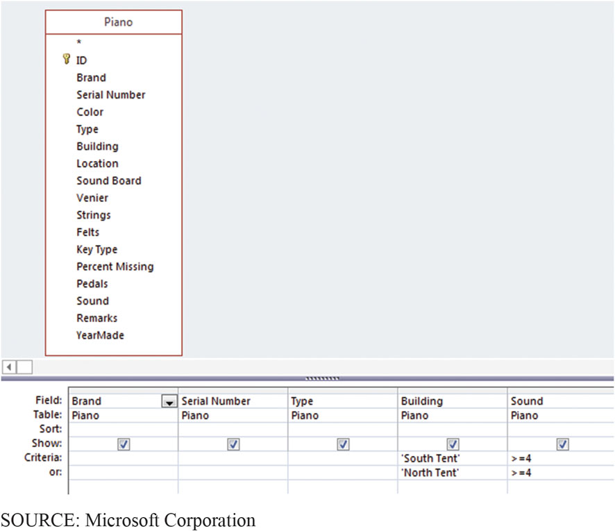

 __Source__   : Microsoft Corporation

# Results from Query

Case Study 5

 __Figure 5\-22__   Piano Sound Quality by Building

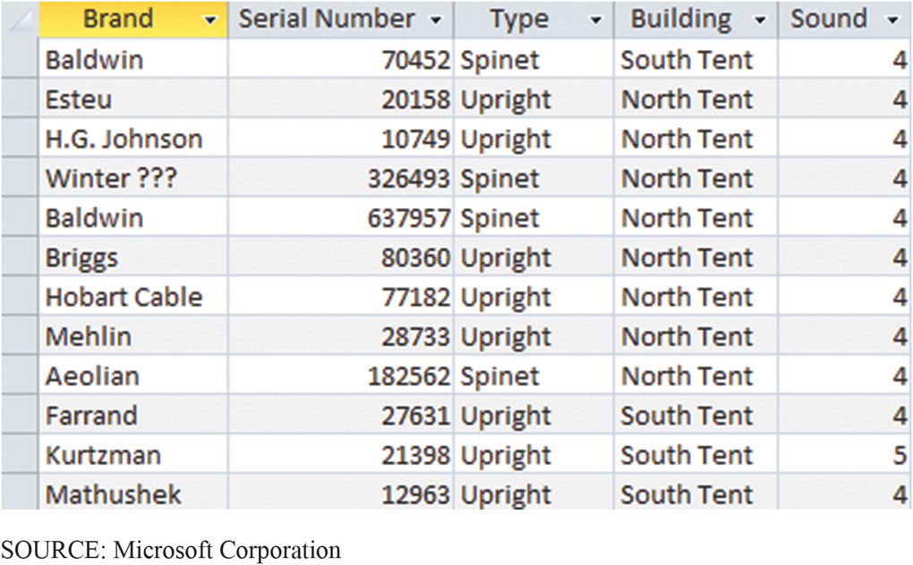

# Piano Sound Quality by Building

Case Study 5

__Figure 5\-23__ Results of Query from Figure 5\-21

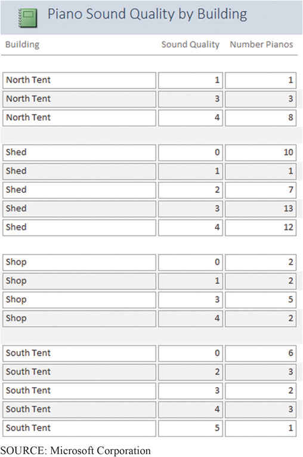

# Copyright

