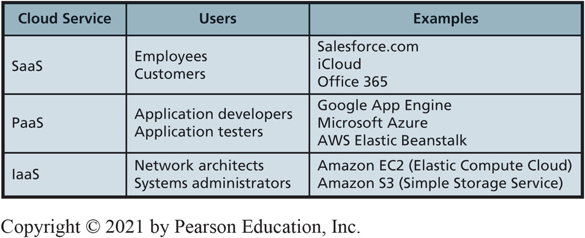

# Experiencing M I S

Ninth Edition

__Chapter 6__

The Cloud

Copyright © 2021\, 2019\, 2017 Pearson Education\, Inc\. All Rights Reserved

# “How about $10 per Terabyte?”

Lease storage capacity from third party\.

All incoming data from drones automatically uploaded\.

Average monthly storage costs cut at least 50%\.

Power savings\, backup time saved\, no new hardware configuration\.

One\-time set up and development cost  s  \.

# Study Questions

__6\-1__  Why is the cloud the future for most organizations?

__6\-2__  How do organizations use the cloud?

__6\-3__  How can eHermes use the cloud?

__6\-4__  How can organizations use cloud services securely?

__6\-5__  What does the cloud mean for your future?

# Benefits of the Cloud

* 6\-1 Why is the cloud the future for most organizations?
* The Cloud
  * Elastic leasing of pooled computer resources over the Internet\.
  *  __Elastic__ 
    * Automatically adjusts for unpredictable demand\.
    * Limits financial risks\.
  *  __Pooled__ 
    * Same physical hardware\.
    * Economies of scale\.

# Where Did the Cloud Come from? (1 of 2)

* 6\-1 Why is the cloud the future for most organizations?
* The Mainframe Era \(1960s–1980s\)
  * Large\-scale high\-speed centralized computers\.
  * Thin clients\, no Internet\, and no Cloud\.
* The Client\-Server Era \(1990s–2000s\)
  * Allowed clients \(users\) to send requests across the Internet to servers\.
  * Internet\, but no modern cloud computing yet\.

# The Mainframe Era (1960s–1980s)

6\-1 Why is the cloud the future for most organizations?

__Figure 6\-1__ The Mainframe Era \(1960s–1980s\)

# The Client-Server Era (1990s–2000s)

6\-1 Why is the cloud the future for most organizations?

__Figure 6\-2__ The Client\-Server Era \(1990s–2000s\)

# Where Did the Cloud Come from? (2 of 2)

* 6\-1 Why is the cloud the future for most organizations?
* The Cloud Computing Era \(2008–Current\)
  * Applications\, data\, and processing power can be used remotely\.
  * Accessed with a variety of devices including P  C  s\, thin clients\, mobile devices\, and I  o  T devices\.

# The Cloud Computing Era (2008–Current)

6\-1 Why is the cloud the future for most organizations?

__Figure 6\-3__ The Cloud Computing Era \(2008–Present\)

# Why Do Organizations Prefer the Cloud?

6\-1 Why is the cloud the future for most organizations?

Lower costs — cheap processors\, essentially free data communication and storage\.

Ubiquitous access\.

Improved scalability\.

Elasticity\.

Virtualization technology\.

Internet\-based standards enable flexible\, standardized processing capabilities\.

# Growth of Amazon Web Services

6\-1 Why is the cloud the future for most organizations?

__Figure 6\-4__ AWS Revenue Growth

# When Does the Cloud Not Make Sense?

* 6\-1 Why is the cloud the future for most organizations?
* When law or standard industry practice require physical control or possession of the data\.
  * Financial institutions legally required to maintain physical control over its data\.

# Why is the Cloud Preferred to In-House Hosting? (1 of 2)

6\-1 Why is the cloud the future for most organizations?

 __Figure 6\-5__   Comparison of Cloud and In\-House Alternatives \(continues on next slide\)

__Positive:__

6\-1 Why is the cloud the future for most organizations?

 __Figure 6\-5__   Comparison of Cloud and In\-House Alternatives \(  con’t  \.\)

__Negative:__

# Using the Cloud

* 6\-2 How do organizations use the cloud?
* Resource Elasticity
  * A car manufacturer runs an ad during the Academy Awards\.
  * Doesn’t know if there will be a thousand\, a million\, 10 million\, or even more site visits\.
  * Cloud vendor will programmatically increase server capacity\.
  * The car manufacturer reduces costs substantially\.

# Example of a Video Banner Ad Customer

6\-2 How do organizations use the cloud?

__Figure 6\-6__ Example Video Banner Ad Customer

# Pooling Resources

* 6\-2 How do organizations use the cloud?
* Economies of scale
  * Average cost decreases as size of operation increases\.
  * Major cloud vendors operate enormous data centers \(Web farms\)\.

# Apple Data Center in Maiden, N C

6\-2 How do organizations use the cloud?

Billion\-dollar facility contains more than 505\,000 square\. feet\.

__Figure 6\-7__ Apple Data Center in Maiden\, NC

__Source__ : Google Earth

# Transportation as a Service (Metaphor)

6\-2 How do organizations use the cloud?

__Figure 6\-8__ Transportation as a Service

# Types of Cloud Service Offerings

6\-2 How do organizations use the cloud?

 __Figure 6\-9__   Three Fundamental Cloud Types

# Comparison of Cloud Service Offerings

6\-2 How do organizations use the cloud?

__Figure 6\-10__ Cloud Service Offerings

# Content Delivery Networks from Cloud Vendors

* 6\-2 How do organizations use the cloud?
* Content delivery network \(C  D  N\)
  * Stores user data in many different geographical locations and makes data available on demand\.
  * Specialized type of P  a  a  S\, but usually considered in its own category\.
  * Minimizes latency\.
  * Used to store and deliver content seldom changed\.

# Traditional Server Content Distribution

6\-2 How do organizations use the cloud?

__Figure 6\-11__ Traditional Server Content Distribution

# Distributed C D N Servers

6\-2 How do organizations use the cloud?

__Figure 6\-12__ Distributed CDN Servers

# C D N Benefits

6\-2 How do organizations use the cloud?

__Figure 6\-13__ Benefits of Content Delivery Networks

# Using Web Services Internally

6\-2 How do organizations use the cloud?

 __Figure 6\-14__   Web Services Principles Applied to Inventory Applications

# eHermes in the Cloud

* 6\-3 How can eHermes use the cloud?
* S  a  a  S products eHermes could use\.
  * Google Mail
  * Google Drive
  * Office 365
  * [Salesforce\.com](https://www.salesforce.com/in/?ir=1)
  * Microsoft C  R  M OnLine
  * many others…

# P a a S Services from Amazon D B M S Products with Elastic Cloud 2 (E C2)

6\-3 How can eHermes use the cloud?

eHermes also could use CDN to distribute content worldwide and respond to leads generated from advertising\.

# I a a S Services at eHermes

6\-3 How can eHermes use the cloud?

Provides basic hardware in the cloud\.

May acquire servers to load operating systems\.

Considerable technical expertise and management\.

Alternative: Use elastic data storage services\.

S  a  a  S and P  a  a  S provide more added value to eHermes\.

# Organizations Using Cloud Services Securely

6\-4 How can organizations use cloud services securely?

__Figure 6\-15__ Remote Access Using VPN; Actual Connections

# Remote Access Using V P N: Apparent Connection

6\-4 How can organizations use cloud services securely?

__Figure 6\-16__ Remote Access Using VPN; Apparent Connection

# Private Cloud for Inventory and Other Applications

6\-4 How can organizations use cloud services securely?

__Figure 6\-17__ Private Cloud for Inventory and Other Applications

# Accessing Private Cloud over a Virtual Private Network

6\-4 How can organizations use cloud services securely?

__Figure 6\-18__ Accessing Private Cloud over a Virtual Private Network

# Using a Virtual Private Cloud

6\-4 How can organizations use cloud services securely?

Subset of a Public Cloud With Highly Restricted\, Secure Access

__Figure 6\-19__ Using a Virtual Private Cloud \(VPC\)

# IRS Systems Overtaxed

* So What?
* Legacy systems can fail \(Tax day 2018\)
  * IRS had legacy system in place for processing tax payments \(circa 1960s\)
  * 64% of current \(2018\) IRS systems considered aged
  * 32% of software is multiple releases behind industry standards
* IRS infrastructure is not cloud based
  * Should they consider a cloud\-based solution?

# How Will the Future Cloud Affect Me?

6\-5 What does the cloud mean for your future?

Cloud services faster\, more secure\, easier to use\, cheaper

Fewer organizations set up own computing infrastructure

More pooling of servers across organizations

Overall size of the cloud gets bigger

Individuals\, small businesses\, large organizations obtain elastic resources at very low cost

Cloud fosters new categories of work

# Future Cloud Services

* 6\-5 What does the cloud mean for your future?
* Remote action systems
  * Telemedicine
  * Telesurgery
  * Telelaw enforcement
  * Provide services in dangerous locations
  * Watch top\-notch performers and performances
* New cloud services
  * Analytics as a Service \(A  a  a  S\)
  * Business Process as a Service \(P  B  a  a  S\)

# How Does the Knowledge in This Chapter Help You?

6\-5 What does the cloud mean for your future?

Cloud knowledge key for all business professionals in early years of career

Anticipate new categories of jobs you might find rewarding

Use of the clouds can potentially save your organization considerable money

# Reverse Engineering Privacy

* Ethics Guide
* Digital billboards deliver targeted advertising
* Location data transmitted by cell phones is sold by cell phone carriers to third parties\.
* Analysis of this data tells digital billboards what message to display throughout the day\.
  * Is this a cool innovation?
  * Is this an egregious security concern?
  * Can we be confident that personally\-identifiable information is removed?

# Senior Network Manager

* Career Guide
* Rebecca Cengiz\-Robbs at Carbonite
  * Q\. What attracted you to this field?
    * A\. “I was attracted to IT by the wide variety of disciplines and the abundant opportunities\, especially for women\. After working as a network administrator and being able to get exposure to storage\, backups\, computing\, security\, and networking\, I realized I liked networking the best\.”
  * Q\. What advice would you give to someone who is considering working in your field?
    * A\. “In addition to technical skills and a good work ethic\, I’d develop emotional intelligence and build a personal network\. Often in IT\, it’s who you know and how you get along with people that will help you stand out and advance\.”

# Active Review

__6\-1__  Why is the cloud the future for most organizations?

__6\-2__  How do organizations use the cloud?

__6\-3__  How can eHermes use the cloud?

__6\-4__  How can organizations use cloud services securely?

__6\-5__  What does the cloud mean for your future?

# Salesforce.com

* Case Study 6
* Dominates market for CRM software
* One of the highest valued cloud computing companies in the U\.S\.
* Four pillars of success:
  * Trust
  * Growth
  * Innovation
  * Equality

# Copyright

