# Experiencing M I S

Ninth Edition

__Chapter 8__

Processes\, Organizations\, and Information Systems

Copyright © 2021\, 2019\, 2017 Pearson Education\, Inc\. All Rights Reserved

# “I Got the Email, but I Couldn’t Download the Attachment.”

* Difficult for everyone to attend meetings
* Wastes time covering old ground
* Cell phone calls interrupt meeting
* Felix not reading meeting minutes
  * “I got the email\, but I couldn’t download the attachment\.”
* Poor communication
* Interpersonal conflicts

# Study Questions

__8\-1__ What are the basic types of processes?

__8\-2__ How can information systems improve process quality?

__8\-3__ How do enterprise systems solve the problems of departmental silos?

__8\-4__ How do CRM\, ERP\, and EAI support enterprise processes?

__8\-5__ What are the challenges of implementing and upgrading enterprise information systems?

__8\-6__ How do inter\-enterprise IS solve the problems of enterprise silos?

# Figure 8-1 Business Process with Three Activities

8\-1 What are the basic types of processes?

__Figure 8\-1__ Business Process with Three Activities

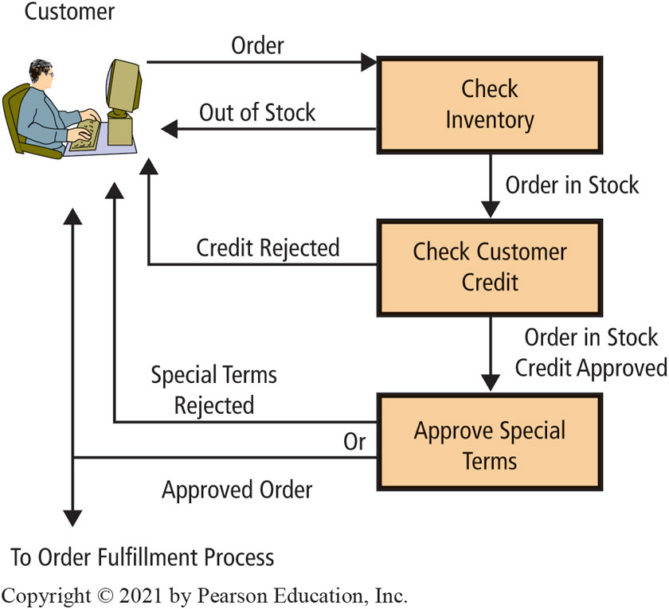

# Figure 8-2 Structured Versus Dynamic Processes

8\-1 What are the basic types of processes?

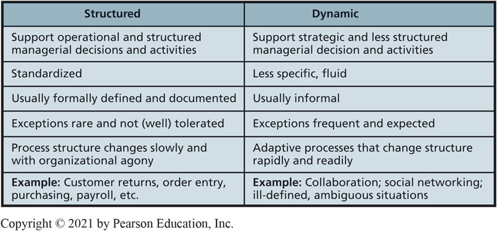

# Figure 8-3 Common Workgroup Processes

8\-1 What are the basic types of processes?

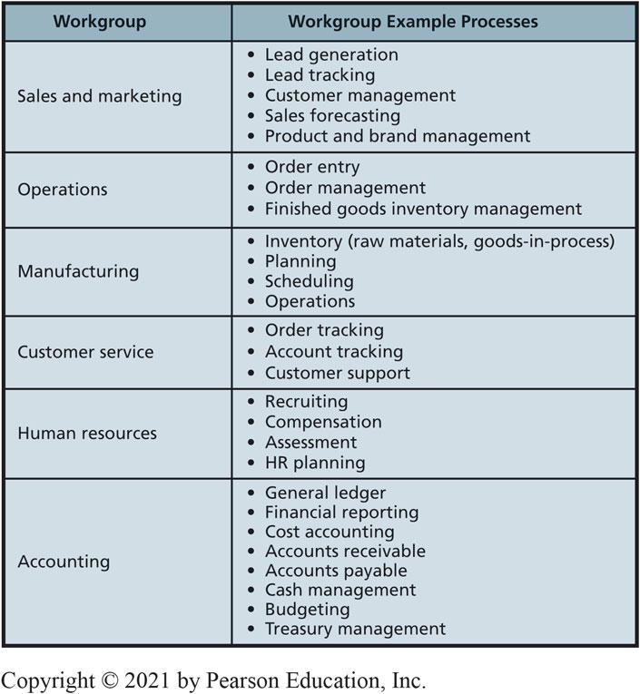

# Figure 8-4 Characteristics of Information Systems

8\-1 What are the basic types of processes?

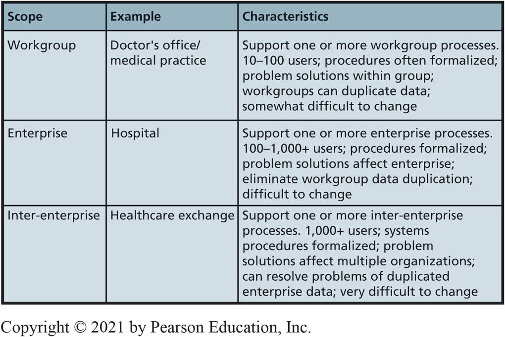

# Improving Process Quality

8\-2 How can information systems improve process quality?

* Process __efficiency__
  * Ratio of outputs to inputs
* Process __effectiveness__
  * How well a process achieves organizational strategy
* How can processes be improved?
  * Change process structure
  * Change process resources
  * Change both

# Improving Process Quality (con’t)

8\-2 How can information systems improve process quality?

* Performing an activity
  * Partially automated\, completely automated
* Augmenting human performing activity
  * Ex: Common reservation system
* Controlling data quality
  * Ensure data complete and correct before continuing process activities

# Eliminating Information Silos

* 8\-3 How do enterprise systems solve the problems of departmental silos?
* What are the problems of information silos?
  * Data duplicated\.
  * Data inconsistency\.
  * Data isolated\.
  * Disjointed processes\.
  * Lack of integrated enterprise information\.
  * Inefficiency: decisions made in isolation\.
  * Increased cost for organization\.

# Problems Created by Information Silos

8\-3 How do enterprise systems solve the problems of departmental silos?

__Figure 8\-5__ Problems Created by Information Silos

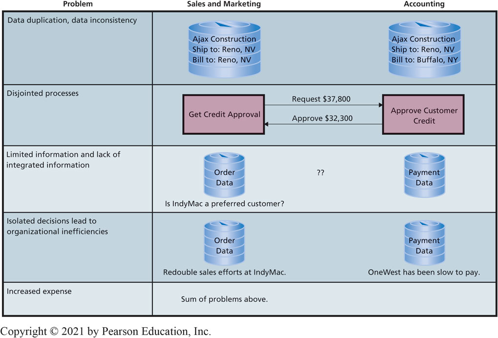

# Solving the Problems of Information Silos (1 of 2)

8\-3 How do enterprise systems solve the problems of departmental silos?

Integrate into single database\.

Revise applications\.

Allow isolation\, manage to avoid problems\.

8\-3 How do enterprise systems solve the problems of departmental silos?

 __Figure 8\-6__   Information Silos as Drivers

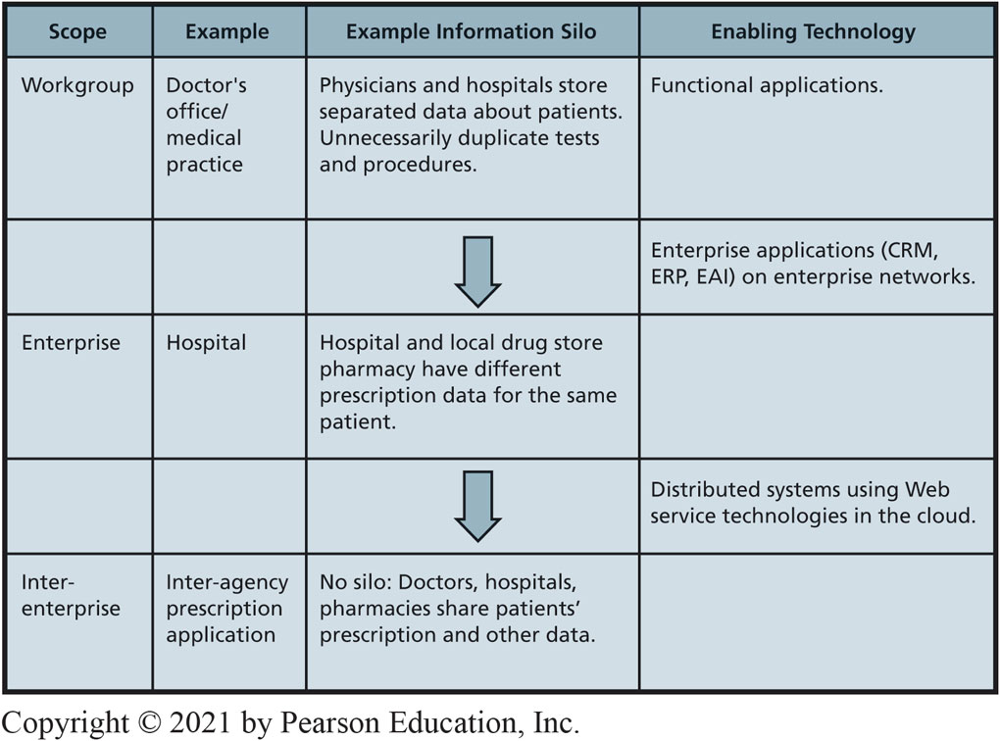

# An Enterprise System for Patient Discharge

8\-3 How do enterprise systems solve the problems of departmental silos?

 __Figure 8\-7__   Example Enterprise Process and Information System

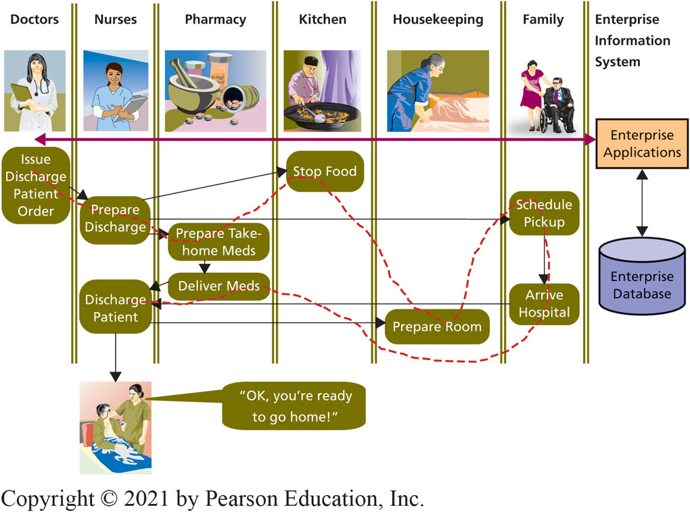

# Business Process Reengineering

* 8\-4 How do CRM\, ERP\, and EAI support enterprise processes?
*  __Business Process Reengineering \(B__    __P__    __R\)__ 
  * Integrated data\, enterprise systems create stronger\, faster\, more effective linkages in value chains\.
  * Difficult\, slow\, exceedingly expensive\.
  * Key personnel determine how best to use new technology\.
  * Requires high\-level and expensive skills and considerable time\.

# Emergence of Enterprise Application Solutions

* 8\-4 How do CRM\, ERP\, and EAI support enterprise processes?
* Inherent processes
  * Predesigned processes for using application\.
  * “Industry best practices\.”
* Customer relationship management \(C  R  M\)\.
* Enterprise resource planning \(E  R  P\)\.
* Enterprise application integration \(E  A  I\)\.

# Customer Relationship Management (C R M)

* 8\-4 How do CRM\, ERP\, and EAI support enterprise processes?
* Suite of applications\, database\, set of inherent processes\.
* Manage all interactions with customer through four phases of customer life cycle\.
  * Marketing\, customer acquisition\, relationship management\, loss/churn\.
* Supports customer\-centric organization\.

# Customer Life Cycle

8\-4 How do CRM\, ERP\, and EAI support enterprise processes?

__Figure 8\-8__ The Customer Life Cycle

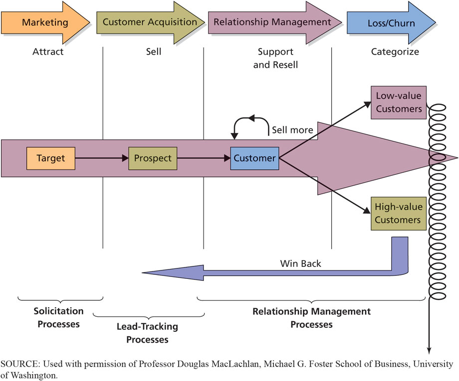

# C R M Applications

8\-4 How do CRM\, ERP\, and EAI support enterprise processes?

__Figure 8\-9__ CRM Applications

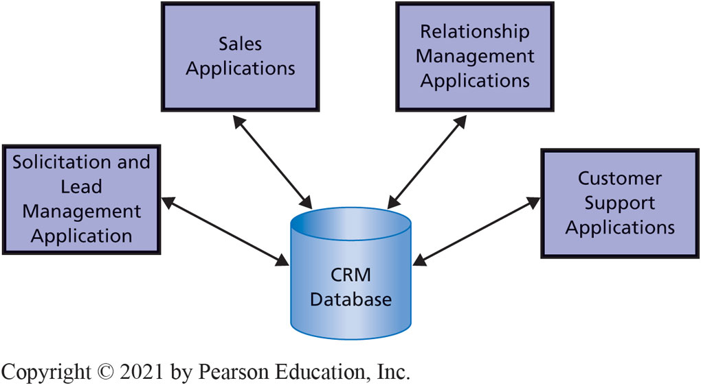

# Digital Dining?

* So What?
* CaliBurger started testing a burger\-flipping robot named Flippy in its Pasadena restaurant
* Cooks about 150 burgers per hour
* Plans to deploy Flippy robots in 50 of its locations
* Payback in a few years:
  * Run around the clock
  * No personal/vacation days
  * No onboarding\, training\, or management

# Digital Dining? (con’t)

* So What?
* The robotic barista from Café X costs $25\,000
  * Makes 150 cups of custom coffee per hour
  * Doesn’t need to be tipped
  * Payback period is about 2 years
* Will major chains adopt robotic workers?
  * Can they remain competitive with human workers?
* The company selling these robots will employ a lot of well\-paid people to make\, sell\, maintain\, and replace these machines increasing human jobs

# E R P Applications

8\-4 How do CRM\, ERP\, and EAI support enterprise processes?

E  R  P is a suite of applications

The primary purpose of an E  R  P system is integration

Integration allows real\-time updates

__Figure 8\-10__ ERP Applications

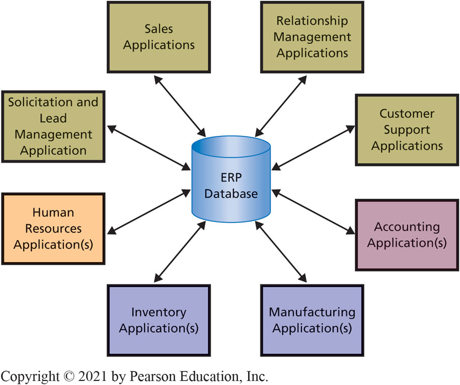

# Purpose of E R P Systems

8\-4 How do CRM\, ERP\, and EAI support enterprise processes?

Suite of applications\, database\, and inherent processes

Consolidates business operations into a single\, consistent computing platform

C  R  M plus accounting\, manufacturing\, inventory\, and human resources applications

S  A  P offers industry\-specific customize packages

# Enterprise Application Integration (E A I)

8\-4 How do CRM\, ERP\, and EAI support enterprise processes?

Connects system “islands”

Enables communicating and sharing data

Provides integrated information

Provides integrated layer on top of existing systems while leaving functional applications “as is”

Enables less expensive\, gradual move to E  R  P

# Design and Implementation for the Five Components

8\-4 How do CRM\, ERP\, and EAI support enterprise processes?

 __Figure 8\-11__   Enterprise Application Integration \(E  A  I\) Architecture

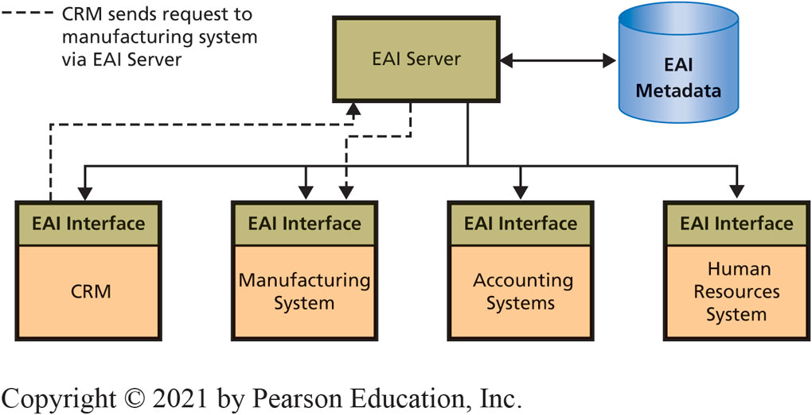

# Factors that Make Implementing ERP Challenging

8\-5 What are the challenges of implementing and upgrading enterprise information systems

Collaborative Management

Requirements Gaps

Transition Problems

Employee Resistance

New Technology

# Enterprise I S Solve the Problems of Information Silos

8\-6 How do inter\-enterprise IS solve the problems of enterprise silos?

 __Figure 8\-12__   Information Silos Without A  R  E  S

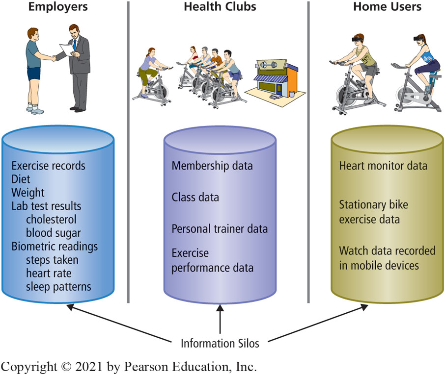

# Inter-enterprise A R E S System

8\-6 How do inter\-enterprise IS solve the problems of enterprise silos?

__Figure 8\-13__ Inter\-enterprise ARES System

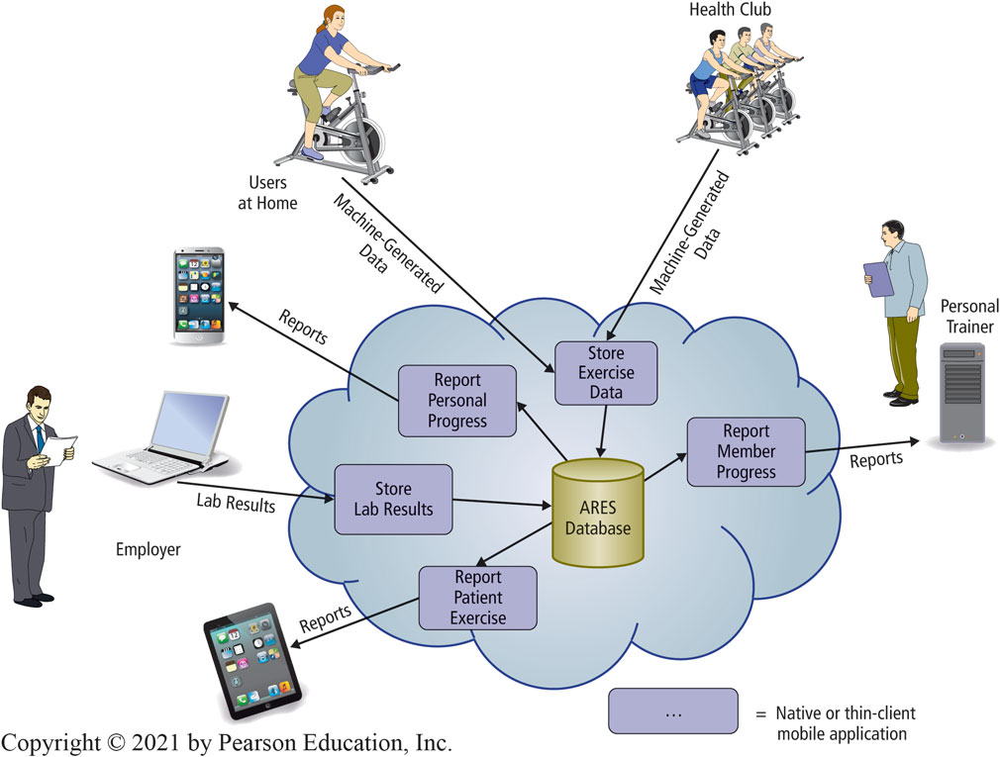

# How Does the Knowledge in this Chapter Help You?

You understand the basic types of processes found in business and how information systems can support those processes and improve process quality

You are aware of the problems posed by departmental silos and the types of solutions made possible by CRM\, ERP\, and EAI

You learned how best to implement and upgrade enterprise information systems

You are able to apply these concepts to inter\-enterprise systems

# Paid Deletion (1 of 2)

* Ethics Guide
* A company experiences negative press\.
  * Manufacturing company dealing with environmental protection violations\.
  * A popular chain of restaurants had a long list of healthcode violations\.
* Companies offer Eric money to tweak the results of Web searches using key terms relevant to these negative incidents\.
* Eric buries or deletes negative results without his employer knowing\.

* Ethics Guide
* What happens if someone finds out search results are being manipulated?
  * Eric could be fired
  * Company could be severely harmed
  * Robin could lose her job too
* How might have Eric rationalized his fraudulent behavior?
* Even if Eric were caught\, would he be guilty of a crime?

# Software/Platform Engineer

* Career Guide
* Ben Peters at Anaconda\, Inc\.
* Q\. What attracted you to this field?
  * A\. “I love working to solve the challenges the industry faces and having the potential to change the world\. When I was exploring majors in college\, I looked at factors like job demand outlook and salary potential\, too\. I wanted to be a part of a growing industry with lots of potential\.”
* Q\. What advice would you give to someone who is considering working in your field?
  * A\. “Practice\, practice\, and more practice\! Try to get as much hands\-on experience as you can while you are in school so you will stand out to future employers\. Focus on grasping the fundamentals of software development\, design\, and architecture\, and you will have a great career\.”

# Active Review

__8\-1__ What are the basic types of processes?

__8\-2__ How can information systems improve process quality?

__8\-3__ How do enterprise systems solve the problems of departmental silos?

__8\-4__ How do CRM\, ERP\, and EAI support enterprise processes?

__8\-5__ What are the challenges of implementing and upgrading enterprise information systems?

__8\-6__ How do inter\-enterprise IS solve the problems of enterprise silos?

# A Tale of Two Interorganizational I S

* Case Study 8
* Access C  T
  * Enrolled 208\,301 and model for state\-run exchanges\.
* Cover Oregon
  * Spent $250 million for system clearly inoperable\.
  * Exchange’s board of directors decided to stop development and utilize the federal exchange\.

# Healthcare Exchange Interorganizational IS

Case Study 8

__Figure 8\-16__ Healthcare Exchange Interorganizational IS

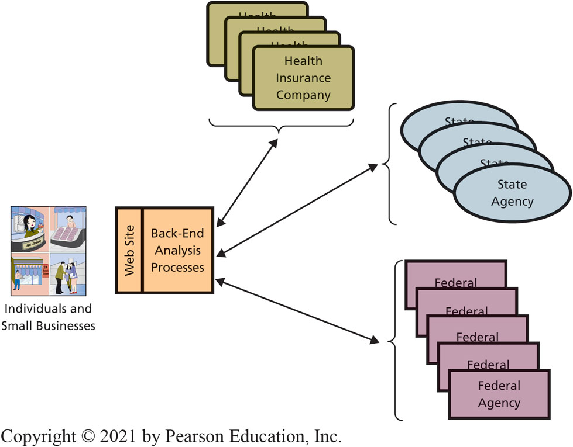

# Access C T (1 of 2)

* Case Study 8
* Exchange went live in only 12 months\.
* Counihan
  * More than 30 years of experience working in insurance industry\.
  * Key player in development of Massachusetts healthcare system\.
* Hired senior staff with deep experience in insurance\.

* Case Study 8
* Wadleigh director of application development for CIGNA\, a health services organization\.
* Primary assignment
  * Hire and manage an outside contractor to develop exchange website and support back\-end code and to manage implementation of exchange information system\.
* Created project plan and began search for contractor to develop the site\.

# Cover Oregon (1 of 3)

Case Study 8

Did not hire a supervising contractor for project\, instead took an active role in software’s development\.

Agency suffered high employee turnover\, and had difficulty hiring and keeping qualified personnel\.

* Case Study 8
* OHA hired software development company to create major software components\.
  * Two of three finalists dropped out at last minute\, leaving Oracle Corporation a sole source vendor\.
  * Oracle negotiated time and materials contracts instead of contract for specific deliverables at specific prices\.
  * When problems developed\, Oracle was paid tens of millions of additional money for change orders on same time and materials basis\.

Case Study 8

Oregon legislature required state to hire a quality assurance contractor\, Maximus Corporation\, to oversee project\.

Maximus reported significant problems involving divided control\, lack of clear requirements\, inappropriate contracting methodology\, lack of project planning\, and lack of progress\.

Unclear who got those reports or what was done with them\.

Head of O  H  A project threatened to withhold Maximus’ payment\.

 __End result: Exchange development failed\.__ 

# Copyright

