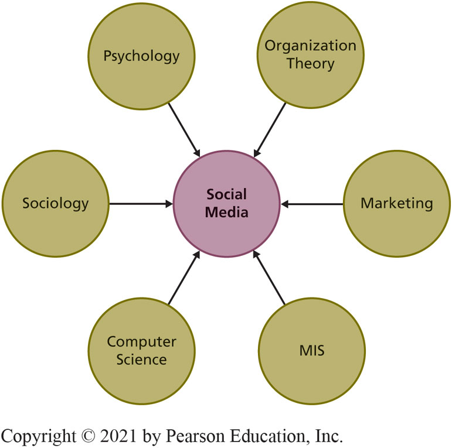
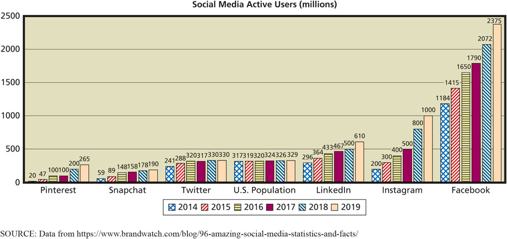
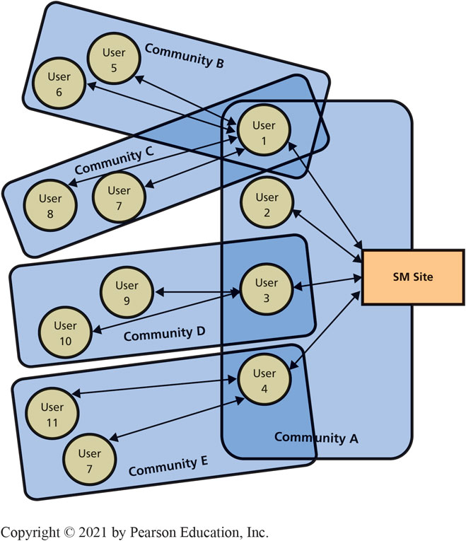
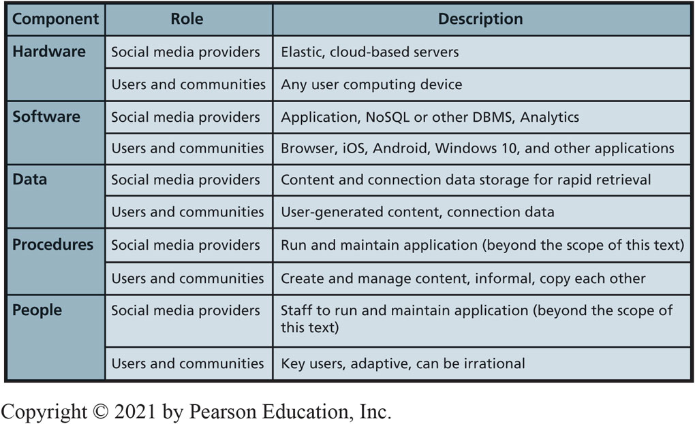
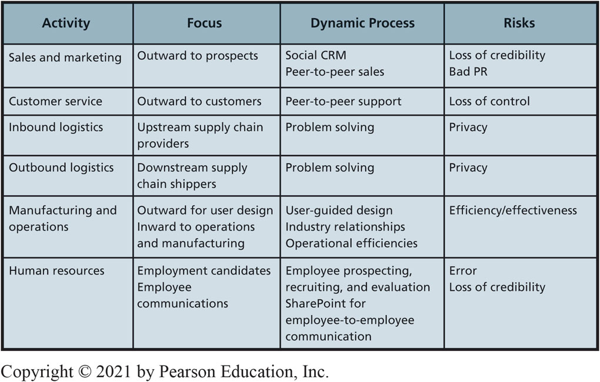
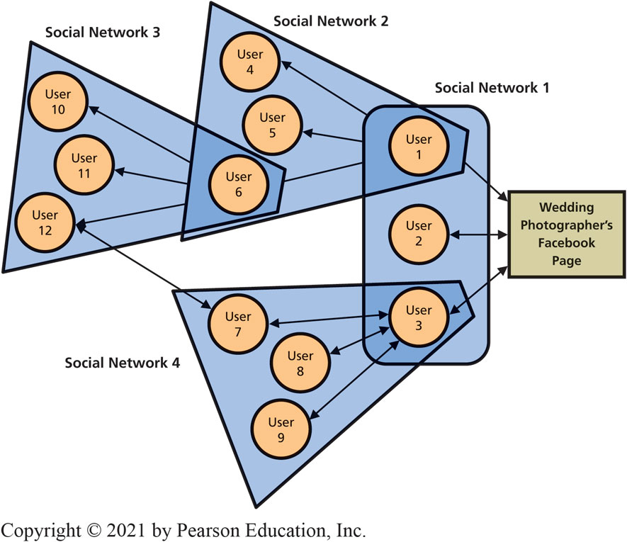
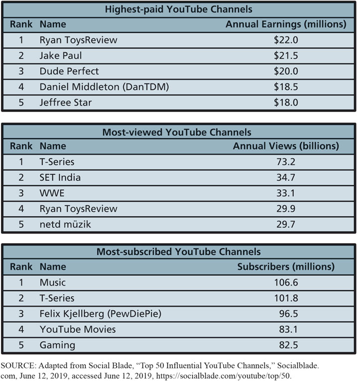
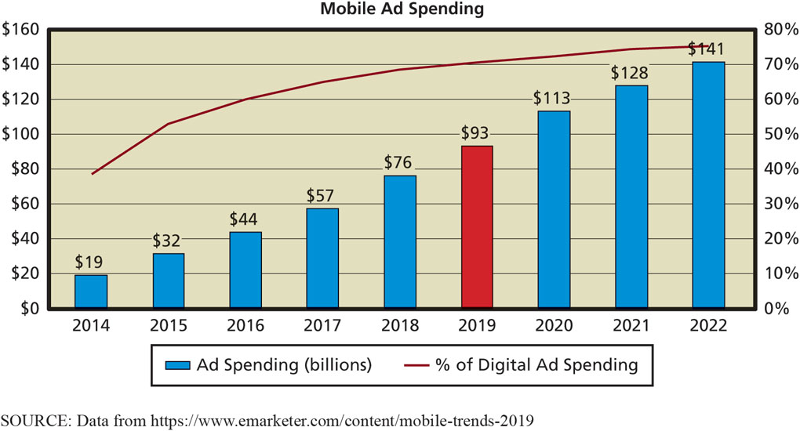
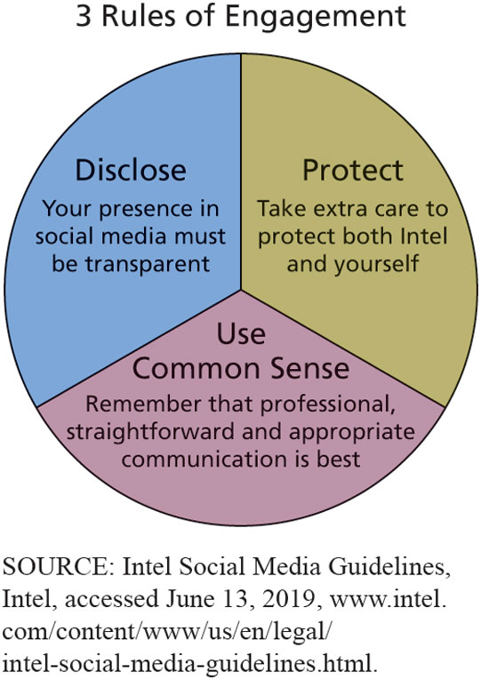
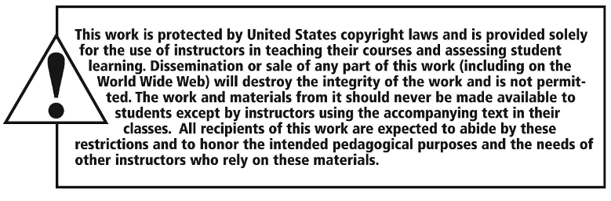

# Experiencing M I S

Ninth Edition

__Chapter 9__

Social Media Information Systems

Slides in this presentation contain hyperlinks\. JAWS users should be able to get a list of links by using INSERT\+F7

Copyright © 2021\, 2019\, 2017 Pearson Education\, Inc\. All Rights Reserved

# “In a mixed-reality environment, we can create anything, replace anything, and alter anything.”

* Find ways to make ARES profitable\.
* Traditionally banner ads\, pop\-ups\, and short videos generate ad revenue\.
* Mixed\-reality apps allows developers to create anything\, replace anything\, and alter anything\.
  * Virtual 60\-foot prehistoric megalodon shark\.
  * Virtual 40\-foot power bar\.
  * Overlay virtual objects over reality\.

# A R E S Application Prototype

* Users can cycle with friends virtually\.
  * Unsure how many users it can support\.
  * Think about details of how system will function before estimating development costs or project timeline\.
* Generating revenue from social media applications difficult\.
* Think about ways to apply new\, emerging technology to accomplish business organizational strategies\.

# Study Questions

__9\-1__  What is a social media information system \(S  M  I  S\)?

__9\-2__  How do S  M  I  S advance organizational strategy?

__9\-3__  How do S  M  I  S increase social capital?

__9\-4__  How do \(some\) companies earn revenue from social media?

__9\-5__  How can organizations address S  M  I  S security concerns?

__9\-6__  Where is social media taking us?

# Social Media Information System (S M I S)

* 9\-1 What is a social media information system \(SMIS\)?
* Social media \(S  M\)
  * I  T for sharing content among networks of users\.
  * Enables   __communities of practice__   \.
    * People related by a common interest\.
* Social media information system \(S  M  I  S\)
  * Sharing content among networks of users\.

# Convergence of Many Disciplines

9\-1 What is a social media information system \(SMIS\)?

 __Figure 9\-1__   Social Media is a Convergence of Disciplines

# Number of Social Media Active Users

9\-1 What is a social media information system \(SMIS\)?

__Figure 9\-2__ Number of Social Media Active Users

# Three S M I S Roles

* 9\-1 What is a social media information system \(SMIS\)?
* Social Media Providers
  * Facebook\, Snapchat\, LinkedIn\, Twitter\, Instagram\, and Pinterest platforms\.
  * Attracting\, targeting demographic groups\.
* Users
  * Individuals and organizations\.
* Communities
  * Mutual interests that transcend familial\, geographic\, and organizational boundaries\.

# S M User Communities

9\-1 What is a social media information system \(SMIS\)?

__Figure 9\-3__ SM Communities

# Social Media Application Providers

* 9\-1 What is a social media information system \(SMIS\)?
* Facebook\, Twitter\, LinkedIn\, Google…
* May charge fee\, depending on application and purpose\.
  * Free company page on Facebook\, but…
  * Fee to advertise to communities that “Like” that page\.
* Internal S  M using SharePoint for wikis\, discussion board\, photo sharing\.

# Five Components of S M I S

9\-1 What is a social media information system \(SMIS\)?

__Figure 9\-4__ Five Components of SMIS

# S M I S and Organizational Strategy

* 9\-2 How do SMIS advance organizational strategy?
* Strategy determines value chains
  * Value chains determine business processes\.
  * Processes determine S  M  I  S requirements\.
* How do value chains determine   __dynamic__   processes?
  * Dynamic process flows cannot be designed or diagrammed\.
* S  M fundamentally changes balance of power among users\, communities\, and organizations\.

# S M in Value Chain Activities

9\-2 How do SMIS advance organizational strategy?

__Figure 9\-5__ SM in Value Chain Activities

# Social Media and the Sales and Marketing Activity

* 9\-2 How do SMIS advance organizational strategy?
* Dynamic\,  S  M\-based  C  R  M process\.
* Social C  R  M
  * Customers craft own relationship\.
    * Wikis\, blogs\, discussion lists\, frequently asked questions\, sites for user reviews and commentary\, other dynamic content\.
  * Customers search content\, contribute reviews and commentary\, ask questions\, create user groups\, etc\.
  * Not centered on customer lifetime value\.

# Social Media and Customer Service

* 9\-2 How do SMIS advance organizational strategy?
* Relationships emerge from joint activity; customers have as much control as companies\.
* Product users freely help each other solve problems\.
* Selling to or through developer networks most successful\.
  * Microsoft’s M  V  P program\.
* Peer\-to\-peer support risks loss of control\.

# Social Media and Inbound and Outbound Logistics

* 9\-2 How do SMIS advance organizational strategy?
* Benefits
  * Numerous solution ideas and rapid evaluation of them\.
  * Better solutions to complex supply chain problems\.
  * Facilitates user created content and feedback among networks needed for problem solving\.
* Loss of privacy
  * Open discussion of problem definitions\, causes\, and solution constraints\.
  * Problem solving in front of your competitors\.

# Social Media and Manufacturing and Operations

9\-2 How do SMIS advance organizational strategy?

Improves communication channels within organization and externally with consumers\, design products\, develop supplier relationships\, and operational efficiencies\.

 __Crowdsourcing__   \.

 __Business\-to\-consumer__   \(   __B2C__   \) and   __Business\-to\-business \(B2B\)\.__ 

YouTube for posting videos of product reviews and testing\, factory walk\-throughs\.

[Yammer](https://www.yammer.com/)  —enterprise social networking service\.

# Social Media and Human Resources

* 9\-2 How do SMIS advance organizational strategy?
* Employee communications using internal personnel sites\.
  * Ex: MySite and MyProfile in SharePoint\.
* Finding prospective employees\, recruiting and evaluating candidates\.
* Place for employees to post their expertise\.
* Risks:
  * Forming erroneous conclusions about employees\.
  * Pushing unpopular management message\.

# Enhanced Golf Fan

So What?

Advances in technology have changed the way we   __consume__   entertainment\.

In 2017\, 59% of people would rather watch a game at home than watch it live \(32%\)\.

The P  G  A has started providing data visualizations\, advanced statistics\, real\-time updates\, and live feeds to improve the viewing experience\.

How could other sports use data analytics to enhance the viewing experience?

# 9-3 How Do S M I S Increase Social Capital?

* 9\-3 How do SMIS increase social capital?
* Capital
  * Investment of resources for future profit\.
* Types of business capital
  * Physical capital: produce goods and services \(factories\, machines\, manufacturing equipment\)\.
  * Human capital: human knowledge and skills investments\.
  * Social capital: social relations with expectation of marketplace returns\.

# What is the Value of Social Capital?

* 9\-3 How do SMIS increase social capital?
* Value of   __social__    __capital__ 
  * Number of relationships\, strength of relationships\, resources controlled\.
* Adds value  in four ways

  * Information
  * Influence
  * Social credentials
  * Personal reinforcement

# How Do Social Networks Add Value to Businesses?

* 9\-3 How do SMIS increase social capital?
* Progressive organizations:
  * Have Facebook\, LinkedIn\, Twitter\, other S  N sites\.
  * Encourage customers and interested parties to leave comments\.

# Using Social Networking to Increase the Number of Relationships

9\-3 How do SMIS increase social capital?

 __Figure 9\-6__   Growing Social Networks

# Top YouTube Channels

9\-3 How do SMIS increase social capital?

__Figure 9\-7__ Top YouTube Channels

# Using Social Networks to Increase the Strength of Relationships

* 9\-3 How do SMIS increase social capital?
*  __Strength of a relationship__ 
    * Likelihood other entity will do something that benefits your organization\.
* Positive reviews\, post pictures using organization’s products or services\, tweet about upcoming product releases\, and so on\.
* Strengthen relationships by asking someone to do you a favor\.
* Frequent interactions strengthen relationships\.

# Using Social Networks to Connect to Those with More Resources

9\-3 How do SMIS increase social capital?

 __Social Capital = Number of Relationships × Relationship Strength × Entity Resources__   \.

Huge network of people with few resources less valuable than a smaller network of people with substantial resources\.

Resources must be relevant\.

Most organizations ignore value of entity assets\.

# Earning Revenue from Social Media

* 9\-4 How do \(some\) companies earn revenue from social media?
*  __Hyper\-social organization__ 
  * Transform interactions with customers\, employees\, and partners into mutually satisfying relationships with them and their communities\.
*  __You Are the Product__ 
  * “If you’re not paying\, you’re the product\.”
  * Renting your eyeballs to an advertiser\.
*  __Monetize__ 

# Revenue Models for Social Media

* 9\-4 How do \(some\) companies earn revenue from social media?
*  __Advertising__ 
  *  __Pay__   \-   __per__   \-   __click\.__ 
  * Use increases value\.
*  __Freemium__ 
  * Offers users a basic service for free\, and then charges a premium for upgrades or advanced features\.
*  __Sales__   —  apps and virtual goods\, affiliate commissions\, donations\.

# Does Mobility Reduce Online Ad Revenue? (1 of 2)

* 9\-4 How do \(some\) companies earn revenue from social media?
* By 2022\, number of mobile devices to reach 12\.3 billion\.
  * Mobile ad spending should reach $141B\, and account for 75 percent of total digital ad spending\.
*  __Conversion__    __rate__ 
    * Frequency someone clicks on ad makes a purchase\, “likes” a site\, or takes some other action desired by advertiser\.
  * Conversion rate on smartphones is 2\.25%\, but 4\.84% on P  C  s\.

* 9\-4 How do \(some\) companies earn revenue from social media?
* Mobile devices are not likely to spell the death of the Web/social media revenue model\.
* How best to configure mobile experience to obtain legitimate clicks and conversions?
*  __Geofencing__   —a location service that allows applications to know when a user has crossed a virtual fence \(specific location\) and then triggers an automated action\.
  * Consumers receive specific ads/coupons based on location

# Mobile Ad Spending

9\-4 How do \(some\) companies earn revenue from social media?

__Figure 9\-8__ Mobile Ad Spending

# Social Media Policy

* 9\-5 How can organizations address SMIS security concerns?
* Develop and publicize   __social__    __media__    __policy__   \.
  * Delineate employees’ rights and responsibilities\.
  * Index to 100 different policies at  [Social Media Today](http://www.socialmediatoday.com/content/complete-guide-developing-social-media-policy-your-business)  \.
* Intel’s Three Pillars of  S  M Policies\.

  * Disclose
  * Protect
  * Use Common Sense

# Intel’s Rules of Social Media Engagement

9\-5 How can organizations address SMIS security concerns?

__Figure 9\-9__ Intel’s Rules of Social Media Engagement

# Managing the Risk of Inappropriate Content

* 9\-5 How can organizations address SMIS security concerns?
*  __User\-generated content \(U__    __G__    __C\)__ 
*  __Problems from external sources__ 
  * Junk and crackpot contributions
  * Inappropriate content
  * Unfavorable reviews
  * Mutinous movements
* Monitor by employees or use outsource service such as  [Bazaarvoice](http://www.bazaarvoice.com/)

# Responding to Social Networking Problems

* 9\-5 How can organizations address SMIS security concerns?
* Leave it\.
  * “Never wrestle with a pig; you’ll get dirty and the pig will enjoy it\.”
* Respond to it\.
  * If it yields positive result\.
* Delete it\.
  * Comments by crackpots\, have nothing to do with the site\, or contains obscene or otherwise inappropriate content\.

# Internal Risks from Social Media (1 of 2)

* 9\-5 How can organizations address SMIS security concerns?
* Threats to information security\, increased organizational liability\, decreased employee productivity\.
* Seemingly innocuous comments inadvertently leak information used to secure access to organizational resources\.
  * Bad idea to tell everyone it’s your birthday because your date of birth \(D  O  B\) can be used to steal your identity\.

* 9\-5 How can organizations address SMIS security concerns?
* Employees may inadvertently increase corporate liability when they use social media\.
  * Sexual harassment liability\.
  * Leak confidential information\.
* Reduced employee productivity\.
  * Many employees visit non\-work\-related Web sites each day\.
  * Facebook \(65%\)\, Twitter \(7%\)\, Instagram \(9%\)\, and Snapchat \(7%\)\.

# The Future of Social Media

* 9\-6 Where is social media taking us?
* New mobile devices with innovative mobile\-device U  X\, coupled with dynamic and agile information systems based on cloud computing and dynamic virtualization\.
* B  Y  O  D policy
  * Organization the endoskeleton\, supporting the work of people on the exterior\.
    * Employees craft own relationships with their employers\.
* Non\-routine cognitive skills more important\.

# How Does the Knowledge in This Chapter Help You? (1 of 2)

How to apply some of your knowledge to help organizations

Learned components of a social media I  S and commitment organization makes when it places a Facebook or Twitter icon on its Web page

Learned how organizations use S  M  I  S to achieve strategies across the five primary value chain activities and how S  M  I  S can increase social capital

Learned how revenue can be earned from social media

Learned about need to manage risks of social media\, and how social media will challenge you in the future

# Synthetic Friends

* Ethics Guide
* Army of bots for company S  M\.
  * Inflates follower count\.
* “  [Click farms](http://theweek.com/articles/560046/inside-counterfeit-facebook-farm)  ”
  * Form of   __click__    __fraud__   \.
  * Large group of low\-paid workers hired to   __click__   on paid advertising links for the   __click__   fraudster\.
* Attracts annoying spam accounts\.
* Then comes the purge\.

# Social Media/Online Reputation Manager

* Career Guide
* Adam Young at RC Willey
* Q\. What attracted you to this field?
  * A\. “While looking for career opportunities\, I saw that technology was always going to be important and was constantly evolving\. I’ve always liked new challenges\, and this looked like a good starting point\.”
* Q\. What advice would you give to someone who is considering working in your field?
  * A\. “Do as much as you can to gain as much experience as you can before you graduate\. A lot of companies are looking for experience\. The more that you do now to develop those skill sets\, the better you will stand out\.”

# Active Review

__9\-1__  What is a social media information system \(S  M  I  S\)?

__9\-2__  How do S  M  I  S advance organizational strategy?

__9\-3__  How do S  M  I  S increase social capital?

__9\-4__  How do \(some\) companies earn revenue from social media?

__9\-5__  How can organizations address S  M  I  S security concerns?

__9\-6__  Where is social media taking us?

# LinkedIn

* Case Study 9
* In 2006\, LinkedIn boasted more than 5 million members
* In 2010\, LinkedIn saw membership climb to 90 million
* More than 1\,000 employees in 10 offices around the world
* In 2011\, LinkedIn became publicly traded and was valued at more than $4\.5 billion
  * Earned more than $150 million per year in advertising revenue

# LinkedIn (con’t)

* Case Study 9
* In 2016\, LinkedIn was acquired by Microsoft for $26 billion
  * More than 9\,000 employees and more than half a billion members in more than 200 countries worldwide
* Would the two companies be worth more together than apart?
* Can it be successfully integrated across all Windows products?

# Copyright

