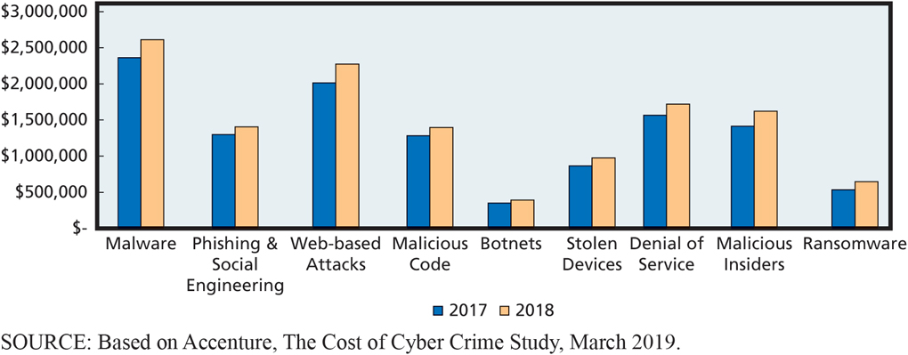

# Experiencing M I S

Ninth Edition

__Chapter 10__

Information Systems Security

Slides in this presentation contain hyperlinks\. JAWS users should be able to get a list of links by using INSERT\+F7

Copyright © 2021\, 2019\, 2017 Pearson Education\, Inc\. All Rights Reserved

# “I Think You’ll See That We Really Do Take Security Seriously.” (1 of 2)

Video conference with exercise equipment manufacturer CanyonBack Fitness \(potential A  R  E  S partner\)\.

Security concerns about integrating A  R  E  S with CanyonBack exercise bikes\.

Does A  R  E  S systems have acceptable level of security?

Can their bikes get hacked? Customers hurt? Personal data stolen?

A  R  E  S implements secure coding practices and secure data backup\.

Users interact with radio buttons\, dropdown menus\, and other interactive A  R elements\.

Reduces the possibility of an S  Q  L injection attack\.

New technology typically brings new risks\.

# Study Questions

__10\-1__  What is the goal of information systems security?

__10\-2__  How big is the computer security problem?

__10\-3__  How should you respond to security threats?

__10\-4__  How should organizations respond to security threats?

__10\-5__  How can technical safeguards protect against security threats?

__10\-6__  How can data safeguards protect against security threats?

__10\-7__  How can human safeguards protect against security threats?

__10\-8__  How should organizations respond to security incidents?

# Information Systems Security Threats

10\-1 What is the goal of information systems security?

 __Figure 10\-1__   Threat/Loss Scenario

# Examples of Threat/Loss

10\-1 What is the goal of information systems security?

 __Figure 10\-2__   Examples of Threat/Loss

# What are the Sources of Threats?

10\-1 What is the goal of information systems security?

 __Figure 10\-3__   Security Problems and Sources

# What Types of Security Loss Exists?

* 10\-1 What is the goal of information systems security?
* Unauthorized Data Disclosure
  * Pretexting
  * Phishing
  * Spoofing
    * [I](https://en.wikipedia.org/wiki/IP_address_spoofing)  [P spoofing](https://en.wikipedia.org/wiki/IP_address_spoofing)
    * [Email spoofing](https://en.wikipedia.org/wiki/Email_spoofing)
  * Sniffing
    * [Wardrivers](https://en.wikipedia.org/wiki/Wardriving)
  * Hacking
  * Natural disasters

# Incorrect Data Modification

* 10\-1 What is the goal of information systems security?
* Procedures incorrectly designed or not followed\.
* Increasing customer’s discount or incorrectly modifying employee’s salary\.
* Placing incorrect data on company Web site\.
* Cause
  * Improper internal controls on systems\.
  * System errors\.
  * Faulty recovery actions after a disaster\.

# Faulty Service

10\-1 What is the goal of information systems security?

Incorrect data modification

Systems working incorrectly

Procedural mistakes

Programming errors

I  T installation errors

Usurpation

Denial of service \(unintentional\)

Denial\-of\-service attacks \(intentional\)

# Loss of Infrastructure

* 10\-1 What is the goal of information systems security?
* Human accidents
* Theft and terrorist events
* Disgruntled or terminated employee
* Natural disasters
* [Advanced Persistent Threat](http://www.banktech.com/anatomy-of-an-advanced-persistent-threat-attack/a/d-id/1316528)
  * A  P  T  37 and Reaper \(North Korea\)
  * Attacked strategic political targets in South Korea\, Japan\, Vietnam\, and the Middle East

# Goal of Information Systems Security

* 10\-1 What is the goal of information systems security?
* Find appropriate trade\-off between risk of loss and cost of implementing safeguards\.
* Protective actions\.
  * Use antivirus software\.
  * Delete browser cookies?
  * Make appropriate trade\-offs to protect yourself and your business\.

# Average Computer Crime Cost and Percent of Attacks by Type

10\-2 How big is the computer security problem?

__Figure 10\-4__ Percent of Companies Experiencing Attacks by Attack Type

# Severity of Computer Crime

10\-2 How big is the computer security problem?

 __Figure 10\-5__   Average Annual Computer Crime Costs by Attack Type

# Accenture Study Findings (2019)

10\-2 How big is the computer security problem?

Ransomware and malicious insider attacks are increasingly serious security threats\.

Information loss and business disruption are principal costs of computer crime\.

Discovery and containment account for over half of the internal costs related to cyber intrusions\.

Security safeguards work\.

# Personal Security Safeguards

10\-3 How should you respond to security threats?

 __Figure 10\-6__   Personal Security Safeguards

# Security Policies

* 10\-4 How should organizations respond to security threats?
* Senior management creates company\-wide policies:
  * What sensitive data will be stored?
  * How will data be processed?
  * Will data be shared with other organizations?
  * How can employees and others obtain copies of data stored about them?
  * How can employees and others request changes to inaccurate data?
* Senior management manages risks\.

# Security Safeguards and the Five Components

10\-4 How should organizations respond to security threats?

 __Figure 10\-7__   Security Safeguards as They Relate to the Five Components

# Largest! Data! Breach! Ever!

* So What?
* October 2017 Yahoo\! announced extent of breach\.
* 3 billion user accounts compromised\.
  * Took over 3 years for Yahoo\! to disclose\.
  * Email addresses\, names\, phone numbers\, hashed password\, security questions/answers\.
  * Hackers working with Russian spies\.
* What effect does this have on Yahoo\!?

# Technical Safeguards

10\-5 How can technical safeguards protect against security threats?

__Figure 10\-8__ Technical Safeguards

# The Essence of h t t p s (S S L or T L S)

10\-5 How can technical safeguards protect against security threats?

 __Figure 10\-9__   The Essence of https \(S  S  L or T  L  S\)

# Use of Multiple Firewalls

10\-5 How can technical safeguards protect against security threats?

 __Figure 10\-10__   Use of Multiple Firewalls

# Malware Protection (Viruses, Spyware, Adware)

10\-5 How can technical safeguards protect against security threats?

Install antivirus and antispyware programs\.

Scan frequently\.

Update malware definitions\.

Open email attachments only from known sources\.

Install software updates promptly\.

Browse only reputable Internet neighborhoods\.

# Spyware/Adware Symptoms and Types of Malware

10\-5 How can technical safeguards protect against security threats?

* Malware
  * Viruses
    * Payload
  * Trojan horses
  * Worms
  * Spyware
    * Keyloggers
  * Adware
  * Ransomware

__Figure 10\-11__ Spyware and Adware Symptoms

# Design for Secure Applications

* 10\-5 How can technical safeguards protect against security threats?
* [S](http://www.tech-faq.com/sql-injection-attack-vulnerability.html)  [Q](http://www.tech-faq.com/sql-injection-attack-vulnerability.html)  [L injection attack](http://www.tech-faq.com/sql-injection-attack-vulnerability.html)
  * User enters S  Q  L statement into a form instead of a name or other data\.
  * Result
    * S  Q  L code becomes part of database commands issued\.
    * Improper data disclosure\, data damage and loss possible\.
  * Well designed applications make injections ineffective\.

# Data Safeguards

10\-6 How can data safeguards protect against security threats?

Data safeguards

Data administration

Database administration

Key escrow

 __Figure 10\-12__   Data Safeguards

# Legal Safeguards for Data

10\-6 How can data safeguards protect against security threats?

* Legal standards specify safeguards organizations must follow regarding data collected and stored
* Payment Card Industry Data Security Standard \(PCI DSS\)
  * Specifies secure storage and processing requirements for credit card data
  * Gramm\-Leach\-Bliley Act \(GLBA\)—protections for consumer financial data stored by financial institutions
  * Health Insurance Portability and Accountability Act \(HIPPA\)—standards that govern health data access and protection\.

# Security Policies for In-House Staff (1 of 2)

10\-7 How can human safeguards protect against security threats?

* Position definition
  * Separate duties and authorities
  * Determine least privilege
  * Document position sensitivity
* Hiring and screening

 __Figure 10\-13__   Security Policy for In\-House Staff \(continues on next slide\)

10\-7 How can human safeguards protect against security threats?

 __Figure 10\-13__   Security Policy for In\-House Staff \(cont’d\.\)

* Dissemination and enforcement
  * Responsibility
  * Accountability
  * Compliance
* Termination
  * Friendly
  * Unfriendly

# Human Safeguards for Nonemployee Personnel

10\-7 How can human safeguards protect against security threats?

Temporary personnel\, vendors\, partner personnel \(employees of business partners\)\, and the public\.

Require vendors and partners to perform appropriate screening and security training\.

Contract specifies security responsibilities\.

Provide accounts and passwords with least privilege and remove accounts as soon as possible\.

# Public User Considerations

* 10\-7 How can human safeguards protect against security threats?
* Public users of Web sites and other openly accessible information systems cannot be held accountable for security violations\.
  *  __Hardening—__   reduce the system’s vulnerabilities
    * Special versions of operating system\.
    * Lock down or eliminate operating systems features and functions not required by application\.
  * Protect such users from internal company security problems\.

# Account Administration

* 10\-7 How can human safeguards protect against security threats?
* Account Management
  * Standards for new user accounts\, modification of account permissions\, removal of unneeded accounts\.
* Password Management
  * Users change passwords frequently\.
* Help Desk Policies
  * Provide means of authenticating users\.

# Sample Account Acknowledgement Form

10\-7 How can human safeguards protect against security threats?

__Figure 10\-14__ Sample Account Acknowledgement Form

# Systems Procedures

10\-7 How can human safeguards protect against security threats?

 __Figure 10\-15__   Systems Procedures

# Security Monitoring (1 of 2)

* 10\-7 How can human safeguards protect against security threats?
* Server activity logs
  * Firewall log
    * Lists of all dropped packets\, infiltration attempts\, unauthorized access\, attempts from within the firewall\.
  * D  B  M  S
    * Successful and failed logins\.
  * Web servers
    * Voluminous logs of Web activities\.
* P  C O/S produce record of log\-ins and firewall activities\.

10\-7 How can human safeguards protect against security threats?

Employ utilities to assess vulnerabilities\.

 __Honeypots__   for computer criminals to attack\.

Investigate security incidents\.

Constantly monitor to determine adequacy of existing security policy and safeguards\.

# Factors in Incident Response

10\-8 How should organizations respond to security incidents?

__Figure 10\-16__ Factors in Incident Response

# How Does the Knowledge in This Chapter Help You?

* Awareness of:
  * Threats to computer security as an individual\, business professional\, employer
  * Risk trade offs
  * Technical\, data\, human safeguards to protect computing devices and data
  * How organizations should respond to security threats
  * How organizations should respond to security incidents
  * Importance of creating and using strong passwords\!

# Web Recording Everything (1 of 2)

* Ethics Guide
* Understand how and why customers make purchase decisions\, then customize the site for each visitor to increase purchases\.
* Web sites are now storing and analyzing everything that visitors do on the site—not just pages they visit or the products that they add to a shopping cart\, but all of the mouse movements\, keystrokes\, and scrolling behavior\, too\.
  * Researchers can analyze mouse movement to uncover emotion\.
* Could be sold to 3rd party\.

Ethics Guide

Business professionals must consider legality\, ethics\, and wisdom when collecting private data\.

Think carefully about email you open over public\, wireless networks\.

Use long\, strong passwords\.

If unsure\, don’t give the data\.

# Manager, Cybersecurity and Privacy

* Career Guide
* Marianne Olsen at P  w  C
  * Q\. What attracted you to this field?
    * A\. “Information security as a whole is constantly growing to meet the ever\-changing threat landscape\, which is very exciting\. Consulting gives you the freedom to work across many different organizations and see solutions in play\. This makes it easier to see what is and isn’t working and to understand the field and the technologies more deeply\.”
  * Q\. What advice would you give to someone who is considering working in your field?
    * A\. “Begin to understand who you are and what you want your life to look like\. In consulting\, there are more opportunities than you have time for\, so you need to understand where you want to go\.\.\.”

# Active Review

__10\-1__  What is the goal of information systems security?

__10\-2__  How big is the computer security problem?

__10\-3__  How should you respond to security threats?

__10\-4__  How should organizations respond to security threats?

__10\-5__  How can technical safeguards protect against security threats?

__10\-6__  How can data safeguards protect against security threats?

__10\-7__  How can human safeguards protect against security threats?

__10\-8__  How should organizations respond to security incidents?

# Hitting the Target

* Case Study 10
* Lost 40 million credit and debit card numbers\.
* Later\, announced additional 70 million customer accounts stolen that included names\, emails\, addresses\, phone numbers\, etc\.
* 98 million customers affected\.
  * 31% of 318 million people in U\.S\.
* Stolen from point\-of\-sale \(P  O  S\) systems at Target stores during holiday shopping season\.

# How Did They Do It?

Bought malware

Spear\-phished users at Fazio to get login credentials on Target vendor server\.

Attackers escalated privileges\, accessed Target’s internal network\, and planted malware\.

Trojan\.P  O  S  R  A  M  extracted data from P  O  S terminals\.

Sent data to drop servers

__Figure 10\-18__ Target Data Breach

# Damage (1 of 2)

* Case Study 10
* Card and pin numbers of 2 million cards for $26\.85 each \($53\.7M\)\.
* Costs
  * Upgraded P  O  S terminals to support chip\-and\-pin cards\,
  * Increased insurance premiums\,
  * Paid legal fees\,
  * Settled with credit card processors\,
  * Paid consumer credit monitoring\,
  * Paid regulatory fines\.

Case Study 10

Loss of customer confidence and drop in revenues \(46% loss for quarter\)\.

Direct loss to Target as high as $450 million\.

C  I  O resigned\, C  E  O paid $16 million to leave\.

Cost credit unions and banks more than $200 million to issue new cards\.

Insurers demand higher premiums\, stricter controls\, and more system auditing\.

Consumers must watch their credit card statements\, and fill out paperwork if fraudulent charges appear\.

# Copyright

