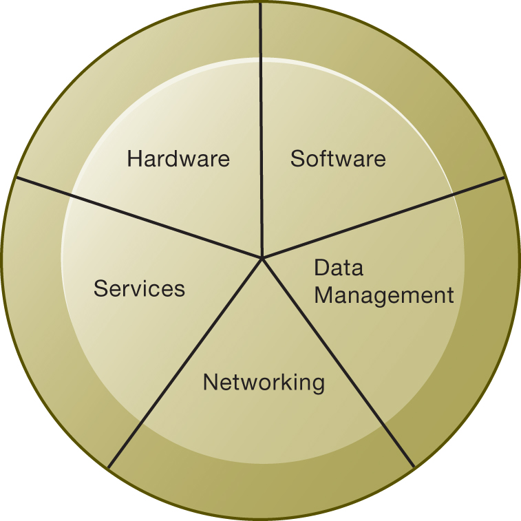
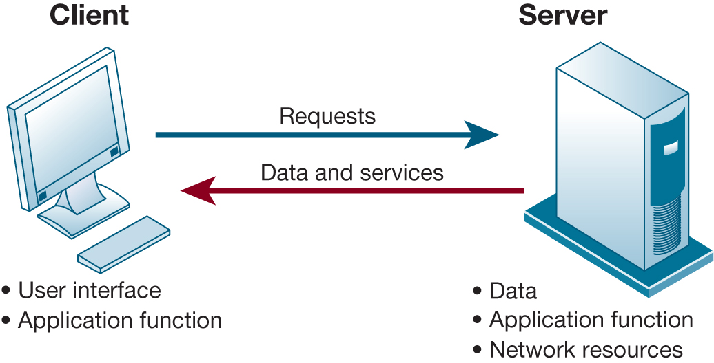
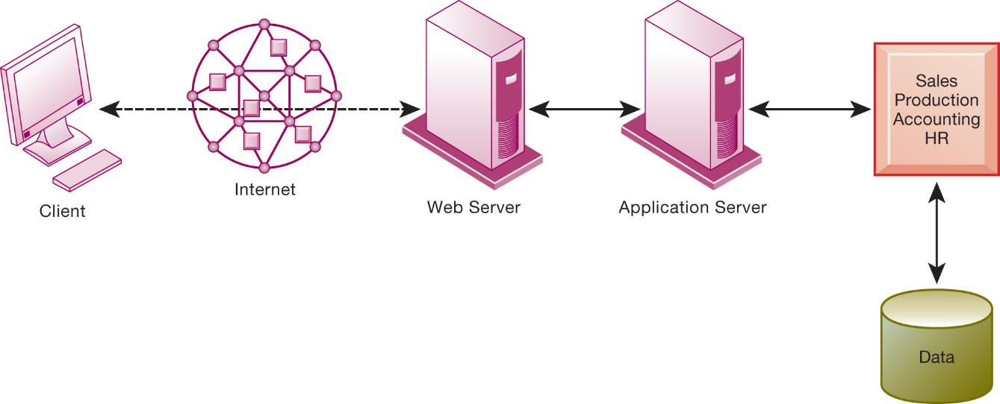
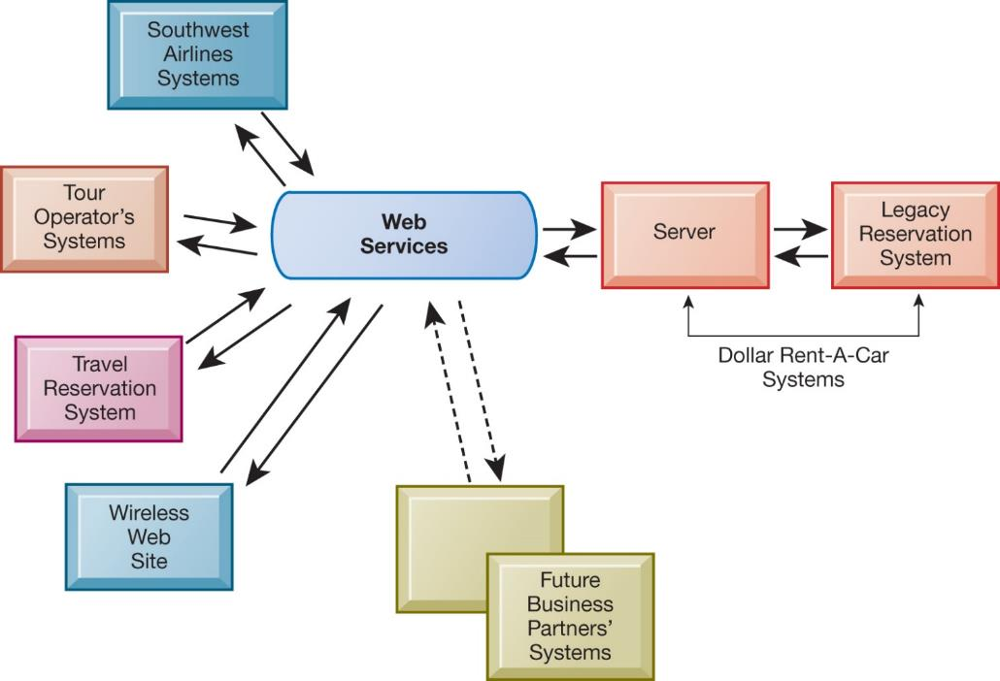

```{r, load_refs, echo=FALSE, cache=FALSE, message=FALSE}
library(RefManageR)
BibOptions(check.entries = FALSE, 
           bib.style = "authoryear", 
           cite.style = 'authoryear', 
           style = "markdown",
           hyperlink = FALSE, 
           dashed = FALSE)
myBib <- ReadBib("assets/example.bib", check = FALSE)
```

```{r xaringan-tile-view, echo=FALSE}
xaringanExtra::use_tile_view()
```

```{r xaringan-panelset, echo=FALSE}
xaringanExtra::use_panelset()
```

```{r xaringan-tachyons, echo=FALSE}
xaringanExtra::use_tachyons()
```

```{r xaringan-extra-styles, echo=FALSE}
xaringanExtra::use_extra_styles(
  hover_code_line = TRUE,         #<<
  mute_unhighlighted_code = TRUE  #<<
)
```

```{r setup, include=FALSE}
options(htmltools.dir.version = FALSE)
knitr::opts_chunk$set(echo = FALSE)
options(knitr.duplicate.label = 'allow')
```

---

## Essentials of Management Information Systems

Fourteenth Edition\, Global Edition


Chapter 5

I TInfrastructure: Hardware and Software

Copyright © 2020 Pearson Education Ltd\.

---

## Learning Objectives

__5\.1__ What are the components ofI Tinfrastructure?

__5\.2__ What are the major computer hardware\, data storage\, input\, and output technologies used in business and the major hardware trends?

__5\.3__ What are the major types of computer software used in business and the major software trends?

__5\.4__ What are the principal issues in managing hardware and software technology?

__5\.5__ How willM I Shelp my career?

---

## Video Cases

Case 1– Rockwell Automation Fuels the Oil and Gas Industry with the Internet of Things \(I o T\)

Case 2–[E S P N](http://espn.com/)[\.com](http://espn.com/): The Future of Sports Coverage in the Cloud

Case 3– Netflix: Building a Business in the Cloud

---

## Hermes UK: Success Delivered Through the Cloud

* Problem
  * Outdated IT infrastructure
  * Highly competitive industry
* Solutions
  * Consumption\-based cloud solution
  * Customer\-centric data model
* Illustrates use of cloud computing to improve effectivenessand improve customer experience

---

## Infrastructure Components

* I Tinfrastructure
  * Platform for supporting all information systems in the business
* Computer hardware
* Computer software
* Data management technology
* Networking and telecommunications technology
* Technology services

---

## Figure 5.1 I T Infrastructure Components



---

## Types of Computers

Personal computers and mobile devices

Workstations

Servers

Mainframes

Supercomputers

Grid computing

---

## Client/Server Computing

* Form of distributed computing
* Splits processing between “clients” and “servers”
* Two\-tiered client/server architecture
* Multi\-tiered client/server architecture \(N\-tier\)
  * Web servers
  * Application servers

---

## Figure 5.2 Client/Server Computing



---

## Figure 5.3 A Multitiered Client/Server Network (N-Tier)



---

## Storage, Input, and Output Technology

* Primary secondary storage technologies
  * Magnetic disk
    * SSD s
  * Optical disks
  * Magnetic tape
  * Storage networking:S A N s
* Input devices
  * E\.g\. keyboard
* Output devices
  * E\.g\. monitor

---

## Contemporary Hardware Trends        (1 of 3)

* The mobile digital platform
  * Smartphones
  * Tablet computers
  * eText readers
* ConsumerizationofI TandB Y O D
* Nanotechnology and quantum computing
* Virtualization
  * Software\-defined storage \(S D S\)

---

## Interactive Session – Technology: Open Source Innovation: The New Competitive Advantage

* Class discussion
  * What is open source software? How is it different from proprietary software?
  * What had motivated Baidu to open source its AI software? How did Baidu benefit from open sourcing?
  * Why did Fujitsu adopt an open source strategy? How did Fujitsu benefit from it?

---

## Examples of Nanotubes


©forance/123R F

---

## Contemporary Hardware Trends        (2 of 3)

* Cloud computing:
  * Computing resources obtained over the Internet
    * Infrastructure as a service \(I aaS\)
    * Software as a service \(S aaS\)
    * Platform as a service \(P aaS\)
  * Public vs\. private clouds
  * Utility computing\, on\-demand computing
  * Hybrid cloud
  * Data storage security is in hands of provider

---

## Figure 5.4 Cloud Computing Platform


---

## Figure 5.5 Major Amazon Web Services


---

## Contemporary Hardware Trends        (3 of 3)

* Green computing
  * GreenI T
  * Practices and technologies for minimizing impact on environment
* High\-performance and power\-saving processors
  * Multicore processors
  * Reduced power consumption

---

## Interactive Session – Organizations: Look to the Cloud

* Class discussion
  * What business benefits do cloud computing services provide? What problems do they solve?
  * What are the disadvantages of cloud computing?
  * What kinds of businesses are most likely to benefit from using cloud computing? Why?

---

## Figure 5.6 The Major Types of Software


---

## Operating System Software

* Software that controls computer activities
* G U Is
* Multitouch
* P Coperating systems
  * Windows\, Mac
  * UNIX
  * Linux \(open source\)
* Mobile operating systems
  * Chrome\, Android\,iO S

---

## Application Software and Desktop Productivity Tools (1 of 2)

* Programming languages for business
  * C
  * C\+\+ \- newer\, object\-oriented version of C
  * Visual Basic: Visual programming language forM SWindows applications
  * Java:O S\-independent object\-oriented programming language
    * Migrated to mobile applications\, game machines\, cableT Vsystems
    * Java Virtual Machine

* Software packages and desktop productivity tools
  * Word processing software
  * Spreadsheetsoftware
  * Data management software
  * Presentation graphics
  * Software suites
  * Web browsers

---

## H T M L  and H T M L 5

* Hypertextmarkuplanguage \(H T M L\):
  * Page description language for specifying how elements are placed on a web page and for creating links to other pages and objects
* H T M L 5
  * Next evolution ofH T M L
  * Enables multimedia embedding without 3rd party plugins like Flash

---

## Web Services

* Software components that exchange information with one another using universal web communication standards and languages
* X M L\(eXtensibleMarkupLanguage\)
  * Foundation of web services
* Service oriented architecture \(S O A\)
  * Collection of services used to build an organization’s software systems

---

## Figure 5.7 How Dollar Rent-A-Car Uses Web Services



---

## Software Trends

* Open source software
  * Linux\, Apache
* Cloud\-based software and tools
  * S aaS\(software as a service\)
    * Google Docs
  * Mashups
    * Zip Realty uses Google Maps and[Zillow\.com](Zillow.com)
  * Apps
    * Mobile apps

---

## Capacity Planning and Scalability

* Capacity planning
  * Predicting when hardware system becomes saturated
  * Ensuring computing power for current and future needs
  * Factors include:
    * Maximum number of users
    * Impact of current\, future software
    * Performance measures
* Scalability
  * Ability of system to expand to serve large number of users without breaking down

---

## Total Cost of Ownership (T C O) model

* Analyzingdirect and indirect costs to determine the actual cost of owning a specific technology
  * Direct costs: hardware\, software purchase costs
  * Indirect costs:ongoingadministration costs\, upgrades\, maintenance\, etc\.
  * Hidden costs: support staff\, downtime\, etc\.
* T C Ocan be reduced through increased centralization\, standardization of hardware and software resources\.

---

## Using Technology Service Providers

* Outsourcing
  * Using external provider to run computercenterand networks
  * Web hosting service
  * Offshore software outsourcing
  * Service level agreements \(S L  As\)
* Using cloud services
  * Appealing to businesses with smallerI Tbudgets
  * Pricing is per hour\, per\-use
  * Switching costs

---

## Managing Mobile Platforms

Mobile devices provide productivity gains

Expenses of equipping employees with devices

Network configuration

Software

Device security

Stolen or compromised devices

Mobile device management \(M D M\) software

---

## Managing Software Localization for Global Business

* Software localization
  * Local language interfaces
  * Complex software interfaces
* Differences in local cultures
* Differences in business processes
* These factors add toT C Oof using technology service providers

---

## How Will M I S Help My Career?

The Business: A1 TechI TConsulting

Position Description

Job Requirements

Interview Questions

