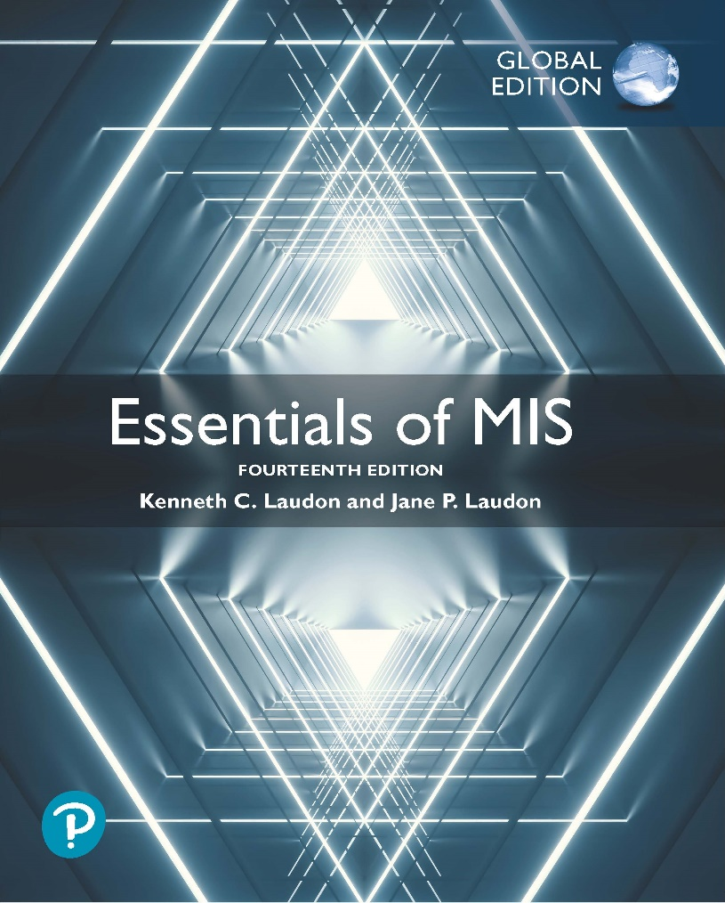
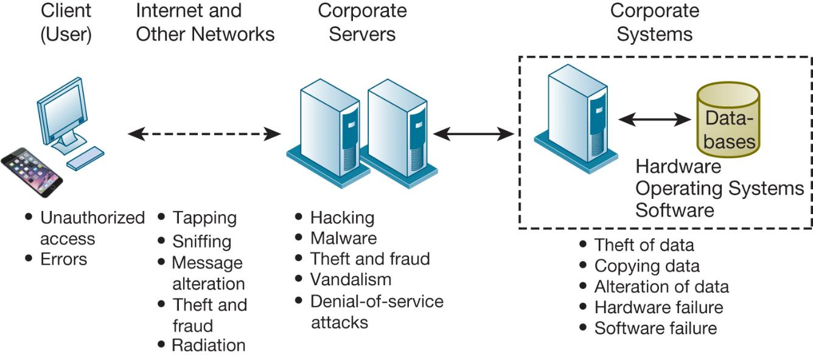
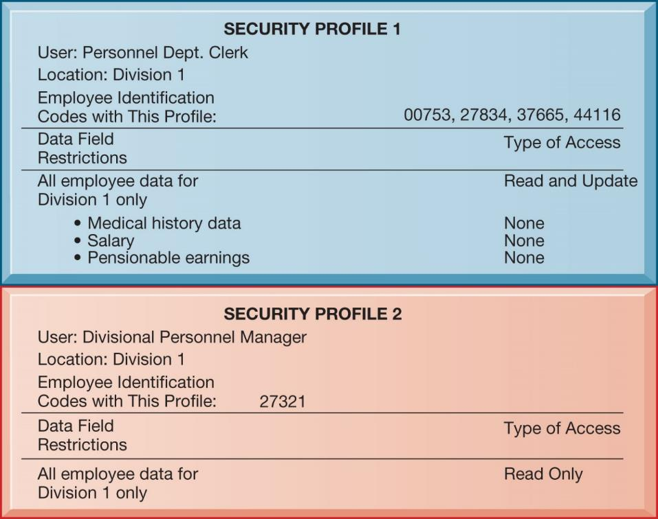
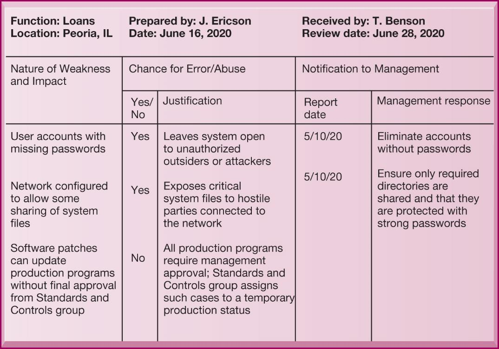
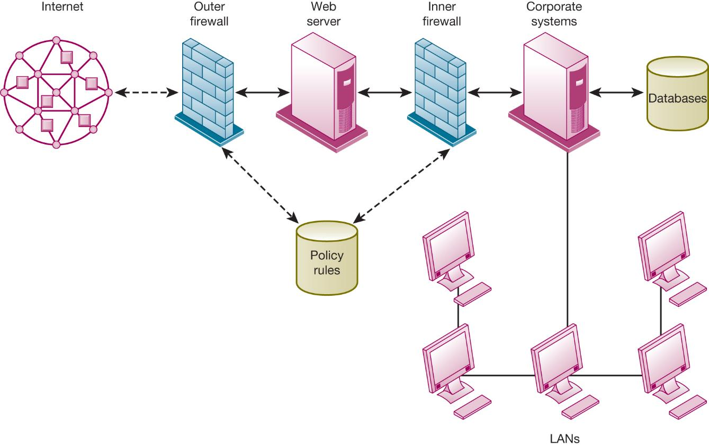
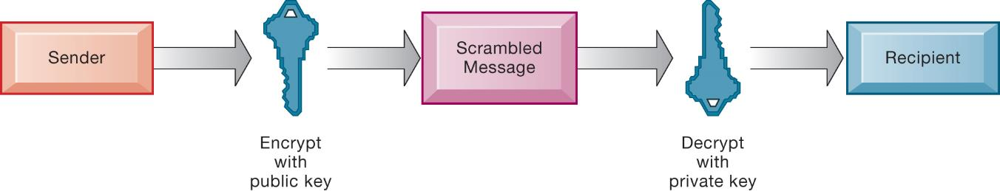
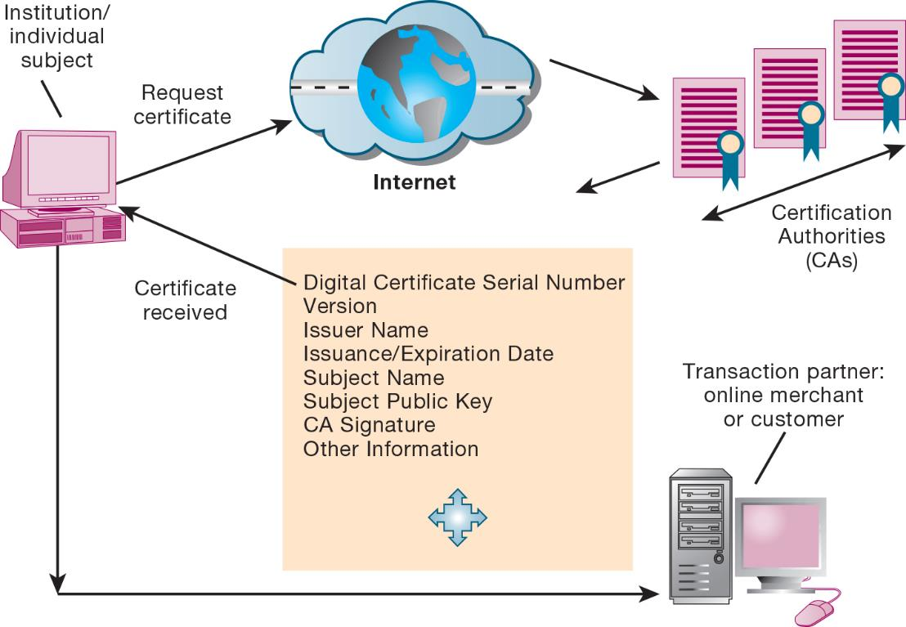

```{r, load_refs, echo=FALSE, cache=FALSE, message=FALSE}
library(RefManageR)
BibOptions(check.entries = FALSE, 
           bib.style = "authoryear", 
           cite.style = 'authoryear', 
           style = "markdown",
           hyperlink = FALSE, 
           dashed = FALSE)
myBib <- ReadBib("assets/example.bib", check = FALSE)
```

```{r xaringan-tile-view, echo=FALSE}
xaringanExtra::use_tile_view()
```

```{r xaringan-panelset, echo=FALSE}
xaringanExtra::use_panelset()
```

```{r xaringan-tachyons, echo=FALSE}
xaringanExtra::use_tachyons()
```

```{r xaringan-extra-styles, echo=FALSE}
xaringanExtra::use_extra_styles(
  hover_code_line = TRUE,         #<<
  mute_unhighlighted_code = TRUE  #<<
)
```

```{r setup, include=FALSE}
options(htmltools.dir.version = FALSE)
knitr::opts_chunk$set(echo = FALSE)
options(knitr.duplicate.label = 'allow')
```

---

## Essentials of Management Information Systems

Fourteenth Edition\, Global Edition



Chapter 8

Securing Information Systems

Copyright © 2020 Pearson Education Ltd\.

---

## Learning Objectives

__8\.1__ Why are information systems vulnerable to destruction\, error\, and abuse?

__8\.2__ What is the business value of security and control?

__8\.3__ What are the components of an organizational framework for security and control?

__8\.4__ What are the most important tools and technologies for safeguarding information resources?

__8\.5__ How willM I Shelp my career?

---

## Video Cases

Case 1: Stuxnet and Cyberwarfare

Case 2: Cyberespionage: The Chinese Threat

Instructional Video 1: Sony PlayStation Hacked; Data Stolen from 77 Million Users

Instructional Video 2: Meet the Hackers: Anonymous Statement on Hacking Sony

---

## The Electric Power Grid Becomes a Cyberwarfare Battleground (1 of 2)

* Problem
  * Large complex infrastructure
  * Numerous access points
  * Uneven security
* Solutions
  * Malware detection
  * Social engineering education
  * Multifactor authentication

Hackers took advantage of uneven security and controls and loose management structure to attack theU\.S\. power grid

Demonstrates vulnerabilities in information technology systems

Illustrates some of the reasons organizations need to pay special attention to information system security

---

## Why Systems Are Vulnerable (1 of 2)

* Security
  * Policies\, procedures\, and technical measures used to prevent unauthorized access\, alteration\, theft\, or physical damage to information systems
* Controls
  * Methods\, policies\, and organizational procedures that ensure safety of organization’s assets; accuracy and reliability of its accounting records; and operational adherence to management standards

Accessibility of networks

Hardware problems \(breakdowns\, configuration errors\, damage from improper use or crime\)

Software problems \(programming errors\, installation errors\, unauthorized changes\)

Disasters

Use of networks/computers outside of firm’s control

Loss and theft of portable devices

---

## Figure 8.1 Contemporary Security Challenges and Vulnerabilities



---

## Internet Vulnerabilities

* Network open to anyone
* Size of Internet means abuses can have wide impact
* Use of fixed Internet addresses with cable /D SL modems creates fixed targets for hackers
* UnencryptedV O IP
* Email\, P2P\,IM
  * Interception
  * Attachments with malicious software
  * Transmitting trade secrets

---

## Wireless Security Challenges

* Radio frequency bands easy to scan
* S S IDs \(service set identifiers\)
  * Identify access points\, broadcast multiple times\, can be identified by sniffer programs
* War driving
  * Eavesdroppers drive by buildings and try to detectS S ID and gain access to network and resources
  * Once access point is breached\, intruder can gain access to networked drives and files
* Rogue access points

---

## Malicious Software: Viruses, Worms, Trojan Horses, and Spyware (1 of 2)

* Malware \(malicious software\)
* Viruses
* Worms
* Worms and viruses spread by
  * Downloads and drive\-by downloads
  * Email\,IM attachments
* Mobile device malware
* Social network malware

* Trojan horse
* S QL injection attacks
* Ransomware
* Spyware
  * Key loggers
  * Other types
    * Reset browser home page
    * Redirect search requests
    * Slow computer performance by taking up memory

---

## Hackers and Computer Crime (1 of 3)

* Hackersvs\. crackers
* Activities include:
  * System intrusion
  * System damage
  * Cybervandalism
    * Intentional disruption\, defacement\, destruction of website or corporate information system
* Spoofing and sniffing

* Denial\-of\-service attacks \(D oS\)
* Distributed denial\-of\-service attacks \(D D oS\)
* Botnets
* Spam
* Computer crime
  * Computer may be target of crime
  * Computer may be instrument of crime

* Identity theft
  * Phishing
  * Evil twins
  * Pharming
* Click fraud
* Cyberterrorism
* Cyberwarfare

---

## Internal Threats: Employees

* Security threats often originate inside an organization
* Inside knowledge
* Sloppy security procedures
  * User lack of knowledge
* Social engineering
* Both end users and information systems specialists are sources of risk

---

## Software Vulnerability

* Commercial software contains flaws that create security vulnerabilities
  * Bugs \(program code defects\)
  * Zero defects cannot be achieved
  * Flaws can open networks to intruders
* Zero\-day vulnerabilities
* Patches
  * Small pieces of software to repair flaws
  * Patch management

---

## What Is the Business Value of Security and Control?

* Failed computer systems can lead to significant or total loss of business function
* Firms now are more vulnerable than ever
  * Confidential personal and financial data
  * Trade secrets\, new products\, strategies
* A security breach may cut into a firm’s market value almost immediately
* Inadequate security and controls also bring forth issues of liability

---

## Interactive Session – Technology: Meltdown and Spectre Haunt the World’s Computers

* Class discussion
  * How dangerous are Spectre and Meltdown? Explain your answer\.
  * Compare the threats of Spectre and Meltdown to cloud computing centers\, corporate data centers\, and individual computer and smartphone users\.
  * How would you protect against Spectre and Meltdown if you were running a public cloud computing center\, if you ran a corporate data center\, and if you were an individual computer user?

---

## Legal and Regulatory Requirements for Electronic Records Management

* H I P AA
  * Medical security and privacy rules and procedures
* Gramm\-Leach\-Bliley Act
  * Requires financial institutions to ensure the security and confidentiality of customer data
* Sarbanes\-Oxley Act
  * Imposes responsibility on companies and their management to safeguard the accuracy and integrity of financial information that is used internally and released externally

---

## Electronic Evidence and Computer Forensics

* Electronic evidence
  * Evidence for white collar crimes often in digital form
  * Proper control of data can save time and money when responding to legal discovery request
* Computer forensics
  * Scientific collection\, examination\, authentication\, preservation\, and analysis of data from computer storage media for use as evidence in court of law
  * Recovery of ambient data

---

## Information Systems Controls

* May be automated or manual
* General controls
  * Govern design\, security\, and use of computer programs and security of data files in general throughout organization
  * Software controls\, hardware controls\, computer operations controls\, data security controls\, system development controls\, administrative controls\,
* Application controls
  * Controls unique to each computerized application
  * Input controls\, processing controls\, output controls

---

## Risk Assessment

* Determines level of risk to firm if specific activity or process is not properly controlled
  * Types of threat
  * Probability of occurrence during year
  * Potential losses\, value of threat
  * Expected annual loss

---

## Table 8.5 Online Order Processing Risk Assessment

---

## Security Policy

* Ranks information risks\, identifies security goals and mechanisms for achieving these goals
* Drives other policies
* Acceptable use policy \(A UP\)
  * Defines acceptable uses of firm’s information resources and computing equipment
* Identity management
  * Identifying valid users
  * Controlling access

---

## Figure 8.2 Access Rules for a Personnel System



---

## Disaster Recovery Planning and Business Continuity Planning

* Disaster recovery planning
  * Devises plans for restoration of disrupted services
* Business continuity planning
  * Focuses on restoring business operations after disaster
* Both types of plans needed to identify firm’s most critical systems
  * Business impact analysis to determine impact of an outage
  * Management must determine which systems restored first

---

## The Role of Auditing

* Information systems audit
  * Examines firm’s overall security environment as well as controls governing individual information systems
* Security audits
  * Review technologies\, procedures\, documentation\, training\, and personnel
  * May even simulate disaster to test responses
* List and rank control weaknesses and the probability of occurrence
* Assess financial and organizational impact of each threat

---

## Figure 8.3 Sample Auditor’s List of Control Weaknesses



---

## Tools and Technologies for Safeguarding Information Systems   (1 of 3)

* Identity management software
  * Automates keeping track of all users and privileges
  * Authenticates users\, protecting identities\, controlling access
* Authentication
  * Password systems
  * Tokens
  * Smart cards
  * Biometric authentication
  * Two\-factor authentication

* Firewall
  * Combination of hardware and software that prevents unauthorized users from accessing private networks
  * Packet filtering
  * Stateful inspection
  * Network address translation \(N AT\)
  * Application proxy filtering

---

## Figure 8.4 A Corporate Firewall



---

## Tools and Technologies for Safeguarding Information Systems   (3 of 3)

* Intrusion detection system
  * Monitors hot spots on corporate networks to detect and deter intruders
* Antivirus and antispyware software
  * Checks computers for presence of malware and can often eliminate it as well
  * Requires continual updating
* Unified threat management \(U TM\) systems

---

## Securing Wireless Networks

* W EP security
  * Static encryption keys are relatively easy to crack
  * Improved if used in conjunction withV PN
* W P A2 specification
  * ReplacesW EP with stronger standards
  * Continually changing\, longer encryption keys

---

## Encryption and Public Key Infrastructure (1 of 3)

* Encryption
  * Transforming text or data into cipher text that cannot be read by unintended recipients
  * Two methods for encryption on networks
    * Secure Sockets Layer \(S SL\) and successor Transport Layer Security \(T LS\)
    * Secure Hypertext Transfer Protocol \(S\-H T TP\)

* Two methods of encryption of messages
  * Symmetric key encryption
    * Sender and receiver use single\, shared key
  * Public key encryption
    * Uses two\, mathematically related keys: public key and private key
    * Sender encrypts message with recipient’s public key
    * Recipient decrypts with private key

---

## Figure 8.5 Public Key Encryption



---

## Encryption and Public Key Infrastructure (3 of 3)

* Digital certificate
  * Data file used to establish the identity of users and electronic assets for protection of online transactions
  * Uses a trusted third party\, certification authority \(CA\)\, to validate a user's identity
  * CA verifies user’s identity\, stores information inCA server\, which generates encrypted digital certificate containing ownerID information and copy of owner’s public key
* Public key infrastructure \(P KI\)
  * Use of public key cryptography working with certificate authority
  * Widely used in e\-commerce

---

## Figure 8.6 Digital Certificates



---

## Securing Transactions with Blockchain

Secure transaction database

Encryption used to verify users and transactions

Decentralized

Records cannot be changed

---

## Ensuring System Availability

* Online transaction processing requires 100% availability
* Fault\-tolerant computer systems
  * Contain redundant hardware\, software\, and power supply components that create an environment that provides continuous\, uninterrupted service
* Deep packet inspection
* Security outsourcing
  * Managed security service providers \(M S S Ps\)

---

## Security Issues for Cloud Computing and the Mobile Digital Platform (1 of 2)

* Security in the cloud
  * Responsibility for security resides with company owning the data
  * Firms must ensure providers have adequate protection:
    * Where data are stored
    * Meeting corporate requirements\, legal privacy laws
    * Segregation of data from other clients
    * Audits and security certifications
  * Service level agreements \(S L As\)

* Securing mobile platforms
  * Security policies should include and cover any special requirements for mobile devices
    * Guidelines for use of platforms and applications
  * Mobile device management tools
    * Authorization
    * Inventory records
    * Control updates
    * Lock down/erase lost devices
    * Encryption
  * Software for segregating corporate data on devices

---

## Ensuring Software Quality

* Software metrics: Objective assessments of system in form of quantified measurements
  * Number of transactions
  * Online response time
  * Payroll checks printed per hour
  * Known bugs per hundred lines of code
* Early and regular testing
* Walkthrough: Review of specification or design document by small group of qualified people
* Debugging: Process by which errors are eliminated

---

## Interactive Session – Organizations: Phishing for Money: Dangerous Emails

* Class discussion
  * Explain the difference between spear phishing and bulk phishing\. Which is most difficult to spot by victims\, and why?
  * What factors should a CEO duped by hackers take into consideration before deciding to contact the police?
  * Do you think that not adding attachments to emails will help protect companies against phishing stacks?
  * Give two pieces of advice to a company or individual on increasing protection against a phishing attack\.

---

## How Will M  I  S Help My Career?

The Company: No\. 1 Value Supermarkets

Position Description: Identity access and management support specialist\, entry\-level

Job Requirements

Interview Questions

Author Tips

