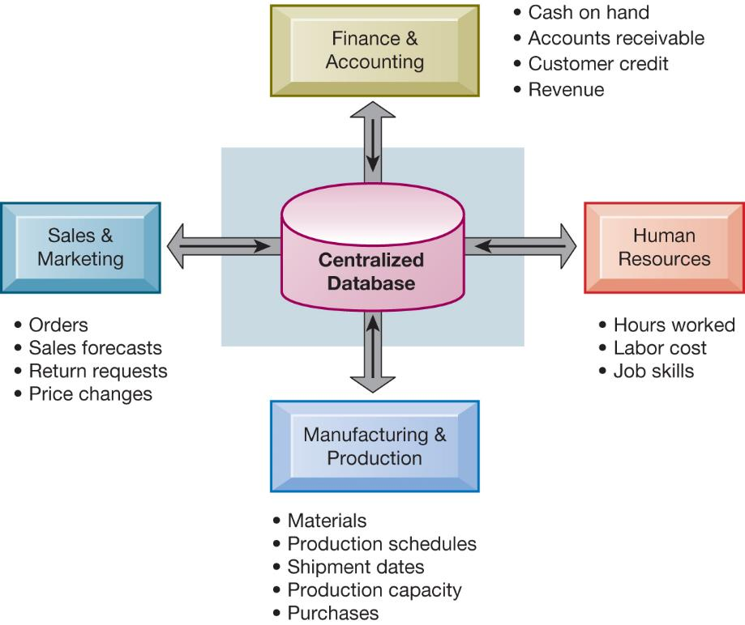
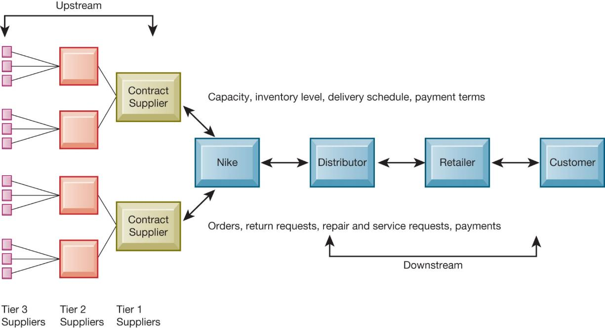
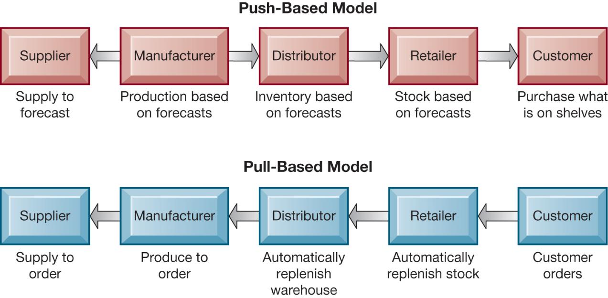
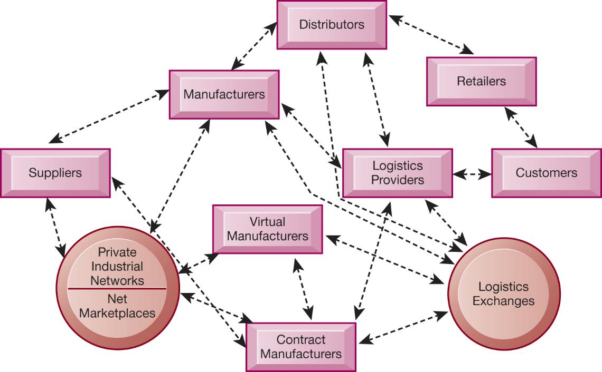
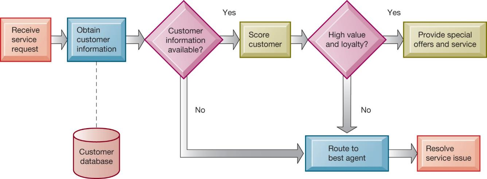
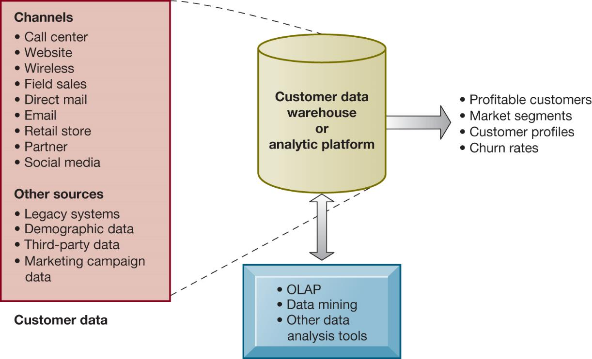

```{r, load_refs, echo=FALSE, cache=FALSE, message=FALSE}
library(RefManageR)
BibOptions(check.entries = FALSE, 
           bib.style = "authoryear", 
           cite.style = 'authoryear', 
           style = "markdown",
           hyperlink = FALSE, 
           dashed = FALSE)
myBib <- ReadBib("assets/example.bib", check = FALSE)
```

```{r xaringan-tile-view, echo=FALSE}
xaringanExtra::use_tile_view()
```

```{r xaringan-panelset, echo=FALSE}
xaringanExtra::use_panelset()
```

```{r xaringan-tachyons, echo=FALSE}
xaringanExtra::use_tachyons()
```

```{r xaringan-extra-styles, echo=FALSE}
xaringanExtra::use_extra_styles(
  hover_code_line = TRUE,         #<<
  mute_unhighlighted_code = TRUE  #<<
)
```

```{r setup, include=FALSE}
options(htmltools.dir.version = FALSE)
knitr::opts_chunk$set(echo = FALSE)
options(knitr.duplicate.label = 'allow')
```

---

## Essentials of Management Information Systems

Fourteenth Edition\, Global Edition


Chapter 9

Achieving Operational Excellence and Customer Intimacy: Enterprise Applications

Copyright © 2020 Pearson Education Ltd\.

---

## Learning Objectives

__9\.1__ How do enterprise systems help businesses achieve operational excellence?

__9\.2__ How do supply chain management systems coordinate planning\, production\, and logistics with suppliers?

__9\.3__ How do customer relationship management systems help firms achieve customer intimacy?

__9\.4__ What are the challenges that enterprise applications pose\, and how are enterprise applications taking advantage of new technologies?

__9\.5__ How willM IS help my career?

---

## Video Cases

Case 1: Maersk Develops a Global Shipping Management System

Instructional Video: GSMS Protects Patients by Serializing Every Bottle of Drugs

---

## Warehouse Management at Norauto: Conversational Commerce (1 of 2)

* Problem
  * Volume and diversity of product range
  * Global operations
  * Complex supply chain
  * Manual processes
* Solutions
  * Scalable replacement
  * Voice recognition software

Norautoused a scalable warehouse management system from Manhattan Associates and avoice recognition solution byVocollectto reduce errors and enhance order\-fulfilment accuracy\.

Demonstrates why companies need enterprise applications

Illustrates the ability ofE R Psystems to dramatically improve operational effectiveness and decision making on a global scale

---

## Enterprise Systems

Enterprise resource planning \(E RP\) systems

Suite of integrated software modules and a common central database

Collects data from many divisions of firm for use in nearly all of firm’s internal business activities

Information entered in one process is immediately available for other processes

---

## Figure 9.1 How Enterprise Systems Work



---

## Enterprise Software

* Built around thousands of predefined business processes that reflect best practices
  * Finance and accounting
  * Human resources
  * Manufacturing and production
  * Sales and marketing
* To implement\, firms:
  * Select functions of system they wish to use
  * Map business processes to software processes
    * Use software’s configuration tables for customizing

---

## Business Value of Enterprise Systems

Increase operational efficiency

Provide firm\-wide information to support decision making

Enable rapid responses to customer requests for information or products

Include analytical tools to evaluate overall organizational performance and improve decision\-making

---

## The Supply Chain

* Network of organizations and processes for:
  * Procuring materials
  * Transforming materials into products
  * Distributing the products
* Upstream supply chain
* Downstream supply chain
* Internal supply chain

---

## Figure 9.2 Nike’s Supply Chain



---

## Supply Chain Management

* Inefficiencies cut into a company’s operating costs
  * Can waste up to 25 percent of operating expenses
* Just\-in\-time strategy
  * Components arrive as they are needed
  * Finished goods shipped after leaving assembly line
* Safety stock: buffer for lack of flexibility in supply chain
* Bullwhip effect
  * Information about product demand gets distorted as it passes from one entity to next across supply chain

---

## Figure 9.3 The Bullwhip Effect


---

## Supply Chain Management Software

* Supply chain planning systems
  * Model existing supply chain
  * Enable demand planning
  * Optimize sourcing\, manufacturing plans
  * Establish inventory levels
  * Identify transportation modes
* Supply chain execution systems
  * Manage flow of products through distribution centers and warehouses

---

## Global Supply Chains and the Internet

* Global supply chain issues
  * Greater geographical distances\, time differences
  * Participants from different countries
    * Different performance standards
    * Different legal requirements
* Internet helps manage global complexities
  * Warehouse management
  * Transportation management
  * Logistics
  * Outsourcing

---

## Demand-Driven Supply Chains: From Push to Pull Manufacturing and Efficient Customer Response

* Push\-based model \(build\-to\-stock\)
  * EarlierS C Msystems
  * Schedules based on best guesses of demand
* Pull\-based model \(demand\-driven\)
  * Web\-based
  * Customer orders trigger events in supply chain
* Internet enables move from sequential supply chains to concurrent supply chains
  * Complex networks of suppliers can adjust immediately

---

## Figure 9.4 Push- Versus Pull-Based Supply Chain Models



---

## Figure 9.5 The Emerging Internet-Driven Supply Chain



---

## Business Value of Supply Chain Management Systems

* Match supply to demand
* Reduce inventory levels
* Improve delivery service
* Speed product time to market
* Use assets more effectively
  * Total supply chain costs can be 75 percent of operating budget
* Increase sales

---

## Interactive Session – Organizations: Soma Bay Prospers with E R P in the Cloud

* Class discussion
  * Identify and describe the problem discussed in this case\. What management\, organization\, and technology factors contributed to the problem?
  * Why was anE R Psystem required for a solution? How did having a cloud\-basedE R Psystem contribute to the solution?
  * What were the business benefits of Soma Bay’s new enterprise system? How did it change decision making and the way the company operated?

---

## Customer Relationship Management

* Knowing the customer
* In large businesses\, too many customers and too many ways customers interact with firm
* C R Msystems
  * Capture and integrate customer data from all over the organization
  * Consolidate and analyze customer data
  * Distribute customer information to various systems and customer touch points across enterprise
  * Provide single enterprise view of customers

---

## Figure 9.6 Customer Relationship Management (C R M)


---

## Customer Relationship Management Software (1 of 2)

* Packages range from niche tools to large\-scale enterprise applications
* More comprehensive packages have modules for:
  * Partner relationship management \(P RM\)
    * Integrating lead generation\, pricing\, promotions\, order configurations\, and availability
    * Tools to assess partners’ performances
  * Employee relationship management \(E RM\)
    * Setting objectives\, employee performance management\, performance\-based compensation\, employee training

* C R Mpackages typically include tools for:
  * Sales force automation \(S FA\)
    * Sales prospect and contact information
    * Sales quote generation capabilities
  * Customer service
    * Assigning and managing customer service requests
    * Web\-based self\-service capabilities
  * Marketing
    * Capturing prospect and customer data\, scheduling and tracking direct\-marketing mailings or email
    * Cross\-selling

---

## Figure 9.7 How C R M Systems Support Marketing

__Responses by Channel for January 2019 Promotional Campaign__


---

## Figure 9.8 C R M Software Capabilities


---

## Figure 9.9 Customer Loyalty Management Process Map



---

## Operational and Analytical C R M

* OperationalC R M
  * Customer\-facing applications
  * Sales force automation call center and customer service support
  * Marketing automation
* AnalyticalC R M
  * Based on data warehouses populated by operationalC R Msystems and customer touch points
  * Analyzes customer data \(O L AP\, data mining\, etc\.\)
    * Customer lifetime value \(C L TV\)

---

## Figure 9.10 Analytical C R M



---

## Interactive Session – People: CRM Helps Adidas Know Its Customers One Shoe Buyer at a Time

* Class discussion
  * Analyze Adidas using the competitive forces and value chain model\.
  * What is Adidas’s business strategy? What is the role of customer relationship management in that strategy?
  * How do information systems support Adidas’s strategy?
  * How did using Salesforce\.com make Adidas more competitive? How did it change the way the company ran its business?
  * Give an example of two business decisions that were improved by using Salesforce\.com\.

---

## Business Value of Customer Relationship Management Systems

* Business value ofC R Msystems
  * Increased customer satisfaction
  * Reduced direct\-marketing costs
  * More effective marketing
  * Lower costs for customer acquisition/retention
  * Increased sales revenue
* Churn rate
  * Number of customers who stop using or purchasing products or services from a company
  * Indicator of growth or decline of firm’s customer base

---

## Enterprise Application Challenges

* Expensive to purchase and implement enterprise applications
  * Multi\-million dollar projects in 2018
  * Long development times
* Technology changes
* Business process changes
* Organizational learning\, changes
* Switching costs\, dependence on software vendors
* Data standardization\, management\, cleansing

---

## Next-Generation Enterprise Applications (1 of 2)

* Enterprise solutions/suites
  * Make applications more flexible\, web\-enabled\, integrated with other systems
* S OA standards
* Open\-source applications
* On\-demand solutions
* Cloud\-based versions
* Functionality for mobile platform

* SocialC R M
  * Incorporating social networking technologies
  * Company social networks
  * Monitor social media activity; social media analytics
  * Manage social and web\-based campaigns
* Business intelligence
  * Inclusion ofB Iwith enterprise applications
  * Flexible reporting\, ad hoc analysis\, “what\-if” scenarios\, digital dashboards\, data visualization

---

## How Will M I S Help My Career?

The Company:X YZ Global Industrial Components

Position Description: Manufacturing management trainee

Job Requirements

Interview Questions

Author Tips

