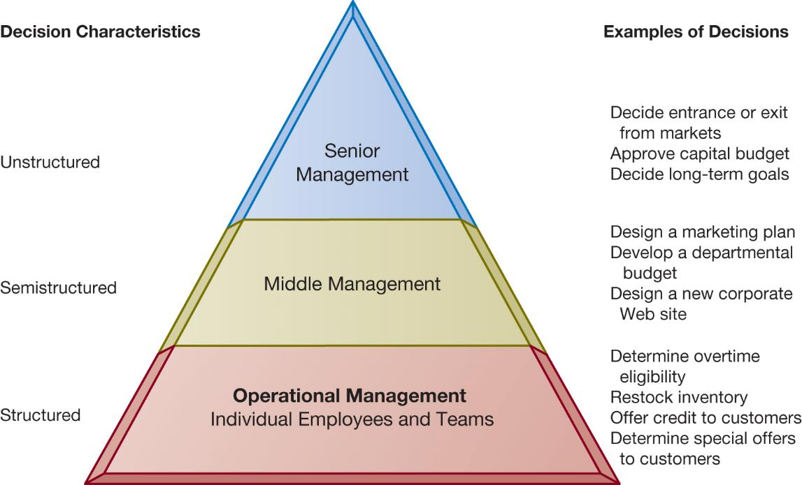
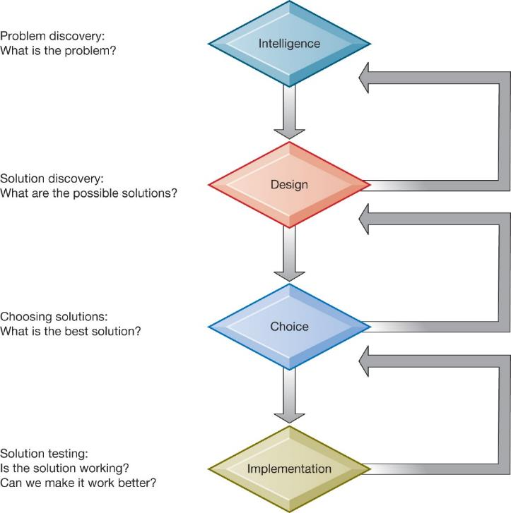
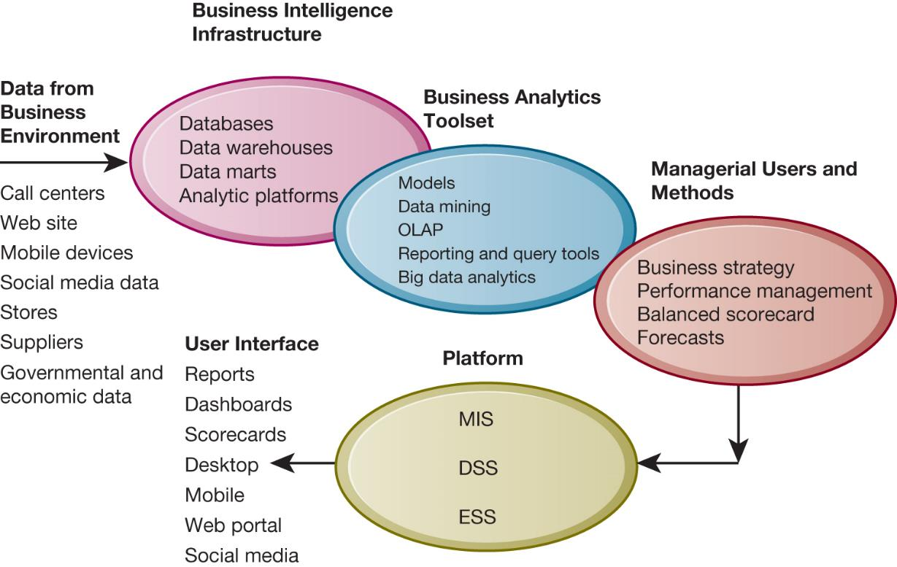
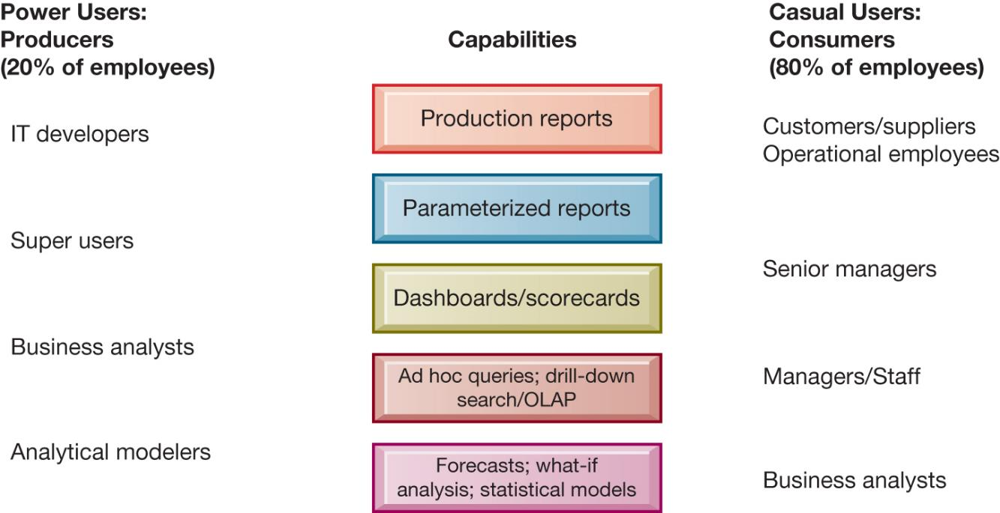
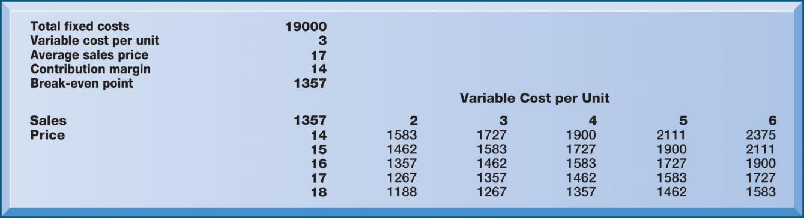
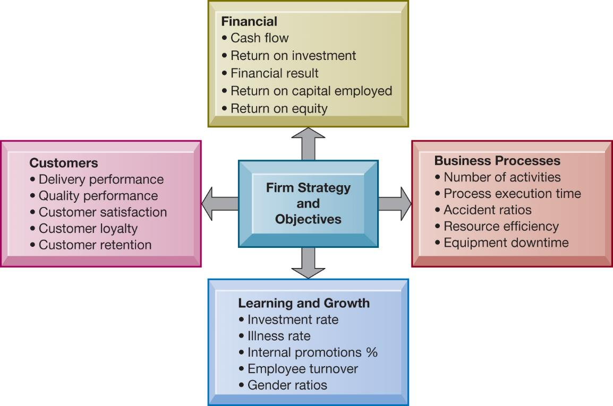
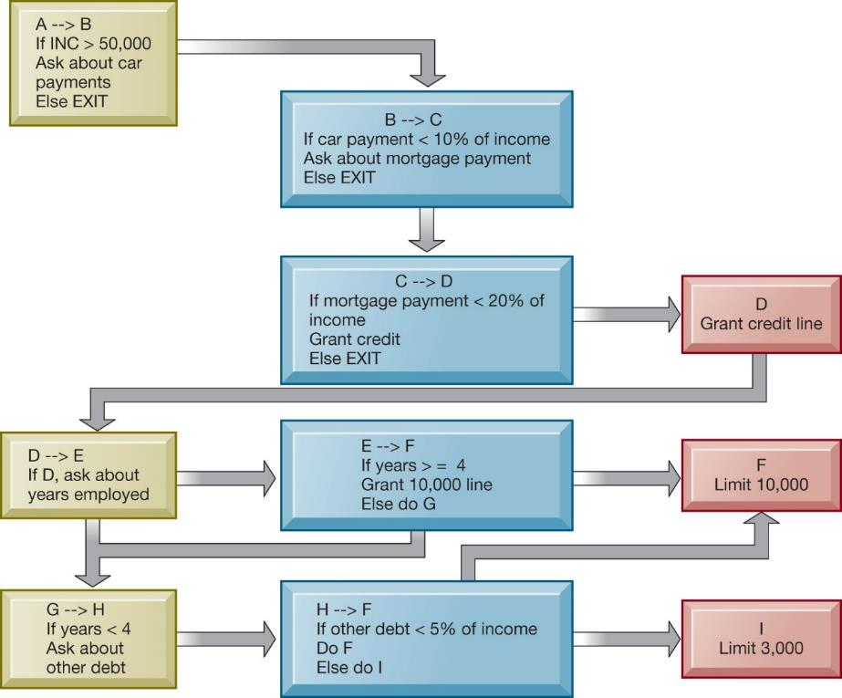
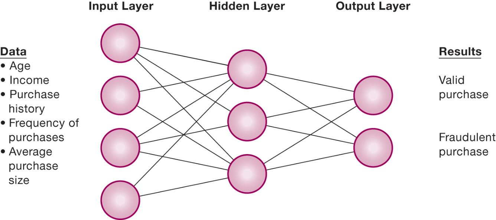
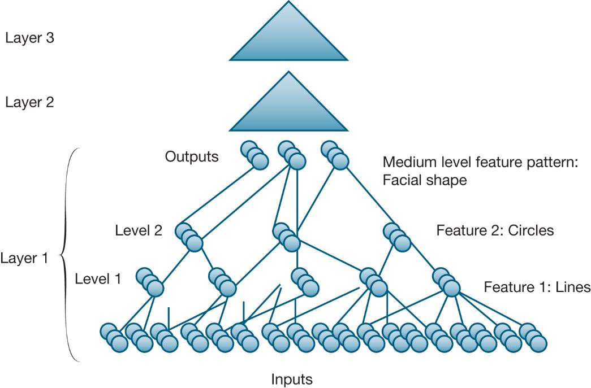
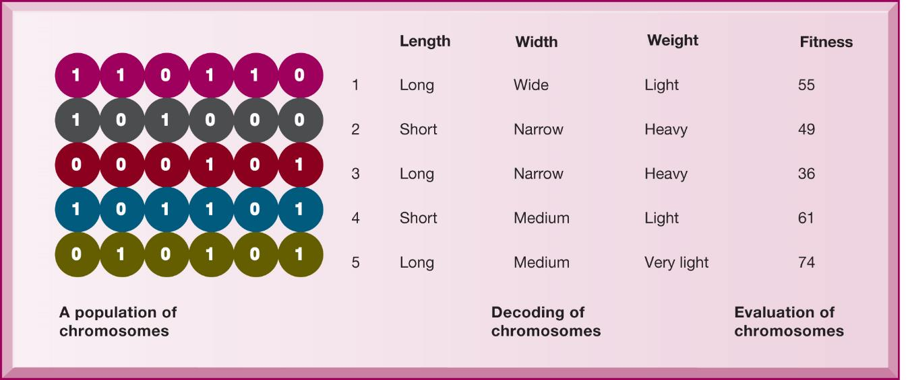

```{r, load_refs, echo=FALSE, cache=FALSE, message=FALSE}
library(RefManageR)
BibOptions(check.entries = FALSE, 
           bib.style = "authoryear", 
           cite.style = 'authoryear', 
           style = "markdown",
           hyperlink = FALSE, 
           dashed = FALSE)
myBib <- ReadBib("assets/example.bib", check = FALSE)
```

```{r xaringan-tile-view, echo=FALSE}
xaringanExtra::use_tile_view()
```

```{r xaringan-panelset, echo=FALSE}
xaringanExtra::use_panelset()
```

```{r xaringan-tachyons, echo=FALSE}
xaringanExtra::use_tachyons()
```

```{r xaringan-extra-styles, echo=FALSE}
xaringanExtra::use_extra_styles(
  hover_code_line = TRUE,         #<<
  mute_unhighlighted_code = TRUE  #<<
)
```

```{r setup, include=FALSE}
options(htmltools.dir.version = FALSE)
knitr::opts_chunk$set(echo = FALSE)
options(knitr.duplicate.label = 'allow')
```

---

## Essentials of Management Information Systems

Fourteenth Edition\, Global Edition


Chapter 11

Improving Decision Making and Managing Artificial Intelligence

Copyright © 2020 Pearson Education Ltd\.

---

## Learning Objectives

__11\.1__ What are the different types of decisions\, and how does the decision\-making process work?

__11\.2__ How do business intelligence and business analytics support decision making?

__11\.3__ What is artificial intelligence \(AI\)? How does it differ from human intelligence?

__11\.4__ What are the major types of AI techniques and how do they benefit organizations?

__11\.5__ How willM I Shelp my career?

---

## Video Cases

Case 1: HowI B M’s Watson Became a Jeopardy Champion

Case 2: Business Intelligence Helps the Cincinnati Zoo Work Smarter

Instructional Video 1:I B MWatson Demo Oncology Diagnosis and Treatment

---

## Machine Learning Helps Akershus University Hospital Make Better Treatment Decisions

* Problem
  * Unstructured data
  * Very large volume of data
  * Opportunities from new technology
* Solutions
  * IBM Watson Explorer
  * Machine learning
  * Natural language processing
* Illustrates how information systems improve decision making

---

## Business Value of Improved Decision Making

* Possible to measure value of improved decision making
* Decisions made at all levels of the firm
  * Some are common\, routine\, and numerous
  * Although value of improving any single decision may be small\, improving hundreds of thousands of “small” decisions adds up to large annual value for the business

---

## Table 11.1 Business Value of Enhanced Decision Making

---

## Types of Decisions

* Unstructured
  * Decision maker must provide judgment to solve problem
  * Novel\, important\, nonroutine
  * No well\-understood or agreed\-upon procedure for making them
* Structured
  * Repetitive and routine
  * Involve definite procedure for handling them so do not have to be treated as new
* Semi\-structured
  * Only part of problem has clear\-cut answer provided by accepted procedure

---

## Figure 11.1 Information Requirements of Key Decision-Making Groups in a Firm



---

## The Decision-Making Process

* 1\.Intelligence
  * Discovering\, identifying\, and understanding the problems occurring in the organization

* 2\.Design
  * Identifying and exploring various solutions

* 3\.Choice
  * Choosing among solution alternatives

* 4\.Implementation
  * Making chosen alternative work and monitoring how well solution is working

---

## Figure 11.2 Stages in Decision Making



---

## High-Velocity Automated Decision Making

Humans eliminated

Decision\-making process captured by computer algorithms

Predefined range of acceptable solutions

Decisions made faster than managers can monitor and control

E\.g\.\, Trading programs at electronic stock exchanges

---

## Quality of Decisions and Decision Making

Accuracy

Comprehensiveness

Fairness

Speed \(efficiency\)

Coherence

Due process

---

## What Is Business Intelligence?

* Infrastructure for managing data from business environment
  * Warehousing
  * Integrating
  * Reporting
  * Analyzing
* Hadoop\,O L A P\, analytics
* Products defined by technology vendors and consulting firms

---

## The Business Intelligence Environment

Six elements in theB Ienvironment

  * 1\.Data from business environment
  * 2\.Business intelligence infrastructure
  * 3\.Business analytics toolset
  * 4\.Managerial users and methods
  * 5\.Delivery platform
    * M  S  S\,D  S  S\,E  S  S

6\.User interface

---

## Figure 11.3 Business Intelligence and Analytics for Decision Support



---

## Business Intelligence and Analytics Capabilities

* Production reports
* Parameterized reports
* Dashboards/scorecards
* Ad\-hoc query/search/report creation
* Drill\-down
* Forecasts\, scenarios\, models
  * Linear forecasting\, what\-if scenario analysis\, data analysis

---

## Table 11.3 Examples of Predefined Business Intelligence Production Reports

---

## Interactive Session – Technology: Siemens Makes Business Processes More Visible

* Class discussion
  * Identify the problem in this case study\. What people\, organization\, and technology factors contributed to the problem?
  * Describe the capabilities of process mining software\. Was this an effective solution? Explain your answer\.
  * How did process mining change decision making at Siemens?
  * What people\, organization\, and technology issues need to be addressed when implementing process mining systems?

---

## Predictive Analytics

* Uses statistical analytics\, data mining\, historical data; assumptions of future conditions
* Extracts information from data to predict future trends and behavior patterns
  * Responses to direct marketing campaigns
  * Best potential customers for credit cards
  * At\-risk customers
  * Customer response to price changes and new services
* Accuracies range from 65 to 90 percent

---

## Big Data Analytics

* Predictive analytics can use the big data generated from social media\, consumer transactions\, sensor and machine output\, etc\.
* Combining with customer data
* Big data analytics driving move toward “smart cities”
  * Utility management
  * Transportation operation
  * Healthcare delivery
  * Public safety

---

## Operational Intelligence and Analytics

* Operational intelligence
  * Day\-to\-day monitoring of business decisions and activity
* Real\-time monitoring
* Schneider National truckload logistics services provider
  * Data developed from sensors in trucks\, trains\, industrial systems
* The Internet of Things \(I o T\) providing huge streams of data from connected sensors and devices

---

## Location Analytics and G I S

* Location analytics
  * Big data analytics that uses location data from mobile phones\, sensors\, and maps
  * E\.g\. Helping a utility company view customer costs as related to location
* G I S– Geographic information systems
  * Help decision makers visualize problems with mapping
  * Tie location data about resources to map

---

## Figure 11.4 Business Intelligence Users



---

## Interactive Session – Organizations: Predictive Maintenance in the Oil and Gas Industry

* Class discussion
  * Why is predictive maintenance so important in the oil and gas industry? What problems does it solve?
  * What is the role of the Internet of Things \(IoT\) and Big Data analytics in predictive maintenance?
  * How did BP and Royal Dutch Shell’s predictive maintenance applications change business operations and decision making?
  * Give an example of how predictive maintenance systems could be used in another industry\.

---

## Support for Semi-Structured Decisions

* Decision\-support systems \(D S S\)
  * B Idelivery platform for “super\-users” who want to create own reports\, use more sophisticated analytics and models
  * What\-if analysis
  * Sensitivity analysis
  * Backward sensitivity analysis
  * Pivot tables: Spreadsheet function for multidimensional analysis
  * Intensive modeling techniques

---

## Figure 11.5 Sensitivity Analysis



---

## Figure 11.6 A Pivot Table That Examines Customer Regional Distribution and Advertising Source


---

## Decision Support for Senior Management (1 of 2)

* Executive support systems
* Balanced scorecard method
  * Measures four dimensions of firm performance
    * Financial
    * Business process
    * Customer
    * Learning and growth
  * Key performance indicators \(K P I\) used to measure each dimension

---

## Figure 11.7 The Balanced Scorecard Framework



---

## Decision Support for Senior Management (2 of 2)

* Business performance management \(B P M\)
  * Management methodology based on firm’s strategies
  * Translates strategies into operational targets
  * Uses set ofK P Is to measure progress toward targets
* E S Scombine internal data with external
  * Financial data\, news\, etc\.
* Drill\-down capabilities

---

## Artificial Intelligence Techniques

* Artificial intelligence:Grand vision vs\. narrow definition
* Evolution of AI
  * Big data databases
  * Reduction in the price of processors
  * Expansion in capacity of processors
  * Refinement and explosion of algorithms
  * Large investments in IT and AI
* Progress in image recognition and natural language
  * E\.g\.: Siri\, Alexa\, facial recognition

---

## What Are the Major Types of AI Techniques and How Do They Benefit Organizations? (1 of 5)

* Expert systems
  * Capture human expertise in a limited domain of knowledge
  * Express expertise as a set of rules in a software system
  * Knowledge base
  * Inference engine

---

## Figure 11.8 Rules in an Expert System



---

## What Are the Major Types of AI Techniques and How Do They Benefit Organizations?(2 of 5)

* Machine learning
  * Computers improving performance by using algorithms to learn patterns from data and examples
* Neural networks
  * Find patterns and relationships in very large amounts of data
  * Sensoring and processing nodes
  * “Deep Learning” neural networks

---

## Figure 11.9 How a Neural Network Works



---

## Figure 11.10 A Deep Learning Network



---

## What Are the Major Types of AI Techniques and How Do They Benefit Organizations?(3 of 5)

* Genetic algorithms
  * Examine large number of solutions for a problem
  * Based on machine learning techniques inspired by evolutionary biology

---

## Figure 11.11 The Components of a Genetic Algorithm



---

## What Are the Major Types of AI Techniques and How Do They Benefit Organizations?(4 of 5)

* Natural language processing
  * Software that can process voice or text commands using natural human language
* Computer vision systems
  * Emulate human visual system to view and extract information from real\-world images
* Robotics
  * Design and use of movable machines that can substitute for humans

* Intelligent Agents
  * Software programs that imitate humans and perform tasks on command
  * The agent uses a limited built\-in or learned knowledge base
  * Accomplish tasks or make decisions on the user’s behalf\, e\.g\. chatbots finding cheap fares\, routing calls in a call center

---

## How Will M I S Help My Career?

The Business: RazzleDazzle Technology

Position Description

Job Requirements

Interview Questions

