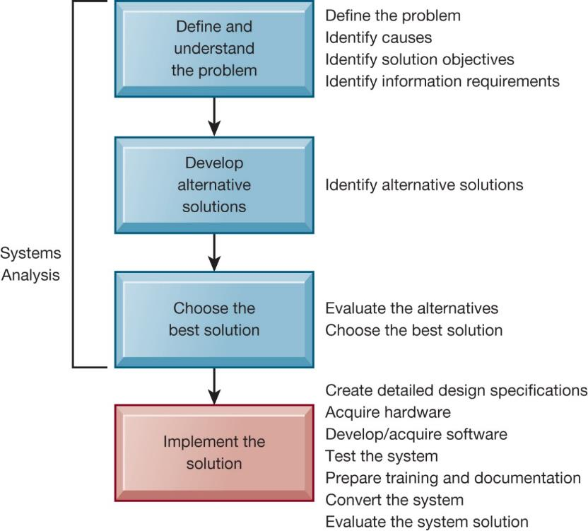
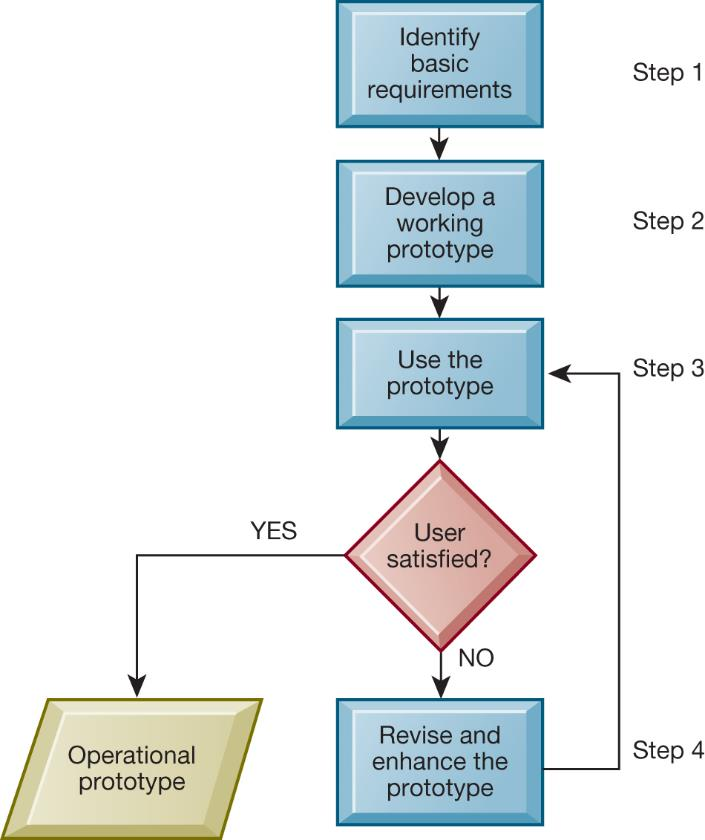
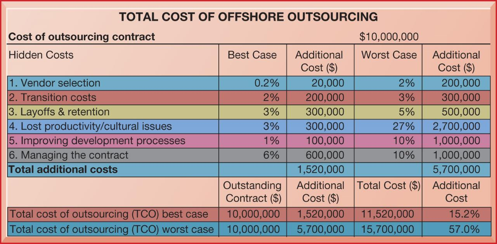

```{r, load_refs, echo=FALSE, cache=FALSE, message=FALSE}
library(RefManageR)
BibOptions(check.entries = FALSE, 
           bib.style = "authoryear", 
           cite.style = 'authoryear', 
           style = "markdown",
           hyperlink = FALSE, 
           dashed = FALSE)
myBib <- ReadBib("assets/example.bib", check = FALSE)
```

```{r xaringan-tile-view, echo=FALSE}
xaringanExtra::use_tile_view()
```

```{r xaringan-panelset, echo=FALSE}
xaringanExtra::use_panelset()
```

```{r xaringan-tachyons, echo=FALSE}
xaringanExtra::use_tachyons()
```

```{r xaringan-extra-styles, echo=FALSE}
xaringanExtra::use_extra_styles(
  hover_code_line = TRUE,         #<<
  mute_unhighlighted_code = TRUE  #<<
)
```

```{r setup, include=FALSE}
options(htmltools.dir.version = FALSE)
knitr::opts_chunk$set(echo = FALSE)
options(knitr.duplicate.label = 'allow')
```

---

## Essentials of Management Information Systems

Fourteenth Edition\, Global Edition


Chapter 12

Making the Business Case for Information Systems and Managing Projects

Copyright © 2020 Pearson Education Ltd\.

---

## Learning Objectives

__12\.1__ How should managers build a business case for the acquisition and development of a new information system?

__12\.2__ What are the core problem\-solving steps for developing a new information system?

__12\.3__ What are the alternative methods for building information systems?

__12\.4__ How should information systems projects be managed?

__12\.5__ How willM I Shelp my career?

---

## Video Cases

Case 1: NASA Project Management Challenges

Case 2:IBM: Business Process Management in a SaaS Environment

Case 3:I B MHelps the City of Madrid with Real\-TimeB P MSoftware

Instructional Videos:

What is PaaS? What is Predix?

B P M: Business Process Management Customer Story

---

## Angostura Builds A Mobile Sales System

* Problem
  * Inefficient manual procedures
  * High order entry error rates
* Solutions
  * SAP ERP
  * SAP Netweaver
  * Gateway software
* Illustrates benefits of implementing a new system solution and automating manual processes

---

## Key Business Case Considerations

IT is an investment of corporate funds\. Is it worth it?

What is the rationale for investment?

How will the system fit with firm’s strategic goals?

How does the system provide value?

What are the risks? Alternative solutions?

How will the firm’s culture\, processes\, and systems need to change?

---

## Figure 12.1 Factors to Consider in Making the Business Case


---

## The Information Systems Plan

Overview of plan contents

Strategic business plan rational

Current systems

New developments

Management strategy

Implementation of the plan

Budget

---

## Selecting Projects

* Determining project costs and benefits
  * Tangible benefits
  * Intangible benefits
  * Capital budgeting methods
* Information systems plan
* Portfolio analysis
* Scoring model

---

## Figure 12.2 A System Portfolio Analysis


---

## Scoring Model for Selecting Alternatives

Used to evaluate alternative system projects\, especially when many criteria exist

Assigns weights to various features of system and calculates weighted totals

Many qualitative judgments involved

Requires experts who understand the issues and the technology

See Table 12\.2 Example Scoring Model in text

---

## Building a Business Case

* New information systems are built as solutions to problems
* Four steps to building an information system
  * Define and understand the problem
  * Develop alternative solutions
  * Choose a solution
  * Implement the solution
* The first three steps are called systems analysis

---

## Determining Solution Costs and Benefits

* Tangible benefits
  * Measurable monetary value
  * E\.g\. lower costs\, higher sales
* Intangible benefits
  * Better customer service
  * Enhanced or faster decision making
* See Table 12\.3 in text Costs and Benefits of Information Systems

---

## Capital Budgeting for Information Systems

* Capital budgeting models
  * Measure value of long\-term capital investment projects
  * Rely on measures of the firm’s cash outflows and inflows
* Principal capital budgeting models evaluate IT projects
  * Payback method
  * Accounting rate of return on investment \(ROI\)
  * Net present value
  * Internal rate of return \(IRR\)
* Limitations of financial models
* See Figure 12\.3 in text

---

## Figure 12.4 Developing an Information System Solution



---

## Evaluating and Choosing Solutions

* Feasibility study:
  * Is solution feasible from financial\, technical\, and organizational standpoint?
* Systems proposal report
  * Describes\, for each alternative solution
    * Costs and benefits
    * Advantages and disadvantages

---

## Implementing the Solution

* Systems design
* Completing implementation
  * Hardware selection and acquisition
  * Software development and programming
  * Testing
  * Training and documentation
  * Conversion
  * Production and maintenance
* Managing the change

---

## Traditional Systems Development Lifecycle

SLDC: Oldest method for building information systems

Phased approach with formal stages

Waterfall approach

Formal division of labor

Used for building large\, complex systems

Time consuming and expensive to use

---

## Figure 12.6 The Traditional Systems Development Life Cycle


---

## Prototyping

* Preliminary model built rapidly and inexpensively
* Four\-step process
  * Identify the user’s basic requirements
  * Develop an initial prototype
  * Use the prototype
  * Revise and enhance the prototype
* Especially useful in designing a user interface

---

## Figure 12.7 The Prototyping Process



---

## End-User Development

End users create simple information systems with little or no assistance from specialists

Completed more rapidly than systems developed with conventional tools

Often leads to higher level of user involvement and satisfaction with systems

Cannot handle large numbers of transactions

Organizational risks

---

## Application Software Packages, Software Services, and Outsourcing

* Request for Proposal \(RFP\)
* Application software packages and cloud software packages
  * Generalized systems for universal functions with standard processes
  * Customization features
* Outsourcing
  * Domestic outsourcing
  * Offshore outsourcing

---

## Figure 12.8 Total Cost of Offshore Outsourcing



---

## Mobile Application Development

* Mobile websites\, web apps
* Native apps
* Different requirements for mobile devices than for PCs
  * Reduced size of screens
  * Touch screens
  * Saving resources: bandwidth\, memory\, processing\, data entry
* Responsive web design

---

## Interactive Session – Technology: Systems Development is Different for Mobile Applications

* Class discussion
  * What people\, organization\, and technology issues need to be addressed when building mobile applications?
  * How does user requirement definition for mobile applications differ from that in traditional systems analysis?
  * Describe how Great\-West’s invoice approval process changed after the mobile application was deployed\.

---

## Rapid Application Development

* Need for agility\, scalability\, and fast\-cycle techniques
* Rapid application development \(RAD\)
  * Creating workable systems in a very short period of time
* Joint application design \(JAD\)
  * End users and information systems specialists working together on design
* Agile development
* DevOps

---

## Component-Based Development and Web Services

* Component\-based development
  * Groups of objects that provide software for common functions \(e\.g\.\, online ordering\) and can be combined to create large\-scale business applications
* Web services
  * Reusable software components that use XML and open Internet standards \(platform independent\)
  * Enable applications to communicate with no custom programming required to share data and services
* Cloud\-based solutions: online development

---

## Project Management Objectives

* Project management
  * Application of knowledge\, skills\, tools\, and techniques to achieve targets within specified budget and time constraints
* Five major variables:
  * Scope
  * Time
  * Cost
  * Quality
  * Risk

---

## Managing Project Risk and System-Related Change

* Implementation and change management
  * Implementation
  * User\-designer communications gap
* Controlling risk factors
  * Formal planning and tools
  * Gantt chart\, PERT chart
  * Project management software
* Overcoming user resistance
  * Ergonomics
  * Organizational impact analysis

---

## Figure 12.10 A  P E R T Chart


---

## Interactive Session – Organizations: Arup Moves Project Management to the Cloud

* Class discussion
  * What is the relationship between information technology\, project management\, and Arup’s business model and business strategy?
  * How does Microsoft Project Online support Arup’s business strategy? How did it change the way the company works?
  * What people\, organization\, and technology issuesdid Arup have to address when selecting Project Online as its global project portfolio management tool?

---

## How Will MIS Help My Career?

The Business: XYZ Multimedia Entertainment

Position Description

Job Requirements

Interview Questions

